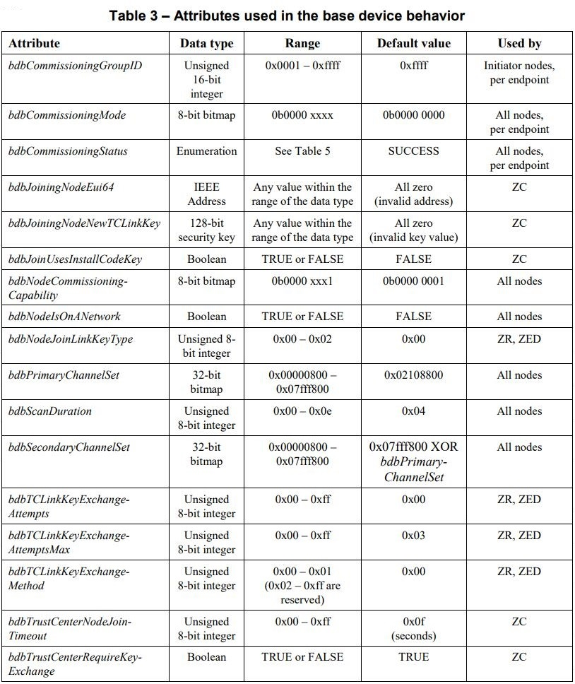
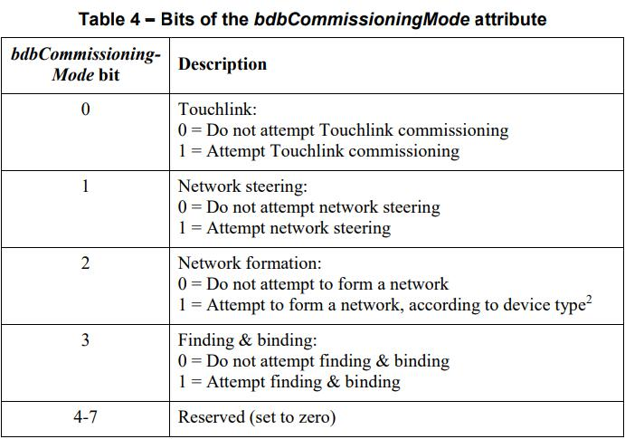
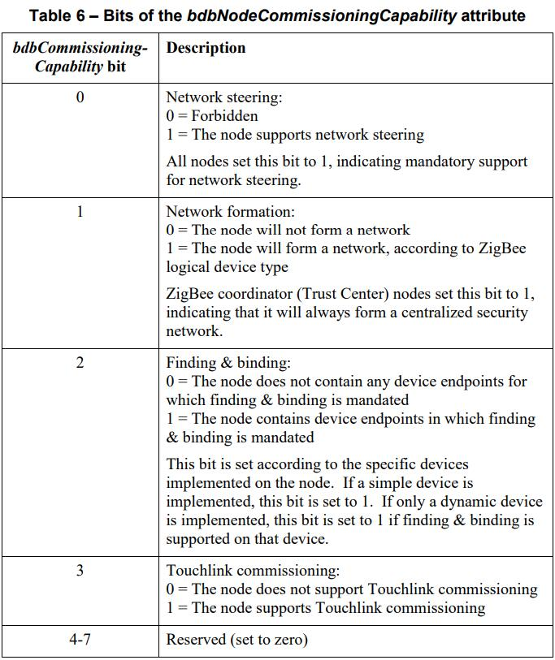
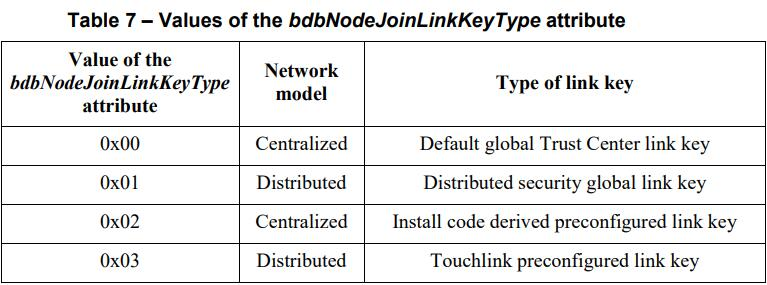

# **Base Device Behavior Specification Version 1.0** <!-- omit in toc -->


# **Notice of use and disclosure** <!-- omit in toc -->

Copyright © ZigBee Alliance, Inc. (1996-2016). All rights Reserved. This information within this document is the property of the ZigBee Alliance and its use and disclosure are restricted. Elements of ZigBee Alliance specifications may be subject to third party intellectual property rights, including without limitation, patent, copyright or trademark rights (such a third party may or may not be a member of ZigBee). ZigBee is not responsible and shall not be held responsible in any manner for identifying or failing to identify any or all such third party intellectual property rights. No right to use any ZigBee name, logo or trademark is conferred herein. Use of any ZigBee name, logo or trademark requires membership in the ZigBee Alliance and compliance with the ZigBee Logo and Trademark Policy and related ZigBee policies. This document and the information contained herein are provided on an “AS IS” basis and ZigBee DISCLAIMS ALL WARRANTIES EXPRESS OR IMPLIED, INCLUDING BUT NOT LIMITED TO (A) ANY WARRANTY THAT THE USE OF THE INFORMATION HEREIN WILL NOT INFRINGE ANY RIGHTS OF THIRD PARTIES (INCLUDING WITHOUT LIMITATION ANY INTELLECTUAL PROPERTY RIGHTS INCLUDING PATENT, COPYRIGHT OR TRADEMARK RIGHTS) OR (B) ANY IMPLIED WARRANTIES OF MERCHANTABILITY, FITNESS FOR A PARTICULAR PURPOSE, TITLE OR NONINFRINGEMENT. IN NO EVENT WILL ZIGBEE BE LIABLE FOR ANY LOSS OF PROFITS, LOSS OF BUSINESS, LOSS OF USE OF DATA, INTERRUPTION OF BUSINESS, OR FOR ANY OTHER DIRECT, INDIRECT, SPECIAL OR EXEMPLARY, INCIDENTIAL, PUNITIVE OR CONSEQUENTIAL DAMAGES OF ANY KIND, IN CONTRACT OR IN TORT, IN CONNECTION WITH THIS DOCUMENT OR THE INFORMATION CONTAINED HEREIN, EVEN IF ADVISED OF THE POSSIBILITY OF SUCH LOSS OR DAMAGE. All Company, brand and product names may be trademarks that are the sole property of their respective owners. The above notice and this paragraph must be included on all copies of this document that are made.

# **修订历史** <!-- omit in toc -->


# **目录** <!-- omit in toc -->

- [1. 引言](#1-引言)
    - [1.1 范围](#11-范围)
    - [1.2 目的](#12-目的)
    - [1.3 一致性级别](#13-一致性级别)
    - [1.4 约定](#14-约定)
        - [1.4.1 数字格式](#141-数字格式)
    - [1.5 一致性测试](#15-一致性测试)
    - [1.6 勘误表](#16-勘误表)
- [2. 参考文献](#2-参考文献)
    - [2.1 ZigBee Alliance 文档](#21-zigbee-alliance-文档)
    - [2.2 IEEE 文档](#22-ieee-文档)
    - [2.3 IETF 文档](#23-ietf-文档)
- [3. 定义](#3-定义)
- [4. 缩写](#4-缩写)
- [5. 环境变量](#5-环境变量)
    - [5.1 所有节点使用的常量](#51-所有节点使用的常量)
        - [5.1.1 bdbcMaxSameNetworkRetryAttempts 常量](#511-bdbcmaxsamenetworkretryattempts-常量)
        - [5.1.2 bdbcMinCommissioningTime 常量](#512-bdbcmincommissioningtime-常量)
        - [5.1.3 bdbcRecSameNetworkRetryAttempts 常量](#513-bdbcrecsamenetworkretryattempts-常量)
        - [5.1.4 bdbcTCLinkKeyExchangeTimeout 常量](#514-bdbctclinkkeyexchangetimeout-常量)
    - [5.2 支持 touchlink 的节点使用的常量](#52-支持-touchlink-的节点使用的常量)
        - [5.2.1 bdbcTLInterPANTransIdLifetime 常量](#521-bdbctlinterpantransidlifetime-常量)
        - [5.2.2 bdbcTLMinStartupDelayTime 常量](#522-bdbctlminstartupdelaytime-常量)
        - [5.2.3 bdbcTLPrimaryChannelSet 常量](#523-bdbctlprimarychannelset-常量)
        - [5.2.4 bdbcTLRxWindowDuration 常量](#524-bdbctlrxwindowduration-常量)
        - [5.2.5 bdbcTLScanTimeBaseDuration 常量](#525-bdbctlscantimebaseduration-常量)
        - [5.2.6 bdbcTLSecondaryChannelSet 常量](#526-bdbctlsecondarychannelset-常量)
    - [5.3 属性](#53-属性)
        - [5.3.1 bdbCommissioningGroupID 属性](#531-bdbcommissioninggroupid-属性)
        - [5.3.2 bdbCommissioningMode 属性](#532-bdbcommissioningmode-属性)
        - [5.3.3 bdbCommissioningStatus 属性](#533-bdbcommissioningstatus-属性)
        - [5.3.4 bdbJoiningNodeEui64 属性](#534-bdbjoiningnodeeui64-属性)
        - [5.3.5 bdbJoiningNodeNewTCLinkKey 属性](#535-bdbjoiningnodenewtclinkkey-属性)
        - [5.3.6 bdbJoinUsesInstallCodeKey 属性](#536-bdbjoinusesinstallcodekey-属性)
        - [5.3.7 bdbNodeCommissioningCapability 属性](#537-bdbnodecommissioningcapability-属性)
        - [5.3.8 bdbNodeIsOnANetwork 属性](#538-bdbnodeisonanetwork-属性)
        - [5.3.9 bdbNodeJoinLinkKeyType 属性](#539-bdbnodejoinlinkkeytype-属性)
        - [5.3.10 bdbPrimaryChannelSet 属性](#5310-bdbprimarychannelset-属性)
        - [5.3.11 bdbScanDuration 属性](#5311-bdbscanduration-属性)
        - [5.3.12 bdbSecondaryChannelSet 属性](#5312-bdbsecondarychannelset-属性)
        - [5.3.13 bdbTCLinkKeyExchangeAttempts 属性](#5313-bdbtclinkkeyexchangeattempts-属性)
        - [5.3.14 bdbTCLinkKeyExchangeAttemptsMax 属性](#5314-bdbtclinkkeyexchangeattemptsmax-属性)
        - [5.3.15 bdbTCLinkKeyExchangeMethod 属性](#5315-bdbtclinkkeyexchangemethod-属性)
        - [5.3.16 bdbTrustCenterNodeJoinTimeout 属性](#5316-bdbtrustcenternodejointimeout-属性)
        - [5.3.17 bdbTrustCenterRequireKeyExchange 属性](#5317-bdbtrustcenterrequirekeyexchange-属性)
- [6. 一般要求](#6-一般要求)
    - [6.1 ZigBee 逻辑设备类型](#61-zigbee-逻辑设备类型)
    - [6.2 网络安全模型](#62-网络安全模型)
    - [6.3 链路密钥](#63-链路密钥)
        - [6.3.1 默认全局信任中心链路密钥](#631-默认全局信任中心链路密钥)
        - [6.3.2 分布式安全全局链路密钥](#632-分布式安全全局链路密钥)
        - [6.3.3 安装码派生的预配置链路密钥](#633-安装码派生的预配置链路密钥)
        - [6.3.4 Touchlink 预配置链路密钥](#634-touchlink-预配置链路密钥)
    - [6.4 安装码的使用](#64-安装码的使用)
    - [6.5 Commissioning](#65-commissioning)
    - [6.6 所有设备的最低要求](#66-所有设备的最低要求)
    - [6.7 默认报告配置](#67-默认报告配置)
    - [6.8 MAC 数据轮询](#68-mac-数据轮询)
    - [6.9 ZigBee 持久数据](#69-zigbee-持久数据)

# 1. 引言 

## 1.1 范围

基础设备行为规范的范围是定义：

* 基础设备所需的环境
* 基础设备的初始化（initialization）过程
* 基础设备的 commissioning 过程
* 基础设备的重置（reset）过程
* 基础设备的安全（security）过程

注意：本文档旨在涵盖与基础设备行为相关的阶段 1 的配置文件互操作性技术要求。另见 \[R4\]。

## 1.2 目的

基础设备行为规范的目的是指定在 ZigBee-PRO 栈上运行的基础设备的环境，初始化，commissioning 和操作过程，以确保配置文件的互操作性。

## 1.3 一致性级别

本文件中的关键词 “SHALL”、“SHALL NOT”、“SHOULD”、“SHOULD NOT”，“RECOMMENDED” 和 “MAY” 应按照 \[R9\] 中的描述进行解释。

## 1.4 约定

### 1.4.1 数字格式

在本规范中，十六进制数字的前缀为 “0x”，二进制数字的前缀为 “0b”。除非在相关文本中另有说明，否则所有其他数字均假定为十进制。

> PS: 下面两段英文为原文对数字格式的解释，不进行翻译。

Binary numbers are specified as successive groups of 4 bits, separated by a space (“ “) character from the most significant bit (next to the 0b prefix and left most on the page) to the least significant bit (rightmost on the page), e.g. the binary number 0b0000 1111 represents the decimal number 15. Where individual bits are indicated (e.g. bit 3) the bit numbers are relative to the least significant bit (i.e. bit 0).

When a bit is specified as having a value of either 0 or 1 it is specified with an “x”, e.g. “0b0000 0xxx” indicates that the lower 3 bits can take any value but the upper 5 bits must each be set to 0.

## 1.5 一致性测试

为了证明符合本规范，需要实现遵循在 **Base Device Behavior Test Specification** \[R6\] 中定义的适当的测试用例。

## 1.6 勘误表

任何针对此规范的勘误都可以在 \[R7\] 中找到。

# 2. 参考文献

## 2.1 ZigBee Alliance 文档

\[R1\] ZigBee Specification, ZigBee Alliance document 05-3474.

\[R2\] ZigBee Cluster Library Specification, ZigBee Alliance document 07-5123.

\[R3\] ZigBee Application Architecture, ZigBee Alliance document 13-0589.

\[R4\] ZigBee Profile Interoperability Technical Requirements Document, ZigBee document 13-0142-09.

\[R5\] Installation Code Key Derivation Sample Code, ZigBee document 09-5343-04.

\[R6\] Base Device Behavior Test Specification, ZigBee document 14-0439.

\[R7\] Z3 Errata for Base Device Behavior 13-0402, ZigBee document 15-02020.

## 2.2 IEEE 文档

\[R8\] Institute of Electrical and Electronics Engineers, Inc., IEEE Std. 802.15.4-2003, IEEE Standard for Information Technology —Telecommunications and Information Exchange between Systems —Local and Metropolitan Area Networks —Specific Requirements —Part 15.4: Wireless Medium Access Control (MAC) and Physical Layer (PHY) Specifications for Low Rate Wireless Personal Area Networks (WPANs). New York: IEEE Press. 2003.

## 2.3 IETF 文档

\[R9\] S. Bradner, Key words for use in RFCs to Indicate Requirement Levels, IETF RFC 2119, March 1997.


# 3. 定义

**应用簇（Application cluster）：**

应用簇是生成持久功能事务的簇，例如，向客户端报告的温度测量服务端簇或从客户端接收命令的 on/off 服务端簇（另请参阅 \[R3\]）。

**应用事务（Application transaction）：**

应用（或功能）事务是一个簇命令和执行设备的持久功能而生成的可能响应，例如属性报告（如报告传感器的测量值）或动作命令（如开、关、切换等）。应用事务不是一个 ZDO 事务，一次性事务或 commissioning 事务。

生成应用事务的簇是发起者。接收事务的初始消息的相应簇是目标。多个 端点/节点 上的相同簇可以是同一个应用事务的目标，因为可以进行多个源绑定或与 分组/广播 目的地进行绑定。

**绑定（Bind or binding (verb)）：**

创建一个绑定或创建一个绑定的动作。

**绑定（Binding (noun)）:**

绑定是节点上的 ZigBee 源绑定表条目，其指示从端点上的簇发送数据的位置（另请参阅 \[R3\]）。

**集中式安全网络（Centralized security network）:**

集中式安全网络是由具有信任中心功能的 ZigBee 协调器形成的 ZigBee 网络。加入此类网络的每个节点都可以通过信任中心进行身份验证，然后才能在网络上操作。

** Commissioning 主管（Commissioning director）：**

网络中的一个节点，能够直接编辑网络中任何节点上的绑定和报告配置。

**设备（Device）**

对应于 ZigBee 定义的设备类型的应用程序实现，其具有唯一的设备标识符并且是节点的一部分。一个设备驻留在单个端点上，称为设备端点。单个节点可以有一个或多个设备（另请参阅 \[R3\]）。

> PS：这里应译为 “装置” 更合适，但考虑大部分 ZigBee 书籍将其译为 “设备”，故本文译为 “设备”。

**分布式安全网络（Distributed security network）：**

分布式安全网络是由 ZigBee 路由器形成的 ZigBee 网络，其没有信任中心。加入此类网络的每个节点先由其父节点进行身份验证，然后才可以在网络上操作。

**动态设备（Dynamic device）：**

动态设备是端点的应用程序实现，其没有特定的应用簇集（另请参阅 \[R3\]）。

**EZ-Mode：**

EZ-Mode 是一种 commissioning 方法，用于定义节点上的网络转向和设备重置，以及查找和绑定具有目标或发起者簇的端点。该方法要求产品支持交互机制以调用该方法。产品的安装者可以访问这些机制。这些机制是依赖于实现的，并且可以是过载 和/或 自动的。

在设备端点上调用 EZ-Mode 会使节点和设备置于 EZ-Mode 下保持 3 分钟的窗口。每次在设备上调用 EZ-Mode 时，它会将窗口再延长 3 分钟。在窗口期间，节点执行 EZ-Mode 网络转向，并且在 EZ-Mode 中设备执行 EZ-Mode 查找和绑定到其他设备。目标设备使用标识（identify）簇在窗口期间进行标识。发起者设备在窗口期间主动发现目标，然后绑定到相应的目标簇。

**EZ-Mode 查找和绑定（EZ-Mode finding & binding）：**

EZ-Mode 查找和绑定是通过在两个或多个设备上匹配的应用簇之间使用标识簇自动建立应用程序连接的过程（另请参阅 \[R3\]）。注意，此后 “EZ-Mode 查找和绑定” 参考为 “查找和绑定”。

**EZ-Mode 网络转向（EZ-Mode network steering）：**

对于尚未加入网络的节点，EZ-Mode 网络转向是搜索和加入开放网络的操作。对于已加入网络的节点，EZ-Mode 网络转向是开放网络以允许新节点加入的动作。注意，此后 “EZ-Mode 网络转向” 参考为 “网络转向”。

**查找和绑定（Finding & binding）：**

参见 **EZ-Mode 查找和绑定**。

**发起者簇（Initiator cluster）：**

发起者簇是一个发起簇事务的应用簇（另请参见 \[R3\]）。

**已加入（Joined）：**

如果一个节点已成功执行网络加入过程或已形成一个网络，则称该节点已加入到一个网络。请注意，如果节点形成网络，其可能还没有任何与之通信的对等节点。同样，如果某个节点已加入网络，其可能它还没有任何绑定端点。

**网络转向（Network steering）：**

参见 **EZ-Mode 网络转向**。

**节点（Node）：**

节点定义为在单个网络上的具有单个 IEEE 地址的 ZigBee-PRO 栈的单个实例。节点由一个或多个逻辑设备实例组成，每个逻辑设备实例在端点上表示，并且节点可以具有节点端点，其是整个节点的示例，例如端点 0 上的 ZDO（另请参见 \[R3\]）。

**简单设备（Simple device）：**

简单设备是一个具有强制应用簇的应用程序特定端点的应用程序实现（另请参见 \[R3\]）。

**目标簇（Target cluster）：**

目标簇是一个应用簇，其接收来自发起者簇的已发起消息，并且可能会响应发起者（另请参阅 \[R3\]）。

**Touchlink commissioning：**

Touchlink commissioning 是一种可选的 commissioning 机制，其在物理邻近上使用 inter-PAN 通信发送命令以在网络上 commissioning 节点。

**实用簇（Utility cluster）：**

实用簇是一个簇，其功能不是产品的持久功能操作的一部分。功能示例：commissioning，配置，发现等。

**ZigBee 协调器（ZigBee coordinator）：**

ZigBee 协调器是一个 ZigBee 逻辑设备类型，其包括信任中心的功能，负责启动集中式安全网络并管理网络的节点加入和密钥分发。ZigBee 协调器节点描述符的逻辑类型字段被设置为 0b000。

**ZigBee 终端设备（ZigBee end device）：**

ZigBee 终端设备是一个 ZigBee 逻辑设备类型，其只能加入现有网络。ZigBee 终端设备节点描述符的逻辑类型字段被设置为 0b010。

**ZigBee 路由器（ZigBee router）：**

ZigBee 路由器是一个 ZigBee 逻辑设备类型，其负责管理节点加入。ZigBee 路由器无法启动集中式安全网络，但可以启动分布式安全网络。ZigBee 路由器节点描述符的逻辑类型字段被设置为 0b001。

# 4. 缩写

| 缩写 | 描述 |
| :-- | :-- |
| AES | 高级加密标准 |
| AIB | 应用程序支持子层信息库 |
| APS | 应用程序支持子层 |
| APSME | 应用程序支持子层管理实体 |
| CBKE | 基于证书的密钥交换 |
| CCITT | 国际电信委员会 |
| CD | commissioning 主管 |
| CRC | 循环冗余校验 |
| EP | 端点 |
| EUI | 扩展唯一标识符 |
| ID | 标识符 |
| IEEE | 电气和电子工程师协会 |
| LQI | 链路质量指示 |
| MAC | 媒体访问控制 |
| MMO | Matyas-Meyer-Oseas |
| NLME | 网络层管理实体 |
| NVRAM | 非易失性随机存取存储器 |
| NWK | 网络 |
| OTA | 在空中 |
| PAN | 个域网 |
| PHY | 物理 |
| TC | 信任中心 |
| WPAN | 无线个域网 |
| ZC | ZigBee 协调器 |
| ZCL | ZigBee 簇库 |
| ZDO | ZigBee 设备对象 |
| ZED | ZigBee 终端设备 |
| ZR | ZigBee 路由器 |

# 5. 环境变量

此子条款指定实现符合基础设备行为规范的节点所需的常量和属性。

本规范中指定的所有常量都使用前缀 “bdbc”（基础设备行为常量），并且所有属性都使用前缀 “bdb”（基础设备行为）。

## 5.1 所有节点使用的常量

Table 1 列出了被所有设备使用的基础设备行为规范定义的常量集。


### 5.1.1 bdbcMaxSameNetworkRetryAttempts 常量

**bdbcMaxSameNetworkRetryAttempts** 常量指定了对同一网络进行的加入或密钥交换的最大尝试次数。

该常量被每个节点使用。

另请参见 **bdbcRecSameNetworkRetryAttempts**。

### 5.1.2 bdbcMinCommissioningTime 常量

**bdbcMinCommissioningTime** 常量指定了开放网络以允许新节点加入或设备标识自身的最小持续时间（秒）。

该常量被每个节点使用。

### 5.1.3 bdbcRecSameNetworkRetryAttempts 常量

**bdbcRecSameNetworkRetryAttempts** 常量指定了对同一网络进行的加入或密钥交换的（RECOMMENDED）最大尝试次数。

该常量被每个节点使用。

另请参见 **bdbcMaxSameNetworkRetryAttempts**。

### 5.1.4 bdbcTCLinkKeyExchangeTimeout 常量

**bdbcTCLinkKeyExchangeTimeout** 常量指定了加入节点在向信任中心发送 APS 请求密钥时等待响应的最长时间（秒）。

该常量被每个节点使用。

## 5.2 支持 touchlink 的节点使用的常量

Table 2 列出了被支持 touchlink commissioning 的设备使用的基础设备行为规范定义的常量集。


### 5.2.1 bdbcTLInterPANTransIdLifetime 常量

**bdbcTLInterPANTransIdLifetime** 常量指定了 inter-PAN 事务 ID 保持有效的最大时间长度。

如果支持 touchlink，则节点将使用此常量。

### 5.2.2 bdbcTLMinStartupDelayTime 常量

**bdbcTLMinStartupDelayTime** 常量指定了发起者等待以确保目标已完成其网络启动过程的时间长度。

如果支持 touchlink，则节点将使用此常量。

### 5.2.3 bdbcTLPrimaryChannelSet 常量

**bdbcTLPrimaryChannelSet** 常量指定了由信道 11、15、20 和 25 组成的信道集的位掩码，其将用于非扩展的 touchlink 扫描。

如果支持 touchlink，则节点将使用此常量。

### 5.2.4 bdbcTLRxWindowDuration 常量

**bdbcTLRxWindowDuration** 常量指定了节点在 touchlink 期间为后续响应启用接收器的最大持续时间。

如果支持 touchlink，则节点将使用此常量。

### 5.2.5 bdbcTLScanTimeBaseDuration 常量

**bdbcTLScanTimeBaseDuration** 常量指定了 touchlink 扫描操作的基本持续时间，在此期间接收器在发送扫描请求后被启用以扫描响应。

如果支持 touchlink，则节点将使用此常量。

### 5.2.6 bdbcTLSecondaryChannelSet 常量

**bdbcTLSecondaryChannelSet** 常量指定了信道集的位掩码，该信道集由在 2.4GHz 中可用的剩余 IEEE 802.15.4-2003 信道组成，这些信道将在扫描 **bdbcTLPrimaryChannelSet** 信道后用于扩展的 touchlink 扫描。

如果支持 touchlink，则节点将使用此常量。

## 5.3 属性

基础设备行为规范定义了 Table 3 中列出的属性集。“Used by” 列指示属性被用于哪个 ZigBee 逻辑设备类型以及是否要为每个端点定义该属性。注意：本规范中定义的所有属性都是节点内部的，在空中不可用。



### 5.3.1 bdbCommissioningGroupID 属性

**bdbCommissioningGroupID** 属性指定了发起者应用在查找和绑定上的分组标识符。如果 **bdbCommissioningGroupID** 等于 0xffff，则任何绑定都将创建为单播。

如果 **bdbCommissioningMode** 属性（参见子条款 5.3.2）的第 3 位等于 1（将尝试查找和绑定），则此属性仅在 commissioning 期间被使用。

此属性被发起者节点使用，其要为每个端点定义。

注意：睡着的 ZigBee 终端设备目标将无法从组播传输中获益（有关详细信息，请参阅 \[R2\] 中的分组簇）。

### 5.3.2 bdbCommissioningMode 属性

**bdbCommissioningMode** 属性用作最高级别 commissioning 过程的参数，并在 commissioning 被调用时指定所采用的 commissioning 方法和选项，由从最低有效位到最高有效位的每个位表示。

请注意，此属性与 **bdbNodeCommissioningCapability** 属性不同，后者指定节点支持哪些 commissioning 机制。该属性是一个位元或 Table 4 中列出的位。

此属性被所有节点使用，其要为每个端点定义。



### 5.3.3 bdbCommissioningStatus 属性

**bdbCommissioningStatus** 属性指定了其 commissioning 尝试的状态，可以被设置为 Table 5 中列出的值之一。

此属性被所有节点使用，其要为每个端点定义。


### 5.3.4 bdbJoiningNodeEui64 属性

**bdbJoiningNodeEui64** 属性包含加入集中式安全网络的节点的 EUI-64。

此属性被 ZigBee 协调器节点使用。

### 5.3.5 bdbJoiningNodeNewTCLinkKey 属性

**bdbJoiningNodeNewTCLinkKey** 属性包含与加入节点建立但尚未确认的新链路密钥。

此属性被 ZigBee 协调器节点使用。

### 5.3.6 bdbJoinUsesInstallCodeKey 属性

**bdbJoinUsesInstallCodeKey** 属性指定了信任中心的策略，该策略指示其在相应节点加入其网络之前是否需要预安装一个安装码派生的预配置链路密钥。

如果 **bdbJoinUsesInstallCodeKey** 等于 FALSE，则信任中心允许节点加入其网络，而无需在节点加入之前预安装与节点关联的相应安装码派生的预配置链路密钥。如果 **bdbJoinUsesInstallCodeKey** 等于 TRUE，则必须在节点加入之前已预安装与该节点关联的相应安装码派生的预配置链路密钥，信任中心才允许节点加入其网络。

此属性被 ZigBee 协调器节点使用。

### 5.3.7 bdbNodeCommissioningCapability 属性

**bdbNodeCommissioningCapability** 属性指定了节点的 commissioning 能力。该属性是一个位元或 Table 6 中列出的位。

此属性被所有节点使用。



### 5.3.8 bdbNodeIsOnANetwork 属性

**bdbNodeIsOnANetwork** 属性指示了节点是否已加入网络。如果 **bdbNodeIsOnANetwork** 等于 FALSE，则该节点尚未形成或加入网络。如果 **bdbNodeIsOnANetwork** 等于 TRUE，则节点形成了集中式安全网络（如果节点是 ZigBee 协调器）或形成了分布式安全网络（如果节点是 ZigBee 路由器）或已加入网络（如果节点是 ZigBee 路由器或 ZigBee 终端设备）。请注意，当 **bdbNodeIsOnANetwork** 等于 TRUE 时，节点可能还没有任何绑定端点。

此属性被所有节点使用。

### 5.3.9 bdbNodeJoinLinkKeyType 属性

**bdbNodeJoinLinkKeyType** 属性指示了链路密钥的类型（请参阅子条款 6.3），当节点加入新网络时，该节点能够使用其解密网络密钥。此属性可以采用 Table 7 中列出的值之一。



此属性被 ZigBee 路由器和 ZigBee 终端设备使用。

### 5.3.10 bdbPrimaryChannelSet 属性

**bdbPrimaryChannelSet** 属性指定了由应用程序定义的将优先使用的信道集，例如，在信道扫描期间。请注意，如果不需要主要扫描，则此属性被设置为 0x00000000。但是，在这种情况下，**bdbSecondaryChannelSet** 不应被设置为 0x00000000。

此属性被所有节点使用。

### 5.3.11 bdbScanDuration 属性

**bdbScanDuration** 属性指定了每个信道的 IEEE 802.15.4 扫描操作的持续时间。扫描每个信道所花费的时间通过 \[aBaseSuperframeDuration *(2n + 1)\] 给出，其中 n 是 **bdbScanDuration** 的值，**aBaseSuperframeDuration** 在 \[R8\] 的子条款 7.4.1（Table 70）中定义。

The scan is performed indirectly via the ZigBee primitives and can be energy, passive or active.

此属性被所有节点使用。

### 5.3.12 bdbSecondaryChannelSet 属性

**bdbSecondaryChannelSet** 属性指定了由应用程序定义的信道集，该信道集将在主要信道之后使用，例如，在信道扫描期间。请注意，如果不需要次要扫描，则此属性被设置为 0x00000000。但是，在这种情况下，**bdbPrimaryChannelSet** 不应被设置为 0x00000000。

此属性被所有节点使用。

### 5.3.13 bdbTCLinkKeyExchangeAttempts 属性

**bdbTCLinkKeyExchangeAttempts** 属性包含了在加入后建立新链路密钥的密钥建立尝试次数。

此属性被 ZigBee 路由器和 ZigBee 终端设备使用。

### 5.3.14 bdbTCLinkKeyExchangeAttemptsMax 属性

**bdbTCLinkKeyExchangeAttemptsMax** 属性指定了在放弃密钥建立之前将进行的最大密钥建立尝试次数。

此属性被 ZigBee 路由器和 ZigBee 终端设备使用。

### 5.3.15 bdbTCLinkKeyExchangeMethod 属性

**bdbTCLinkKeyExchangeMethod** 属性指定了在加入网络后用于建立新链路密钥的方法，并且可以设置为 Table 8 中列出的非保留值之一。

此属性被 ZigBee 路由器和 ZigBee 终端设备使用。


### 5.3.16 bdbTrustCenterNodeJoinTimeout 属性

**bdbTrustCenterNodeJoinTimeout** 属性为信任中心指定了一个超时（秒），以移除未成功建立新链路密钥的新加入节点的信任中心链路密钥。

此属性被 ZigBee 协调器节点使用。

### 5.3.17 bdbTrustCenterRequireKeyExchange 属性

**bdbTrustCenterRequireKeyExchange** 属性指定了信任中心是否要求加入设备将其初始链路密钥与信任中心生成的新链路密钥进行交换。如果 **bdbTrustCenterRequireKeyExchange** 等于 TRUE，则加入节点必须经历链路密钥交换过程；无法交换链路密钥将导致节点从网络中移除。如果 **bdbTrustCenterRequireKeyExchange** 等于 FALSE，则信任中心将允许加入节点保留在网络上而不交换其初始链路密钥。

此属性被 ZigBee 协调器节点使用。

# 6. 一般要求

本条款规定了实现基础设备行为规范的所有节点的一般要求。

## 6.1 ZigBee 逻辑设备类型

逻辑设备类型被指定为 ZigBee 协调器的节点应（SHALL）包含信任中心的角色。ZigBee 协调器应（SHALL）形成集中式安全网络，因此，不应（SHALL NOT）尝试加入另一个网络。

逻辑设备类型被指定为 ZigBee 路由器的节点应（SHALL）能够加入现有的集中式或分布式安全网络。然而，ZigBee 路由器不应（SHALL NOT）形成集中式安全网络，但如果现有的集中式或分布式安全网络无法加入，则可以（MAY）形成分布式安全网络。

逻辑设备类型被指定为 ZigBee 终端设备的节点应（SHALL）能够加入现有的集中式或分布式安全网络。

一个节点可以（MAY）支持成为 ZigBee 协调器和 ZigBee 路由器的能力，其可在应用程序控制下切换。然而，在任何时候，该节点都应（SHALL）只被指定为其中的一种类型。这就允许节点作为 ZigBee 路由器以尝试加入网络的场景，并且如果没有网络可加入，则该节点可以切换成 ZigBee 协调器，并因此形成集中式安全网络。一旦节点形成或加入网络，它不应（SHALL NOT）改变其类型，除非它先破坏或离开该网络。

## 6.2 网络安全模型

ZigBee 网络可以（MAY）支持集中式安全模型（集中式安全网络）或分布式安全模型（分布式安全网络）。所有非 ZigBee 协调器节点都应（SHALL）能够加入任一模型支持的网络，并适应其加入网络的安全条件（参见 \[R1\] 的子条款 4.6.3）。这种适应性对用户应该（SHOULD）尽可能地无缝。

## 6.3 链路密钥

每个节点都应（SHALL）包含以下链路密钥：

1. 默认全局信任中心链路密钥（default global Trust Center link key）
2. 分布式安全全局链路密钥（distributed security global link key）
3. 安装码派生的预配置链路密钥（install code derived preconfigured link key）

此外，如果节点支持 touchlink commissioning，它还应包含以下链路密钥：

4. Touchlink 预配置链路密钥（touchlink preconfigured link key）

**bdbNodeJoinLinkKeyType** 属性指示了在加入期间用于解密网络密钥的链路密钥类型。

### 6.3.1 默认全局信任中心链路密钥

默认全局信任中心链路密钥是所有设备都支持的链路密钥，如果未指定其他链路密钥，则其可用于加入集中式安全网络。此链路密钥的值应(SHALL)为：

```
Default global Trust Center link key (0:15) = 0x5a 0x69 0x67 0x42
                                              0x65 0x65 0x41 0x6c
                                              0x6c 0x69 0x61 0x6e
                                              0x63 0x65 0x30 0x39
```

### 6.3.2 分布式安全全局链路密钥

分布式安全全局链路密钥用于加入分布式安全网络。该链路密钥被提供给公司，以作为一个产品成功认证的结果。对于测试，此密钥的值应(SHALL)为：

```
Distributed security global link key (0:15) = 0xd0 0xd1 0xd2 0xd3
                                              0xd4 0xd5 0xd6 0xd7
                                              0xd8 0xd9 0xda 0xdb
                                              0xdc 0xdd 0xde 0xdf
```

### 6.3.3 安装码派生的预配置链路密钥

安装码派生的预配置链路密钥是由为产品创建的随机安装码生成的，并以制造商特定的方式提供给节点，以在安装期间引用。有关详细信息，请参阅子条款 10.1。

### 6.3.4 Touchlink 预配置链路密钥

Touchlink 预配置链路密钥用于加入网络（通过 touchlink）。该链路密钥被提供给公司，以作为一个产品成功认证的结果。对于测试，此密钥的值应(SHALL)为：

```
Touchlink preconfigured link key (0:15) = 0xc0 0xc1 0xc2 0xc3
                                          0xc4 0xc5 0xc6 0xc7
                                          0xc8 0xc9 0xca 0xcb
                                          0xcc 0xcd 0xce 0xcf
```

在 touchlink 过程中使用 touchlink 预配置链路密钥的节点应（SHALL）将扫描响应 inter-PAN 命令帧的密钥位掩码字段的第 4 位或第 15 位设置为 1（参见 \[R2\]），具体取决于节点是在认证测试期间还是在认证后的产品中使用（正常操作）。

## 6.4 安装码的使用

所有节点都应（SHALL）支持安装码。

通过零售渠道无法获得和专业安装的节点（例如，电表或燃气表）可以（MAY）被配置为在加入时需要使用安装码。

通过零售渠道可获得和支持用户配置机制的节点（例如，物理开关）可以（MAY）默认为一种仅需使用安装码的入网络模式。然而，其应（SHALL）有一个机制，以切换到所有可考虑的入网络模式。

通过零售渠道获得但没有用户配置机制的节点应（SHALL）能够自动加入所有网络。

信任中心可以（MAY）要求加入其网络的所有节点使用安装码。

## 6.5 Commissioning

所有节点都应（SHALL）支持网络转向，以便所有节点都可以使用一个通用的机制作为后备。实现简单设备类的设备应（SHALL）支持查找和绑定，而实现动态或节点设备类的设备可（MAY）支持查找和绑定。根据节点上实现的各个设备规范，可以（MAY）支持其他 commissioning 机制。

节点支持的 commissioning 机制在 **bdbNodeCommissioningCapability** 属性中指定（参见子条款 5.3）。

本规范规定了以下 commissioning 机制的过程：

* 网络转向。所有节点都应（SHALL）支持网络转向。
* 网络形成。节点形成网络的能力及其网络安全模型应（SHALL）取决于节点的逻辑设备类型。
* 查找和绑定。在实现简单设备类的设备上应（SHALL）支持定位和绑定到其他设备上的应用簇的能力，并且可以（MAY）在实现动态或节点设备类的设备上也支持该能力。
* Touchlink commissioning。节点可以（MAY）支持基于邻近度的 commissioning 机制。如果支持 touchlink commissioning，则节点应（SHALL）支持作为 touchlink 发起者，目标或两者。

一个实现可以（MAY）随时使用 commissioning，例如，可以随时对整个节点执行网络转向，或者在适合应用程序的任何端点上随时执行查找和绑定。但是，每次使用时都应（SHALL）按照最高级 commissioning 过程中的规定执行。

例如，在单个端点上实现温度传感器设备的节点可以在激活特定用户按钮时使用 commissioning 过程。类似地，在两个端点（每个开关一个）上实现 开/关 灯开关设备的节点可以在激活每个开关时使用 commissioning 过程。

所需的 commissioning 过程由每个活动端点定义的若干属性控制（另请参见子条款 5.3）：**bdbCommissioningMode**，**bdbCommissioningGroupID** 和 **bdbCommissioningStatus**。要执行 commissioning，需要在 **bdbCommissioningMode** 属性中指定要在当时执行的 commissioning 选项。如果需要查找和绑定，还要指定 **bdbCommissioningGroupID**（用于查找和绑定的分组）。请注意，如果不需要分组绑定，则 **bdbCommissioningGroupID** 属性被设置为 0xffff。执行请求的 commissioning 选项后，**bdbCommissioningStatus** 属性将指示尝试的状态。

**bdbCommissioningMode** 中指定的 commissioning 选项按照最低有效位的顺序执行，即首先是 touchlink commissioning，然后是网络转向，再后是网络形成，最后是查找和绑定，如下所示：

1. 如果指定了作为 touchlink commissioning 发起者并且成功，则在调用 commissioning 过程期间不应（SHALL）执行 **bdbCommissioningMode** 中指定的其他 commissioning 选项。注意，如果发起者接收到对 touchlink 扫描请求的响应，则认为 touchlink 成功。
2. 如果指定了网络转向，则节点应（SHALL）根据节点是否已加入网络来尝试网络转向。
3. 如果指定了网络形成，则节点应（SHALL）仅在节点尚未加入网络时尝试网络形成。因此，如果指定了网络转向并且成功，则节点不应（SHALL NOT）尝试网络形成。如果指定了网络形成且节点是 ZigBee 协调器，则它应（SHALL）尝试形成集中式安全网络。相反，如果指定了网络形成且节点是 ZigBee 路由器，则它应（SHALL）尝试形成分布式安全网络。如果节点是 ZigBee 终端设备，则它应（SHALL）跳过网络形成。
4. 如果指定了查找和绑定，则节点应（SHALL）仅在网络上可操作时才尝试查找和绑定。可以（MAY）在节点上实现的一个或多个端点上发起查找和绑定，其形式取决于簇类（有关详细信息，请参阅 \[R3\]）。对于类型 1 客户端或类型 2 服务端簇，应用程序应（SHALL）执行查找和绑定以作为发起者端点。相反，对于类型 1 服务端或类型 2 客户端簇，应用程序应（SHALL）执行查找和绑定以作为目标端点。

## 6.6 所有设备的最低要求

所有节点都应（SHALL）支持以下要求：

* 节点应（SHALL）处理 ZDO 发现服务命令：**Active\_EP\_req**、**Node\_Desc\_req**、**Simple\_Desc\_req**、**IEEE\_addr\_req**，**NWK\_addr\_req** 和 **Match\_Desc\_req**；并分别用 **Active\_EP\_rsp**、**Node\_Desc\_rsp**、**Simple\_Desc\_rsp**、**IEEE\_addr\_rsp**，**NWK\_addr\_rsp** 和 **Match\_Desc\_rsp** 命令进行响应。
* 节点应（SHALL）处理 ZDO 节点管理器服务命令：**Mgmt\_Bind\_req** 和 **Mgmt\_Lqi\_req**；并分别用 **Mgmt\_Bind\_rsp** 和 **Mgmt\_Lqi\_rsp** 命令进行响应。
* 节点应（SHALL）处理 ZDO 绑定表服务命令：**Bind\_req** 和 **Unbind\_req**；并分别使用 **Bind\_rsp** 和 **Unbind\_rsp** 命令进行响应。
* 节点应（SHALL）处理 ZDO 网络管理器服务命令：**Mgmt\_Leave\_req**；并使用 **Mgmt\_Leave\_rsp** 命令进行响应。
* 节点应（SHALL）能够在查找和绑定期间广播 **Identify Query** 命令帧之后，处理接收至少一个 **Identify** 簇，**Identify Query Response** 命令帧。如果节点能够处理接收多个 **Identify Query Response** 命令帧，那么它的处理是特定于实现的。
* 支持作为查找和绑定发起者的节点应（SHALL）实现一个绑定表，其可用条目数大于或等于节点的每个设备上支持的簇实例（应用事务的发起者）的总和。在查找和绑定，touchlink 或集中式 commissioning 期间，绑定都是被配置在绑定表中。无论用于生成绑定的 commissioning 机制如何，绑定表都应（SHALL）是一致的，以便可以使用 **Mgmt\_Bind\_req** 命令检索其内容。
* 对于每个指定为强制的和可报告的已实现属性，节点应（SHALL）具有一个默认的报告配置（参见子条款 6.7）。
* 可以成为应用事务的目标的节点应（SHALL）支持分组寻址并且分组表中至少有 8 个成员（memberships）。

## 6.7 默认报告配置

对于指定为可报告的每个已实现属性，应（SHALL）存在一个默认的报告配置（最大报告间隔为 0x0000 或在 0x003d 到 0xfffe 范围内）。默认报告配置是这样的：如果在节点上创建了给定簇的绑定，则节点应（SHALL）向该绑定发送报告，而无需设置任何额外的报告配置。可以（MAY）随时覆盖属性的默认报告配置。在这种情况下，应（SHALL）使用更新后的报告配置。

从同一属性的上一个报告开始，当经过的时间等于该属性的最大报告间隔时，应（SHALL）生成一个报告。配置后的第一个报告的时间未被指定。如果最大报告间隔被设置为 0x0000，则不会定期报告，但基于更改的报告仍可操作。

考虑一个简单的湿度传感器以作为一个默认报告配置的示例。湿度传感器最好清楚其报告配置应该是什么，以节省电池电量。因此，它应该具有一个默认报告配置，以便一旦它加入网络并创建绑定，它就会立即开始发送其湿度报告。

## 6.8 MAC 数据轮询

所有嗜睡的 ZigBee 终端设备都需要 MAC 数据轮询才能在 ZigBee-PRO 网络中正常操作。基础设备行为规范不限制 MAC 数据轮询的频率。数据轮询频率的选择根据产品的功耗设计因素来作出决定。然而，以下是一个确保其在网络中正确操作的建议集：

MAC 数据轮询率应该（SHOULD）基于节点的操作状态是动态的。建议（RECOMMENDED）它至少有两种速率，一个快速率和一个慢速率。

ZigBee 规范仅要求父节点缓冲单个消息 7.5 秒。该单个缓冲区适用于所有嗜睡的 ZigBee 终端设备。因此，一个嗜睡的 ZigBee 终端设备应该（SHOULD）更频繁地（快于 7.5 秒每次）轮询，以便能够检索它所期望的缓冲消息。

当节点等待活动响应消息（例如 APS 确认，ZCL 响应或参与多消息协议）时，它应该（SHOULD）以其快速率进行轮询。建议（RECOMMENDED）这个快速率至少为每 3 秒钟一次。

当节点没有等待活动消息时，它可以（MAY）慢速率进行轮询，例如每小时一次。这可确保它仍与网络及其父系连接。

在初加入 ZigBee-PRO 网络期间，包括查找和绑定，嗜睡的 ZigBee 终端设备应该（SHOULD）以快速率进行轮询。

## 6.9 ZigBee 持久数据

除了 ZigBee 规范（参见 \[R1\]）和 ZCL 规范（参见 \[R2\]）中指定的持久数据外，节点还应（SHALL）在重置间保留以下数据：

* bdbNodeIsOnANetwork 属性

