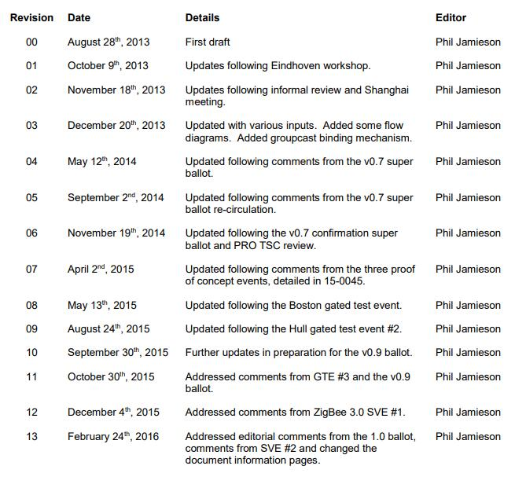
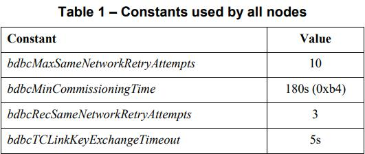

# **Base Device Behavior Specification Version 1.0** <!-- omit in toc -->

# **Notice of use and disclosure** <!-- omit in toc -->

Copyright © ZigBee Alliance, Inc. (1996-2016). All rights Reserved. This information within this document is the property of the ZigBee Alliance and its use and disclosure are restricted. Elements of ZigBee Alliance specifications may be subject to third party intellectual property rights, including without limitation, patent, copyright or trademark rights (such a third party may or may not be a member of ZigBee). ZigBee is not responsible and shall not be held responsible in any manner for identifying or failing to identify any or all such third party intellectual property rights. No right to use any ZigBee name, logo or trademark is conferred herein. Use of any ZigBee name, logo or trademark requires membership in the ZigBee Alliance and compliance with the ZigBee Logo and Trademark Policy and related ZigBee policies. This document and the information contained herein are provided on an “AS IS” basis and ZigBee DISCLAIMS ALL WARRANTIES EXPRESS OR IMPLIED, INCLUDING BUT NOT LIMITED TO (A) ANY WARRANTY THAT THE USE OF THE INFORMATION HEREIN WILL NOT INFRINGE ANY RIGHTS OF THIRD PARTIES (INCLUDING WITHOUT LIMITATION ANY INTELLECTUAL PROPERTY RIGHTS INCLUDING PATENT, COPYRIGHT OR TRADEMARK RIGHTS) OR (B) ANY IMPLIED WARRANTIES OF MERCHANTABILITY, FITNESS FOR A PARTICULAR PURPOSE, TITLE OR NONINFRINGEMENT. IN NO EVENT WILL ZIGBEE BE LIABLE FOR ANY LOSS OF PROFITS, LOSS OF BUSINESS, LOSS OF USE OF DATA, INTERRUPTION OF BUSINESS, OR FOR ANY OTHER DIRECT, INDIRECT, SPECIAL OR EXEMPLARY, INCIDENTIAL, PUNITIVE OR CONSEQUENTIAL DAMAGES OF ANY KIND, IN CONTRACT OR IN TORT, IN CONNECTION WITH THIS DOCUMENT OR THE INFORMATION CONTAINED HEREIN, EVEN IF ADVISED OF THE POSSIBILITY OF SUCH LOSS OR DAMAGE. All Company, brand and product names may be trademarks that are the sole property of their respective owners. The above notice and this paragraph must be included on all copies of this document that are made.

# **Revision history** <!-- omit in toc -->

# **Table of Contents** <!-- omit in toc -->

- [1. 引言](#1-引言)
    - [1.1 范围](#11-范围)
    - [1.2 目的](#12-目的)
    - [1.3 一致性级别](#13-一致性级别)
    - [1.4 约定](#14-约定)
        - [1.4.1 数字格式](#141-数字格式)
    - [1.5 一致性测试](#15-一致性测试)
    - [1.6 勘误表](#16-勘误表)
- [2. 参考文献](#2-参考文献)
    - [2.1 ZigBee Alliance 文档](#21-zigbee-alliance-文档)
    - [2.2 IEEE 文档](#22-ieee-文档)
    - [2.3 IETF 文档](#23-ietf-文档)
- [3. 定义](#3-定义)
- [4. 缩写](#4-缩写)
- [5. 环境变量](#5-环境变量)
    - [5.1 所有节点使用的常量](#51-所有节点使用的常量)
        - [5.1.1 bdbcMaxSameNetworkRetryAttempts 常量](#511-bdbcmaxsamenetworkretryattempts-常量)
        - [5.1.2 bdbcMinCommissioningTime 常量](#512-bdbcmincommissioningtime-常量)
        - [5.1.3 bdbcRecSameNetworkRetryAttempts 常量](#513-bdbcrecsamenetworkretryattempts-常量)
        - [5.1.4 bdbcTCLinkKeyExchangeTimeout 常量](#514-bdbctclinkkeyexchangetimeout-常量)
    - [5.2 支持 touchlink 的节点使用的常量](#52-支持-touchlink-的节点使用的常量)
        - [5.2.1 bdbcTLInterPANTransIdLifetime 常量](#521-bdbctlinterpantransidlifetime-常量)
        - [5.2.2 bdbcTLMinStartupDelayTime 常量](#522-bdbctlminstartupdelaytime-常量)
        - [5.2.3 bdbcTLPrimaryChannelSet 常量](#523-bdbctlprimarychannelset-常量)
        - [5.2.4 bdbcTLRxWindowDuration 常量](#524-bdbctlrxwindowduration-常量)
        - [5.2.5 bdbcTLScanTimeBaseDuration 常量](#525-bdbctlscantimebaseduration-常量)
        - [5.2.6 bdbcTLSecondaryChannelSet 常量](#526-bdbctlsecondarychannelset-常量)
    - [5.3 属性](#53-属性)
        - [5.3.1 bdbCommissioningGroupID 属性](#531-bdbcommissioninggroupid-属性)
        - [5.3.2 bdbCommissioningMode 属性](#532-bdbcommissioningmode-属性)
        - [5.3.3 bdbCommissioningStatus 属性](#533-bdbcommissioningstatus-属性)
        - [5.3.4 bdbJoiningNodeEui64 属性](#534-bdbjoiningnodeeui64-属性)
        - [5.3.5 bdbJoiningNodeNewTCLinkKey 属性](#535-bdbjoiningnodenewtclinkkey-属性)
        - [5.3.6 bdbJoinUsesInstallCodeKey 属性](#536-bdbjoinusesinstallcodekey-属性)
        - [5.3.7 bdbNodeCommissioningCapability 属性](#537-bdbnodecommissioningcapability-属性)
        - [5.3.8 bdbNodeIsOnANetwork 属性](#538-bdbnodeisonanetwork-属性)
        - [5.3.9 bdbNodeJoinLinkKeyType 属性](#539-bdbnodejoinlinkkeytype-属性)
        - [5.3.10 bdbPrimaryChannelSet 属性](#5310-bdbprimarychannelset-属性)
        - [5.3.11 bdbScanDuration 属性](#5311-bdbscanduration-属性)
        - [5.3.12 bdbSecondaryChannelSet 属性](#5312-bdbsecondarychannelset-属性)
        - [5.3.13 bdbTCLinkKeyExchangeAttempts 属性](#5313-bdbtclinkkeyexchangeattempts-属性)
        - [5.3.14 bdbTCLinkKeyExchangeAttemptsMax 属性](#5314-bdbtclinkkeyexchangeattemptsmax-属性)
        - [5.3.15 bdbTCLinkKeyExchangeMethod 属性](#5315-bdbtclinkkeyexchangemethod-属性)
        - [5.3.16 bdbTrustCenterNodeJoinTimeout 属性](#5316-bdbtrustcenternodejointimeout-属性)
        - [5.3.17 bdbTrustCenterRequireKeyExchange 属性](#5317-bdbtrustcenterrequirekeyexchange-属性)

# 1. 引言 

## 1.1 范围

基础设备行为规范的范围是定义：
* 基础设备所需的环境
* 基础设备的初始化（initialization）过程
* 基础设备的试车（commissioning）过程
* 基础设备的重置（reset）过程
* 基础设备的安全（security）过程

注意：本文档旨在涵盖与基础设备行为相关的阶段 1 的配置文件互操作性技术要求。另见 \[R4\]。

## 1.2 目的

基础设备行为规范的目的是指定在 ZigBee-PRO 栈上运行的基础设备的环境，初始化，试车和操作过程，以确保配置文件的互操作性。

## 1.3 一致性级别

本文件中的关键词 “SHALL”、“SHALL NOT”、“SHOULD”、“SHOULD NOT”，“RECOMMENDED” 和 “MAY” 应按照 \[R9\] 中的描述进行解释。

## 1.4 约定

### 1.4.1 数字格式

在本规范中，十六进制数字的前缀为 “0x”，二进制数字的前缀为 “0b”。除非在相关文本中另有说明，否则所有其他数字均假定为十进制。

> PS: 下面两段英文为原文对数字格式的解释，不进行翻译。

Binary numbers are specified as successive groups of 4 bits, separated by a space (“ “) character from the most significant bit (next to the 0b prefix and left most on the page) to the least significant bit (rightmost on the page), e.g. the binary number 0b0000 1111 represents the decimal number 15. Where individual bits are indicated (e.g. bit 3) the bit numbers are relative to the least significant bit (i.e. bit 0).

When a bit is specified as having a value of either 0 or 1 it is specified with an “x”, e.g. “0b0000 0xxx” indicates that the lower 3 bits can take any value but the upper 5 bits must each be set to 0.

## 1.5 一致性测试

为了证明符合本规范，需要实现遵循在 **Base Device Behavior Test Specification** \[R6\] 中定义的适当的测试用例。

## 1.6 勘误表

任何针对此规范的勘误都可以在 \[R7\] 中找到。

# 2. 参考文献

## 2.1 ZigBee Alliance 文档

\[R1\] ZigBee Specification, ZigBee Alliance document 05-3474.

\[R2\] ZigBee Cluster Library Specification, ZigBee Alliance document 07-5123.

\[R3\] ZigBee Application Architecture, ZigBee Alliance document 13-0589.

\[R4\] ZigBee Profile Interoperability Technical Requirements Document, ZigBee document 13-0142-09.

\[R5\] Installation Code Key Derivation Sample Code, ZigBee document 09-5343-04.

\[R6\] Base Device Behavior Test Specification, ZigBee document 14-0439.

\[R7\] Z3 Errata for Base Device Behavior 13-0402, ZigBee document 15-02020.

## 2.2 IEEE 文档

\[R8\] Institute of Electrical and Electronics Engineers, Inc., IEEE Std. 802.15.4-2003, IEEE Standard for Information Technology —Telecommunications and Information Exchange between Systems —Local and Metropolitan Area Networks —Specific Requirements —Part 15.4: Wireless Medium Access Control (MAC) and Physical Layer (PHY) Specifications for Low Rate Wireless Personal Area Networks (WPANs). New York: IEEE Press. 2003.

## 2.3 IETF 文档

\[R9\] S. Bradner, Key words for use in RFCs to Indicate Requirement Levels, IETF RFC 2119, March 1997.

# 3. 定义

**应用簇（Application cluster）：**

应用簇是生成持久功能事务的簇，例如，向客户端报告的温度测量服务端簇或从客户端接收命令的 on/off 服务端簇（另请参阅 \[R3\]）。

**应用事务（Application transaction）：**

应用（或功能）事务是一个簇命令和执行设备的持久功能而生成的可能响应，例如属性报告（如报告传感器的测量值）或动作命令（如开、关、切换等）。应用事务不是一个 ZDO 事务，一次性事务或试车事务。

生成应用事务的簇是发起者。接收事务的初始消息的相应簇是目标。多个 端点/节点 上的相同簇可以是同一个应用事务的目标，因为可以进行多个源绑定或与 分组/广播 目的地进行绑定。

**绑定（Bind or binding (verb)）：**

创建一个绑定或创建一个绑定的动作。

**绑定（Binding (noun)）:**

绑定是节点上的 ZigBee 源绑定表条目，其指示从端点上的簇发送数据的位置（另请参阅 \[R3\]）。

**集中式安全网络（Centralized security network）:**

集中式安全网络是由具有信任中心功能的 ZigBee 协调器形成的 ZigBee 网络。加入此类网络的每个节点都可以通过信任中心进行身份验证，然后才能在网络上操作。

**试车主管（Commissioning director）：**

网络中的一个节点，能够直接编辑网络中任何节点上的绑定和报告配置。

**设备（Device）**

对应于 ZigBee 定义的设备类型的应用程序实现，其具有唯一的设备标识符并且是节点的一部分。一个设备驻留在单个端点上，称为设备端点。单个节点可以有一个或多个设备（另请参阅 \[R3\]）。

> PS：这里应译为 “装置” 更合适，但考虑大部分 ZigBee 书籍将其译为 “设备”，故本文译为 “设备”。

**分布式安全网络（Distributed security network）：**

分布式安全网络是由 ZigBee 路由器形成的 ZigBee 网络，其没有信任中心。加入此类网络的每个节点先由其父节点进行身份验证，然后才可以在网络上操作。

**动态设备（Dynamic device）：**

动态设备是端点的应用程序实现，其没有特定的应用簇集（另请参阅 \[R3\]）。

**EZ-Mode：**

EZ-Mode 是一种试车方法，用于定义节点上的网络转向和设备重置，以及查找和绑定具有目标或发起者簇的端点。该方法要求产品支持交互机制以调用该方法。产品的安装者可以访问这些机制。这些机制是依赖于实现的，并且可以是过载 和/或 自动的。

在设备端点上调用 EZ-Mode 会使节点和设备置于 EZ-Mode 下保持 3 分钟的窗口。每次在设备上调用 EZ-Mode 时，它会将窗口再延长 3 分钟。在窗口期间，节点执行 EZ-Mode 网络转向，并且在 EZ-Mode 中设备执行 EZ-Mode 查找和绑定到其他设备。目标设备使用标识（identify）簇在窗口期间进行标识。发起者设备在窗口期间主动发现目标，然后绑定到相应的目标簇。

**EZ-Mode 查找和绑定（EZ-Mode finding & binding）：**

EZ-Mode 查找和绑定是通过在两个或多个设备上匹配的应用簇之间使用标识簇自动建立应用程序连接的过程（另请参阅 \[R3\]）。注意，此后 “EZ-Mode 查找和绑定” 参考为 “查找和绑定”。

**EZ-Mode 网络转向（EZ-Mode network steering）：**

对于尚未加入网络的节点，EZ-Mode 网络转向是搜索和加入开放网络的操作。对于已加入网络的节点，EZ-Mode 网络转向是打开网络以允许新节点加入的动作。注意，此后 “EZ-Mode 网络转向” 参考为 “网络转向”。

**查找和绑定（Finding & binding）：**

参见 **EZ-Mode 查找和绑定**。

**发起者簇（Initiator cluster）：**

发起者簇是一个发起簇事务的应用簇（另请参见 \[R3\]）。

**已加入（Joined）：**

如果一个节点已成功执行网络加入过程或已形成一个网络，则称该节点已加入到一个网络。请注意，如果节点形成网络，其可能还没有任何与之通信的对等节点。同样，如果某个节点已加入网络，其可能它还没有任何绑定端点。

**网络转向（Network steering）：**

参见 **EZ-Mode 网络转向**。

**节点（Node）：**

节点定义为在单个网络上的具有单个 IEEE 地址的 ZigBee-PRO 栈的单个实例。节点由一个或多个逻辑设备实例组成，每个逻辑设备实例在端点上表示，并且节点可以具有节点端点，其是整个节点的示例，例如端点 0 上的 ZDO（另请参见 \[R3\]）。

**简单设备（Simple device）：**

简单设备是一个具有强制应用簇的应用程序特定端点的应用程序实现（另请参见 \[R3\]）。

**目标簇（Target cluster）：**

目标簇是一个应用簇，其接收来自发起者簇的已发起消息，并且可能会响应发起者（另请参阅 \[R3\]）。

**Touchlink 试车（Touchlink commissioning）：**

Touchlink 试车是一种可选的试车机制，其在物理邻近上使用 inter-PAN 通信发送命令以在网络上试车节点。

**实用簇（Utility cluster）：**

实用簇是一个簇，其功能不是产品的持久功能操作的一部分。功能示例：试车，配置，发现等。

**ZigBee 协调器（ZigBee coordinator）：**

ZigBee 协调器是一个 ZigBee 逻辑设备类型，其包括信任中心的功能，负责启动集中式安全网络并管理网络的节点加入和密钥分发。ZigBee 协调器节点描述符的逻辑类型字段被设置为 0b000。

**ZigBee 终端设备（ZigBee end device）：**

ZigBee 终端设备是一个 ZigBee 逻辑设备类型，其只能加入现有网络。ZigBee 终端设备节点描述符的逻辑类型字段被设置为 0b010。

**ZigBee 路由器（ZigBee router）：**

ZigBee 路由器是一个 ZigBee 逻辑设备类型，其负责管理节点加入。ZigBee 路由器无法启动集中式安全网络，但可以启动分布式安全网络。ZigBee 路由器节点描述符的逻辑类型字段被设置为 0b001。

# 4. 缩写

| 缩写 | 描述 |
| :-- | :-- |
| AES | 高级加密标准 |
| AIB | 应用程序支持子层信息库 |
| APS | 应用程序支持子层 |
| APSME | 应用程序支持子层管理实体 |
| CBKE | 基于证书的密钥交换 |
| CCITT | 国际电信委员会 |
| CD | 试车主管 |
| CRC | 循环冗余校验 |
| EP | 端点 |
| EUI | 扩展唯一标识符 |
| ID | 标识符 |
| IEEE | 电气和电子工程师协会 |
| LQI | 链路质量指示 |
| MAC | 媒体访问控制 |
| MMO | Matyas-Meyer-Oseas |
| NLME | 网络层管理实体 |
| NVRAM | 非易失性随机存取存储器 |
| NWK | 网络 |
| OTA | 在空中 |
| PAN | 个域网 |
| PHY | 物理 |
| TC | 信任中心 |
| WPAN | 无线个域网 |
| ZC | ZigBee 协调器 |
| ZCL | ZigBee 簇库 |
| ZDO | ZigBee 设备对象 |
| ZED | ZigBee 终端设备 |
| ZR | ZigBee 路由器 |

# 5. 环境变量

此子条款指定实现符合基础设备行为规范的节点所需的常量和属性。

本规范中指定的所有常量都使用前缀 “bdbc”（基础设备行为常量），并且所有属性都使用前缀 “bdb”（基础设备行为）。

## 5.1 所有节点使用的常量

Table 1 列出了被所有设备使用的基础设备行为规范定义的常量集。

### 5.1.1 bdbcMaxSameNetworkRetryAttempts 常量

**bdbcMaxSameNetworkRetryAttempts** 常量指定了对同一网络进行的加入或密钥交换的最大尝试次数。

该常量被每个节点使用。

另请参见 **bdbcRecSameNetworkRetryAttempts**。

### 5.1.2 bdbcMinCommissioningTime 常量

**bdbcMinCommissioningTime** 常量指定了打开网络以允许新节点加入或设备标识自身的最小持续时间（秒）。

该常量被每个节点使用。

### 5.1.3 bdbcRecSameNetworkRetryAttempts 常量

**bdbcRecSameNetworkRetryAttempts** 常量指定了对同一网络进行的加入或密钥交换的（RECOMMENDED）最大尝试次数。

该常量被每个节点使用。

另请参见 **bdbcMaxSameNetworkRetryAttempts**。

### 5.1.4 bdbcTCLinkKeyExchangeTimeout 常量

**bdbcTCLinkKeyExchangeTimeout** 常量指定了加入节点在向信任中心发送 APS 请求密钥时等待响应的最长时间（秒）。

该常量被每个节点使用。

## 5.2 支持 touchlink 的节点使用的常量

Table 2 列出了被支持 touchlink 试车的设备使用的基础设备行为规范定义的常量集。

### 5.2.1 bdbcTLInterPANTransIdLifetime 常量

**bdbcTLInterPANTransIdLifetime** 常量指定了 inter-PAN 事务 ID 保持有效的最大时间长度。

如果支持 touchlink，则节点将使用此常量。

### 5.2.2 bdbcTLMinStartupDelayTime 常量

**bdbcTLMinStartupDelayTime** 常量指定了发起者等待以确保目标已完成其网络启动过程的时间长度。

如果支持 touchlink，则节点将使用此常量。

### 5.2.3 bdbcTLPrimaryChannelSet 常量

**bdbcTLPrimaryChannelSet** 常量指定了由信道 11、15、20 和 25 组成的信道集的位掩码，其将用于非扩展的 touchlink 扫描。

如果支持 touchlink，则节点将使用此常量。

### 5.2.4 bdbcTLRxWindowDuration 常量

**bdbcTLRxWindowDuration** 常量指定了节点在 touchlink 期间为后续响应启用接收器的最大持续时间。

如果支持 touchlink，则节点将使用此常量。

### 5.2.5 bdbcTLScanTimeBaseDuration 常量

**bdbcTLScanTimeBaseDuration** 常量指定了 touchlink 扫描操作的基本持续时间，在此期间接收器在发送扫描请求后被启用以扫描响应。

如果支持 touchlink，则节点将使用此常量。

### 5.2.6 bdbcTLSecondaryChannelSet 常量

**bdbcTLSecondaryChannelSet** 常量指定了信道集的位掩码，该信道集由在 2.4GHz 中可用的剩余 IEEE 802.15.4-2003 信道组成，这些信道将在扫描 **bdbcTLPrimaryChannelSet** 信道后用于扩展的 touchlink 扫描。

如果支持 touchlink，则节点将使用此常量。

## 5.3 属性

基础设备行为规范定义了 Table 3 中列出的属性集。“Used by” 列指示属性被用于哪个 ZigBee 逻辑设备类型以及是否要为每个端点定义该属性。注意：本规范中定义的所有属性都是节点内部的，在空中不可用。

### 5.3.1 bdbCommissioningGroupID 属性

**bdbCommissioningGroupID** 属性指定了发起者应用在查找和绑定上的分组标识符。如果 **bdbCommissioningGroupID** 等于 0xffff，则任何绑定都将创建为单播。

如果 **bdbCommissioningMode** 属性（参见子条款 5.3.2）的第 3 位等于 1（将尝试查找和绑定），则此属性仅在试车期间被使用。

此属性被发起者节点使用，其要为每个端点定义。

注意：睡着的 ZigBee 终端设备目标将无法从组播传输中获益（有关详细信息，请参阅 \[R2\] 中的分组簇）。

### 5.3.2 bdbCommissioningMode 属性

**bdbCommissioningMode** 属性用作最高级别试车过程的参数，并在试车被调用时指定所采用的试车方法和选项，由从最低有效位到最高有效位的每个位表示。

请注意，此属性与 **bdbNodeCommissioningCapability** 属性不同，后者指定节点支持哪些试车机制。该属性是一个位元或 Table 4 中列出的位。

此属性被所有节点使用，其要为每个端点定义。

### 5.3.3 bdbCommissioningStatus 属性

**bdbCommissioningStatus** 属性指定了其试车尝试的状态，可以被设置为 Table 5 中列出的值之一。

此属性被所有节点使用，其要为每个端点定义。

### 5.3.4 bdbJoiningNodeEui64 属性

**bdbJoiningNodeEui64** 属性包含加入集中式安全网络的节点的 EUI-64。

此属性被 ZigBee 协调器节点使用。

### 5.3.5 bdbJoiningNodeNewTCLinkKey 属性

**bdbJoiningNodeNewTCLinkKey** 属性包含与加入节点建立但尚未确认的新链路密钥。

此属性被 ZigBee 协调器节点使用。

### 5.3.6 bdbJoinUsesInstallCodeKey 属性

**bdbJoinUsesInstallCodeKey** 属性指定了信任中心的策略，该策略指示其在相应节点加入其网络之前是否需要预安装一个安装码派生的预配置链路密钥。

如果 **bdbJoinUsesInstallCodeKey** 等于 FALSE，则信任中心允许节点加入其网络，而无需在节点加入之前预安装与节点关联的相应安装码派生的预配置链路密钥。如果 **bdbJoinUsesInstallCodeKey** 等于 TRUE，则必须在节点加入之前已预安装与该节点关联的相应安装码派生的预配置链路密钥，信任中心才允许节点加入其网络。

此属性被 ZigBee 协调器节点使用。

### 5.3.7 bdbNodeCommissioningCapability 属性

**bdbNodeCommissioningCapability** 属性指定了节点的试车能力。该属性是一个位元或 Table 6 中列出的位。

此属性被所有节点使用。

### 5.3.8 bdbNodeIsOnANetwork 属性

**bdbNodeIsOnANetwork** 属性指示了节点是否已加入网络。如果 **bdbNodeIsOnANetwork** 等于 FALSE，则该节点尚未形成或加入网络。如果 **bdbNodeIsOnANetwork** 等于 TRUE，则节点形成了集中式安全网络（如果节点是 ZigBee 协调器）或形成了分布式安全网络（如果节点是 ZigBee 路由器）或已加入网络（如果节点是 ZigBee 路由器或 ZigBee 终端设备）。请注意，当 **bdbNodeIsOnANetwork** 等于 TRUE 时，节点可能还没有任何绑定端点。

此属性被所有节点使用。

### 5.3.9 bdbNodeJoinLinkKeyType 属性

**bdbNodeJoinLinkKeyType** 属性指示了链路密钥的类型（请参阅子条款 6.3），当节点加入新网络时，该节点能够使用其解密网络密钥。此属性可以采用 Table 7 中列出的值之一。

此属性被 ZigBee 路由器和 ZigBee 终端设备使用。

### 5.3.10 bdbPrimaryChannelSet 属性

**bdbPrimaryChannelSet** 属性指定了由应用程序定义的将优先使用的信道集，例如，在信道扫描期间。请注意，如果不需要主要扫描，则此属性被设置为 0x00000000。但是，在这种情况下，**bdbSecondaryChannelSet** 不应被设置为 0x00000000。

此属性被所有节点使用。

### 5.3.11 bdbScanDuration 属性

**bdbScanDuration** 属性指定了每个信道的 IEEE 802.15.4 扫描操作的持续时间。扫描每个信道所花费的时间通过 \[aBaseSuperframeDuration *(2n + 1)\] 给出，其中 n 是 **bdbScanDuration** 的值，**aBaseSuperframeDuration** 在 \[R8\] 的子条款 7.4.1（Table 70）中定义。

The scan is performed indirectly via the ZigBee primitives and can be energy, passive or active.

此属性被所有节点使用。

### 5.3.12 bdbSecondaryChannelSet 属性

**bdbSecondaryChannelSet** 属性指定了由应用程序定义的信道集，该信道集将在主要信道之后使用，例如，在信道扫描期间。请注意，如果不需要次要扫描，则此属性被设置为 0x00000000。但是，在这种情况下，**bdbPrimaryChannelSet** 不应被设置为 0x00000000。

此属性被所有节点使用。

### 5.3.13 bdbTCLinkKeyExchangeAttempts 属性

**bdbTCLinkKeyExchangeAttempts** 属性包含了在加入后建立新链路密钥的密钥建立尝试次数。

此属性被 ZigBee 路由器和 ZigBee 终端设备使用。

### 5.3.14 bdbTCLinkKeyExchangeAttemptsMax 属性

**bdbTCLinkKeyExchangeAttemptsMax** 属性指定了在放弃密钥建立之前将进行的最大密钥建立尝试次数。

此属性被 ZigBee 路由器和 ZigBee 终端设备使用。

### 5.3.15 bdbTCLinkKeyExchangeMethod 属性

**bdbTCLinkKeyExchangeMethod** 属性指定了在加入网络后用于建立新链路密钥的方法，并且可以设置为 Table 8 中列出的非保留值之一。

此属性被 ZigBee 路由器和 ZigBee 终端设备使用。

### 5.3.16 bdbTrustCenterNodeJoinTimeout 属性

**bdbTrustCenterNodeJoinTimeout** 属性为信任中心指定了一个超时（秒），以移除未成功建立新链路密钥的新加入节点的信任中心链路密钥。

此属性被 ZigBee 协调器节点使用。

### 5.3.17 bdbTrustCenterRequireKeyExchange 属性

**bdbTrustCenterRequireKeyExchange** 属性指定了信任中心是否要求加入设备将其初始链路密钥与信任中心生成的新链路密钥进行交换。如果 **bdbTrustCenterRequireKeyExchange** 等于 TRUE，则加入节点必须经历链路密钥交换过程；无法交换链路密钥将导致节点从网络中移除。如果 **bdbTrustCenterRequireKeyExchange** 等于 FALSE，则信任中心将允许加入节点保留在网络上而不交换其初始链路密钥。

此属性被 ZigBee 协调器节点使用。
