# **Base Device Behavior Specification Version 1.0** <!-- omit in toc -->


# **Notice of use and disclosure** <!-- omit in toc -->

Copyright © ZigBee Alliance, Inc. (1996-2016). All rights Reserved. This information within this document is the property of the ZigBee Alliance and its use and disclosure are restricted. Elements of ZigBee Alliance specifications may be subject to third party intellectual property rights, including without limitation, patent, copyright or trademark rights (such a third party may or may not be a member of ZigBee). ZigBee is not responsible and shall not be held responsible in any manner for identifying or failing to identify any or all such third party intellectual property rights. No right to use any ZigBee name, logo or trademark is conferred herein. Use of any ZigBee name, logo or trademark requires membership in the ZigBee Alliance and compliance with the ZigBee Logo and Trademark Policy and related ZigBee policies. This document and the information contained herein are provided on an “AS IS” basis and ZigBee DISCLAIMS ALL WARRANTIES EXPRESS OR IMPLIED, INCLUDING BUT NOT LIMITED TO (A) ANY WARRANTY THAT THE USE OF THE INFORMATION HEREIN WILL NOT INFRINGE ANY RIGHTS OF THIRD PARTIES (INCLUDING WITHOUT LIMITATION ANY INTELLECTUAL PROPERTY RIGHTS INCLUDING PATENT, COPYRIGHT OR TRADEMARK RIGHTS) OR (B) ANY IMPLIED WARRANTIES OF MERCHANTABILITY, FITNESS FOR A PARTICULAR PURPOSE, TITLE OR NONINFRINGEMENT. IN NO EVENT WILL ZIGBEE BE LIABLE FOR ANY LOSS OF PROFITS, LOSS OF BUSINESS, LOSS OF USE OF DATA, INTERRUPTION OF BUSINESS, OR FOR ANY OTHER DIRECT, INDIRECT, SPECIAL OR EXEMPLARY, INCIDENTIAL, PUNITIVE OR CONSEQUENTIAL DAMAGES OF ANY KIND, IN CONTRACT OR IN TORT, IN CONNECTION WITH THIS DOCUMENT OR THE INFORMATION CONTAINED HEREIN, EVEN IF ADVISED OF THE POSSIBILITY OF SUCH LOSS OR DAMAGE. All Company, brand and product names may be trademarks that are the sole property of their respective owners. The above notice and this paragraph must be included on all copies of this document that are made.

# **修订历史** <!-- omit in toc -->


# **目录** <!-- omit in toc -->

- [1. 引言](#1-引言)
    - [1.1 范围](#11-范围)
    - [1.2 目的](#12-目的)
    - [1.3 一致性级别](#13-一致性级别)
    - [1.4 约定](#14-约定)
        - [1.4.1 数字格式](#141-数字格式)
    - [1.5 一致性测试](#15-一致性测试)
    - [1.6 勘误表](#16-勘误表)
- [2. 参考文献](#2-参考文献)
    - [2.1 ZigBee Alliance 文档](#21-zigbee-alliance-文档)
    - [2.2 IEEE 文档](#22-ieee-文档)
    - [2.3 IETF 文档](#23-ietf-文档)
- [3. 定义](#3-定义)
- [4. 缩写](#4-缩写)
- [5. 环境变量](#5-环境变量)
    - [5.1 所有节点使用的常量](#51-所有节点使用的常量)
        - [5.1.1 bdbcMaxSameNetworkRetryAttempts 常量](#511-bdbcmaxsamenetworkretryattempts-常量)
        - [5.1.2 bdbcMinCommissioningTime 常量](#512-bdbcmincommissioningtime-常量)
        - [5.1.3 bdbcRecSameNetworkRetryAttempts 常量](#513-bdbcrecsamenetworkretryattempts-常量)
        - [5.1.4 bdbcTCLinkKeyExchangeTimeout 常量](#514-bdbctclinkkeyexchangetimeout-常量)
    - [5.2 支持 touchlink 的节点使用的常量](#52-支持-touchlink-的节点使用的常量)
        - [5.2.1 bdbcTLInterPANTransIdLifetime 常量](#521-bdbctlinterpantransidlifetime-常量)
        - [5.2.2 bdbcTLMinStartupDelayTime 常量](#522-bdbctlminstartupdelaytime-常量)
        - [5.2.3 bdbcTLPrimaryChannelSet 常量](#523-bdbctlprimarychannelset-常量)
        - [5.2.4 bdbcTLRxWindowDuration 常量](#524-bdbctlrxwindowduration-常量)
        - [5.2.5 bdbcTLScanTimeBaseDuration 常量](#525-bdbctlscantimebaseduration-常量)
        - [5.2.6 bdbcTLSecondaryChannelSet 常量](#526-bdbctlsecondarychannelset-常量)
    - [5.3 属性](#53-属性)
        - [5.3.1 bdbCommissioningGroupID 属性](#531-bdbcommissioninggroupid-属性)
        - [5.3.2 bdbCommissioningMode 属性](#532-bdbcommissioningmode-属性)
        - [5.3.3 bdbCommissioningStatus 属性](#533-bdbcommissioningstatus-属性)
        - [5.3.4 bdbJoiningNodeEui64 属性](#534-bdbjoiningnodeeui64-属性)
        - [5.3.5 bdbJoiningNodeNewTCLinkKey 属性](#535-bdbjoiningnodenewtclinkkey-属性)
        - [5.3.6 bdbJoinUsesInstallCodeKey 属性](#536-bdbjoinusesinstallcodekey-属性)
        - [5.3.7 bdbNodeCommissioningCapability 属性](#537-bdbnodecommissioningcapability-属性)
        - [5.3.8 bdbNodeIsOnANetwork 属性](#538-bdbnodeisonanetwork-属性)
        - [5.3.9 bdbNodeJoinLinkKeyType 属性](#539-bdbnodejoinlinkkeytype-属性)
        - [5.3.10 bdbPrimaryChannelSet 属性](#5310-bdbprimarychannelset-属性)
        - [5.3.11 bdbScanDuration 属性](#5311-bdbscanduration-属性)
        - [5.3.12 bdbSecondaryChannelSet 属性](#5312-bdbsecondarychannelset-属性)
        - [5.3.13 bdbTCLinkKeyExchangeAttempts 属性](#5313-bdbtclinkkeyexchangeattempts-属性)
        - [5.3.14 bdbTCLinkKeyExchangeAttemptsMax 属性](#5314-bdbtclinkkeyexchangeattemptsmax-属性)
        - [5.3.15 bdbTCLinkKeyExchangeMethod 属性](#5315-bdbtclinkkeyexchangemethod-属性)
        - [5.3.16 bdbTrustCenterNodeJoinTimeout 属性](#5316-bdbtrustcenternodejointimeout-属性)
        - [5.3.17 bdbTrustCenterRequireKeyExchange 属性](#5317-bdbtrustcenterrequirekeyexchange-属性)
- [6. 一般要求](#6-一般要求)
    - [6.1 ZigBee 逻辑设备类型](#61-zigbee-逻辑设备类型)
    - [6.2 网络安全模型](#62-网络安全模型)
    - [6.3 链路密钥](#63-链路密钥)
        - [6.3.1 默认全局信任中心链路密钥](#631-默认全局信任中心链路密钥)
        - [6.3.2 分布式安全全局链路密钥](#632-分布式安全全局链路密钥)
        - [6.3.3 安装码派生的预配置链路密钥](#633-安装码派生的预配置链路密钥)
        - [6.3.4 Touchlink 预配置链路密钥](#634-touchlink-预配置链路密钥)
    - [6.4 安装码的使用](#64-安装码的使用)
    - [6.5 Commissioning](#65-commissioning)
    - [6.6 所有设备的最低要求](#66-所有设备的最低要求)
    - [6.7 默认报告配置](#67-默认报告配置)
    - [6.8 MAC 数据轮询](#68-mac-数据轮询)
    - [6.9 ZigBee 持久数据](#69-zigbee-持久数据)
- [7. 初始化](#7-初始化)
    - [7.1 初始化过程](#71-初始化过程)
- [8. Commissioning](#8-commissioning)
    - [8.1 顶级 commissioning 过程](#81-顶级-commissioning-过程)
    - [8.2 已在网节点的网络转向过程](#82-已在网节点的网络转向过程)
    - [8.3 非在网节点的网络转向过程](#83-非在网节点的网络转向过程)
    - [8.4 网络形成过程](#84-网络形成过程)
    - [8.5 目标端点的查找和绑定过程](#85-目标端点的查找和绑定过程)
    - [8.6 发起者端点的查找和绑定过程](#86-发起者端点的查找和绑定过程)
    - [8.7 发起者的 Touchlink 过程](#87-发起者的-touchlink-过程)
        - [8.7.1 网络 启动/加入 命令的常规字段设置](#871-网络-启动加入-命令的常规字段设置)
            - [8.7.1.1 Inter-PAN transaction identifier 字段](#8711-inter-pan-transaction-identifier-字段)
            - [8.7.1.2 Key index 和 encrypted network key 字段](#8712-key-index-和-encrypted-network-key-字段)
            - [8.7.1.3 Network address 字段](#8713-network-address-字段)
            - [8.7.1.4 Group identifiers begin/end 字段](#8714-group-identifiers-beginend-字段)
            - [8.7.1.5 Free network/group address range begin/end 字段](#8715-free-networkgroup-address-range-beginend-字段)
    - [8.8 目标的 Touchlink 过程](#88-目标的-touchlink-过程)
- [9. 重置](#9-重置)
    - [9.1 通过 basic 簇重置](#91-通过-basic-簇重置)
    - [9.2 通过 touchlink commissioning 簇重置](#92-通过-touchlink-commissioning-簇重置)
    - [9.3 通过网络的 leave 命令重置](#93-通过网络的-leave-命令重置)
    - [9.4 通过 Mgmt\_Leave\_req ZDO 命令重置](#94-通过-mgmt_leave_req-zdo-命令重置)
    - [9.5 通过本地动作重置](#95-通过本地动作重置)
- [10. 安全](#10-安全)
    - [10.1 安装码](#101-安装码)
        - [10.1.1 安装码格式](#1011-安装码格式)
            - [10.1.1.1 CRC 算法信息](#10111-crc-算法信息)
        - [10.1.2 散列函数](#1012-散列函数)
            - [10.1.2.1 MMO 散列代码示例](#10121-mmo-散列代码示例)
    - [10.2 节点操作](#102-节点操作)
        - [10.2.1 加入节点的策略值](#1021-加入节点的策略值)
            - [10.2.1.1 acceptNewUnsolicitedTrustCenterLinkKey 策略](#10211-acceptnewunsolicitedtrustcenterlinkkey-策略)
            - [10.2.1.2 acceptNewUnsolicitedApplicationLinkKey 策略](#10212-acceptnewunsolicitedapplicationlinkkey-策略)
        - [10.2.2 信任中心地址](#1022-信任中心地址)
        - [10.2.3 信任中心链路密钥](#1023-信任中心链路密钥)
        - [10.2.4 请求链路密钥](#1024-请求链路密钥)
        - [10.2.5 信任中心链路密钥交换过程](#1025-信任中心链路密钥交换过程)
        - [10.2.6 接收新链路密钥](#1026-接收新链路密钥)

# 1. 引言 

## 1.1 范围

基础设备行为规范的范围是定义：

* 基础设备所需的环境
* 基础设备的初始化（initialization）过程
* 基础设备的 commissioning 过程
* 基础设备的重置（reset）过程
* 基础设备的安全（security）过程

注意：本文档旨在涵盖与基础设备行为相关的阶段 1 的配置文件互操作性技术要求。另见 \[R4\]。

## 1.2 目的

基础设备行为规范的目的是指定在 ZigBee-PRO 协议栈上运行的基础设备的环境，初始化，commissioning 和操作过程，以确保配置文件的互操作性。

## 1.3 一致性级别

本文件中的关键词 “SHALL”、“SHALL NOT”、“SHOULD”、“SHOULD NOT”，“RECOMMENDED” 和 “MAY” 应按照 \[R9\] 中的描述进行解释。

## 1.4 约定

### 1.4.1 数字格式

在本规范中，十六进制数字的前缀为 “0x”，二进制数字的前缀为 “0b”。除非在相关文本中另有说明，否则所有其他数字均假定为十进制。

> PS: 下面两段英文为原文对数字格式的解释，不进行翻译。

Binary numbers are specified as successive groups of 4 bits, separated by a space (“ “) character from the most significant bit (next to the 0b prefix and left most on the page) to the least significant bit (rightmost on the page), e.g. the binary number 0b0000 1111 represents the decimal number 15. Where individual bits are indicated (e.g. bit 3) the bit numbers are relative to the least significant bit (i.e. bit 0).

When a bit is specified as having a value of either 0 or 1 it is specified with an “x”, e.g. “0b0000 0xxx” indicates that the lower 3 bits can take any value but the upper 5 bits must each be set to 0.

## 1.5 一致性测试

为了证明符合本规范，需要实现遵循在 **Base Device Behavior Test Specification** \[R6\] 中定义的适当的测试用例。

## 1.6 勘误表

任何针对此规范的勘误都可以在 \[R7\] 中找到。

# 2. 参考文献

## 2.1 ZigBee Alliance 文档

\[R1\] ZigBee Specification, ZigBee Alliance document 05-3474.

\[R2\] ZigBee Cluster Library Specification, ZigBee Alliance document 07-5123.

\[R3\] ZigBee Application Architecture, ZigBee Alliance document 13-0589.

\[R4\] ZigBee Profile Interoperability Technical Requirements Document, ZigBee document 13-0142-09.

\[R5\] Installation Code Key Derivation Sample Code, ZigBee document 09-5343-04.

\[R6\] Base Device Behavior Test Specification, ZigBee document 14-0439.

\[R7\] Z3 Errata for Base Device Behavior 13-0402, ZigBee document 15-02020.

## 2.2 IEEE 文档

\[R8\] Institute of Electrical and Electronics Engineers, Inc., IEEE Std. 802.15.4-2003, IEEE Standard for Information Technology —Telecommunications and Information Exchange between Systems —Local and Metropolitan Area Networks —Specific Requirements —Part 15.4: Wireless Medium Access Control (MAC) and Physical Layer (PHY) Specifications for Low Rate Wireless Personal Area Networks (WPANs). New York: IEEE Press. 2003.

## 2.3 IETF 文档

\[R9\] S. Bradner, Key words for use in RFCs to Indicate Requirement Levels, IETF RFC 2119, March 1997.


# 3. 定义

**应用簇（Application cluster）：**

应用簇是生成持久功能事务的簇，例如，向客户端报告的 **temperature measurement** 服务端簇或从客户端接收命令的 **on/off** 服务端簇（另请参阅 \[R3\]）。

**应用事务（Application transaction）：**

应用（或功能）事务是一个簇命令和执行设备的持久功能而生成的可能响应，例如属性报告（如报告传感器的测量值）或动作命令（如开、关、切换等）。应用事务不是一个 ZDO 事务，一次性事务或 commissioning 事务。

生成应用事务的簇是发起者。接收事务的初始消息的相应簇是目标。多个 端点/节点 上的相同簇可以是同一个应用事务的目标，因为可以进行多个源绑定或与 分组/广播 目的地进行绑定。

**绑定（Bind or binding (verb)）：**

创建一个绑定或创建一个绑定的动作。

**绑定（Binding (noun)）:**

绑定是节点上的 ZigBee 源绑定表条目，其指示从端点上的簇发送数据的位置（另请参阅 \[R3\]）。

**集中式安全网络（Centralized security network）:**

集中式安全网络是由具有信任中心功能的 ZigBee 协调器形成的 ZigBee 网络。加入此类网络的每个节点都可以通过信任中心进行身份验证，然后才能在网络上操作。

** Commissioning 主管（Commissioning director）：**

网络中的一个节点，能够直接编辑网络中任何节点上的绑定和报告配置。

**设备（Device）**

对应于 ZigBee 定义的设备类型的应用程序实现，其具有唯一的设备标识符并且是节点的一部分。一个设备驻留在单个端点上，称为设备端点。单个节点可以有一个或多个设备（另请参阅 \[R3\]）。

> PS：这里应译为 “装置” 更合适，但考虑大部分 ZigBee 书籍将其译为 “设备”，故本文译为 “设备”。

**分布式安全网络（Distributed security network）：**

分布式安全网络是由 ZigBee 路由器形成的 ZigBee 网络，其没有信任中心。加入此类网络的每个节点先由其父节点进行身份验证，然后才可以在网络上操作。

**动态设备（Dynamic device）：**

动态设备是端点的应用程序实现，其没有特定的应用簇集（另请参阅 \[R3\]）。

**EZ-Mode：**

EZ-Mode 是一种 commissioning 方法，用于定义节点上的网络转向和设备重置，以及查找和绑定具有目标或发起者簇的端点。该方法要求产品支持交互机制以调用该方法。产品的安装者可以访问这些机制。这些机制是依赖于实现的，并且可以是重载的 和/或 自动的。

在设备端点上调用 EZ-Mode 会使节点和设备置于 EZ-Mode 下保持 3 分钟的窗口。每次在设备上调用 EZ-Mode 时，它会将窗口再延长 3 分钟。在窗口期间，节点执行 EZ-Mode 网络转向，并且在 EZ-Mode 中设备执行 EZ-Mode 查找和绑定到其他设备。目标设备使用 **identify** 簇在窗口期间进行标识。发起者设备在窗口期间主动发现目标，然后绑定到相应的目标簇。

**EZ-Mode 查找和绑定（EZ-Mode finding & binding）：**

EZ-Mode 查找和绑定是通过在两个或多个设备上匹配的应用簇之间使用 **identify** 簇自动建立应用程序连接的过程（另请参阅 \[R3\]）。注意，此后 “EZ-Mode 查找和绑定” 参考为 “查找和绑定”。

**EZ-Mode 网络转向（EZ-Mode network steering）：**

对于尚未加入网络的节点，EZ-Mode 网络转向是搜索和加入开放网络的操作。对于已加入网络的节点，EZ-Mode 网络转向是开放网络以允许新节点加入的动作。注意，此后 “EZ-Mode 网络转向” 参考为 “网络转向”。

**查找和绑定（Finding & binding）：**

参见 **EZ-Mode 查找和绑定**。

**发起者簇（Initiator cluster）：**

发起者簇是一个发起簇事务的应用簇（另请参见 \[R3\]）。

**已加入（Joined）：**

如果一个节点已成功执行网络加入过程或已形成一个网络，则称该节点已加入到一个网络。请注意，如果节点形成网络，其可能还没有任何与之通信的对等节点。同样，如果某个节点已加入网络，其可能它还没有任何绑定端点。

**网络转向（Network steering）：**

参见 **EZ-Mode 网络转向**。

**节点（Node）：**

节点定义为在单个网络上的具有单个 IEEE 地址的 ZigBee-PRO 协议栈的单个实例。节点由一个或多个逻辑设备实例组成，每个逻辑设备实例在端点上表示，并且节点可以具有节点端点，其是整个节点的示例，例如端点 0 上的 ZDO（另请参见 \[R3\]）。

**简单设备（Simple device）：**

简单设备是一个具有强制应用簇的应用程序特定端点的应用程序实现（另请参见 \[R3\]）。

**目标簇（Target cluster）：**

目标簇是一个应用簇，其接收来自发起者簇的已发起消息，并且可能会响应发起者（另请参阅 \[R3\]）。

**Touchlink commissioning：**

Touchlink commissioning 是一种可选的 commissioning 机制，其在物理邻近上使用 inter-PAN 通信发送命令以在网络上 commissioning 节点。

**实用簇（Utility cluster）：**

实用簇是一个簇，其功能不是产品的持久功能操作的一部分。功能示例：commissioning，配置，发现等。

**ZigBee 协调器（ZigBee coordinator）：**

ZigBee 协调器是一个 ZigBee 逻辑设备类型，其包括信任中心的功能，负责启动集中式安全网络并管理网络的节点加入和密钥分发。ZigBee 协调器节点描述符的 **logical type** 字段被设置为 **0b000**。

**ZigBee 终端设备（ZigBee end device）：**

ZigBee 终端设备是一个 ZigBee 逻辑设备类型，其只能加入现有网络。ZigBee 终端设备节点描述符的 **logical type** 字段被设置为 **0b010**。

**ZigBee 路由器（ZigBee router）：**

ZigBee 路由器是一个 ZigBee 逻辑设备类型，其负责管理节点加入。ZigBee 路由器无法启动集中式安全网络，但可以启动分布式安全网络。ZigBee 路由器节点描述符的 **logical type** 字段被设置为 **0b001**。

# 4. 缩写

| 缩写 | 描述 |
| :-- | :-- |
| AES | 高级加密标准 |
| AIB | 应用程序支持子层信息库 |
| APS | 应用程序支持子层 |
| APSME | 应用程序支持子层管理实体 |
| CBKE | 基于证书的密钥交换 |
| CCITT | 国际电信委员会 |
| CD | commissioning 主管 |
| CRC | 循环冗余校验 |
| EP | 端点 |
| EUI | 扩展唯一标识符 |
| ID | 标识符 |
| IEEE | 电气和电子工程师协会 |
| LQI | 链路质量指示 |
| MAC | 媒体访问控制 |
| MMO | Matyas-Meyer-Oseas |
| NLME | 网络层管理实体 |
| NVRAM | 非易失性随机存取存储器 |
| NWK | 网络 |
| OTA | 在空中 |
| PAN | 个域网 |
| PHY | 物理 |
| TC | 信任中心 |
| WPAN | 无线个域网 |
| ZC | ZigBee 协调器 |
| ZCL | ZigBee 簇库 |
| ZDO | ZigBee 设备对象 |
| ZED | ZigBee 终端设备 |
| ZR | ZigBee 路由器 |

# 5. 环境变量

此子条款指定实现符合基础设备行为规范的节点所需的常量和属性。

本规范中指定的所有常量都使用前缀 “bdbc”（基础设备行为常量），并且所有属性都使用前缀 “bdb”（基础设备行为）。

## 5.1 所有节点使用的常量

Table 1 列出了被所有设备使用的基础设备行为规范定义的常量集。


### 5.1.1 bdbcMaxSameNetworkRetryAttempts 常量

**bdbcMaxSameNetworkRetryAttempts** 常量指定了对同一网络进行的加入或密钥交换的最大尝试次数。

该常量被每个节点使用。

另请参见 **bdbcRecSameNetworkRetryAttempts**。

### 5.1.2 bdbcMinCommissioningTime 常量

**bdbcMinCommissioningTime** 常量指定了开放网络以允许新节点加入或设备标识自身的最小持续时间（秒）。

该常量被每个节点使用。

### 5.1.3 bdbcRecSameNetworkRetryAttempts 常量

**bdbcRecSameNetworkRetryAttempts** 常量指定了对同一网络进行的加入或密钥交换的（RECOMMENDED）最大尝试次数。

该常量被每个节点使用。

另请参见 **bdbcMaxSameNetworkRetryAttempts**。

### 5.1.4 bdbcTCLinkKeyExchangeTimeout 常量

**bdbcTCLinkKeyExchangeTimeout** 常量指定了加入节点在向信任中心发送 APS 请求密钥时等待响应的最长时间（秒）。

该常量被每个节点使用。

## 5.2 支持 touchlink 的节点使用的常量

Table 2 列出了被支持 touchlink commissioning 的设备使用的基础设备行为规范定义的常量集。


### 5.2.1 bdbcTLInterPANTransIdLifetime 常量

**bdbcTLInterPANTransIdLifetime** 常量指定了 inter-PAN 事务 ID 保持有效的最大时间长度。

如果支持 touchlink，则节点将使用此常量。

### 5.2.2 bdbcTLMinStartupDelayTime 常量

**bdbcTLMinStartupDelayTime** 常量指定了发起者等待以确保目标已完成其网络启动过程的时间长度。

如果支持 touchlink，则节点将使用此常量。

### 5.2.3 bdbcTLPrimaryChannelSet 常量

**bdbcTLPrimaryChannelSet** 常量指定了由信道 11、15、20 和 25 组成的信道集的位掩码，其将用于非扩展的 touchlink 扫描。

如果支持 touchlink，则节点将使用此常量。

### 5.2.4 bdbcTLRxWindowDuration 常量

**bdbcTLRxWindowDuration** 常量指定了节点在 touchlink 期间为后续响应启用接收器的最大持续时间。

如果支持 touchlink，则节点将使用此常量。

### 5.2.5 bdbcTLScanTimeBaseDuration 常量

**bdbcTLScanTimeBaseDuration** 常量指定了 touchlink 扫描操作的基本持续时间，在此期间接收器在发送扫描请求后被启用以扫描响应。

如果支持 touchlink，则节点将使用此常量。

### 5.2.6 bdbcTLSecondaryChannelSet 常量

**bdbcTLSecondaryChannelSet** 常量指定了信道集的位掩码，该信道集由在 2.4GHz 中可用的剩余 IEEE 802.15.4-2003 信道组成，这些信道将在扫描 **bdbcTLPrimaryChannelSet** 信道后用于扩展的 touchlink 扫描。

如果支持 touchlink，则节点将使用此常量。

## 5.3 属性

基础设备行为规范定义了 Table 3 中列出的属性集。“Used by” 列指示属性被用于哪个 ZigBee 逻辑设备类型以及是否要为每个端点定义该属性。注意：本规范中定义的所有属性都是节点内部的，在空中不可用。


### 5.3.1 bdbCommissioningGroupID 属性

**bdbCommissioningGroupID** 属性指定了发起者应用在查找和绑定上的分组标识符。如果 **bdbCommissioningGroupID** 等于 **0xffff**，则任何绑定都将创建为单播。

如果 **bdbCommissioningMode** 属性（参见子条款 5.3.2）的第 3 位等于 **1**（将尝试查找和绑定），则此属性仅在 commissioning 期间被使用。

此属性被发起者节点使用，其要为每个端点定义。

注意：睡着的 ZigBee 终端设备目标将无法从组播传输中获益（有关详细信息，请参阅 \[R2\] 中的 **groups** 簇）。

### 5.3.2 bdbCommissioningMode 属性

**bdbCommissioningMode** 属性用作顶级 commissioning 过程的参数，并在 commissioning 被调用时指定所采用的 commissioning 方法和选项，由从最低有效位到最高有效位的每个位表示。

请注意，此属性与 **bdbNodeCommissioningCapability** 属性不同，后者指定节点支持哪些 commissioning 机制。该属性是一个位元或 Table 4 中列出的位。

此属性被所有节点使用，其要为每个端点定义。


### 5.3.3 bdbCommissioningStatus 属性

**bdbCommissioningStatus** 属性指定了其 commissioning 尝试的状态，可以被设置为 Table 5 中列出的值之一。

此属性被所有节点使用，其要为每个端点定义。


### 5.3.4 bdbJoiningNodeEui64 属性

**bdbJoiningNodeEui64** 属性包含加入集中式安全网络的节点的 EUI-64。

此属性被 ZigBee 协调器节点使用。

### 5.3.5 bdbJoiningNodeNewTCLinkKey 属性

**bdbJoiningNodeNewTCLinkKey** 属性包含与加入节点建立但尚未确认的新链路密钥。

此属性被 ZigBee 协调器节点使用。

### 5.3.6 bdbJoinUsesInstallCodeKey 属性

**bdbJoinUsesInstallCodeKey** 属性指定了信任中心的策略，该策略指示其在相应节点加入其网络之前是否需要预安装一个安装码派生的预配置链路密钥。

如果 **bdbJoinUsesInstallCodeKey** 等于 **FALSE**，则信任中心允许节点加入其网络，而无需在节点加入之前预安装与节点关联的相应安装码派生的预配置链路密钥。如果 **bdbJoinUsesInstallCodeKey** 等于 **TRUE**，则必须在节点加入之前已预安装与该节点关联的相应安装码派生的预配置链路密钥，信任中心才允许节点加入其网络。

此属性被 ZigBee 协调器节点使用。

### 5.3.7 bdbNodeCommissioningCapability 属性

**bdbNodeCommissioningCapability** 属性指定了节点的 commissioning 能力。该属性是一个位元或 Table 6 中列出的位。

此属性被所有节点使用。


### 5.3.8 bdbNodeIsOnANetwork 属性

**bdbNodeIsOnANetwork** 属性指示了节点是否已加入网络。如果 **bdbNodeIsOnANetwork** 等于 **FALSE**，则该节点尚未形成或加入网络。如果 **bdbNodeIsOnANetwork** 等于 **TRUE**，则节点形成了集中式安全网络（如果节点是 ZigBee 协调器）或形成了分布式安全网络（如果节点是 ZigBee 路由器）或已加入网络（如果节点是 ZigBee 路由器或 ZigBee 终端设备）。注意，当 **bdbNodeIsOnANetwork** 等于 **TRUE** 时，节点可能还没有任何绑定端点。

此属性被所有节点使用。

### 5.3.9 bdbNodeJoinLinkKeyType 属性

**bdbNodeJoinLinkKeyType** 属性指示了链路密钥的类型（请参阅子条款 6.3），当节点加入新网络时，该节点能够使用其解密网络密钥。此属性可以采用 Table 7 中列出的值之一。


此属性被 ZigBee 路由器和 ZigBee 终端设备使用。

### 5.3.10 bdbPrimaryChannelSet 属性

**bdbPrimaryChannelSet** 属性指定了由应用程序定义的将优先使用的信道集，例如，在信道扫描期间。请注意，如果不需要主要扫描，则此属性被设置为 **0x00000000**。但是，在这种情况下，**bdbSecondaryChannelSet** 不应被设置为 **0x00000000**。

此属性被所有节点使用。

### 5.3.11 bdbScanDuration 属性

**bdbScanDuration** 属性指定了每个信道的 IEEE 802.15.4 扫描操作的持续时间。扫描每个信道所花费的时间通过 \[aBaseSuperframeDuration *(2n + 1)\] 给出，其中 **n** 是 **bdbScanDuration** 的值，**aBaseSuperframeDuration** 在 \[R8\] 的子条款 7.4.1（Table 70）中定义。

The scan is performed indirectly via the ZigBee primitives and can be energy, passive or active.

此属性被所有节点使用。

### 5.3.12 bdbSecondaryChannelSet 属性

**bdbSecondaryChannelSet** 属性指定了由应用程序定义的信道集，该信道集将在主要信道之后使用，例如，在信道扫描期间。请注意，如果不需要次要扫描，则此属性被设置为 **0x00000000**。但是，在这种情况下，**bdbPrimaryChannelSet** 不应被设置为 **0x00000000**。

此属性被所有节点使用。

### 5.3.13 bdbTCLinkKeyExchangeAttempts 属性

**bdbTCLinkKeyExchangeAttempts** 属性包含了在加入后建立新链路密钥的密钥建立尝试次数。

此属性被 ZigBee 路由器和 ZigBee 终端设备使用。

### 5.3.14 bdbTCLinkKeyExchangeAttemptsMax 属性

**bdbTCLinkKeyExchangeAttemptsMax** 属性指定了在放弃密钥建立之前将进行的最大密钥建立尝试次数。

此属性被 ZigBee 路由器和 ZigBee 终端设备使用。

### 5.3.15 bdbTCLinkKeyExchangeMethod 属性

**bdbTCLinkKeyExchangeMethod** 属性指定了在加入网络后用于建立新链路密钥的方法，并且可以设置为 Table 8 中列出的非保留值之一。

此属性被 ZigBee 路由器和 ZigBee 终端设备使用。


### 5.3.16 bdbTrustCenterNodeJoinTimeout 属性

**bdbTrustCenterNodeJoinTimeout** 属性为信任中心指定了一个超时（秒），以移除未成功建立新链路密钥的新加入节点的信任中心链路密钥。

此属性被 ZigBee 协调器节点使用。

### 5.3.17 bdbTrustCenterRequireKeyExchange 属性

**bdbTrustCenterRequireKeyExchange** 属性指定了信任中心是否要求加入设备将其初始链路密钥与信任中心生成的新链路密钥进行交换。如果 **bdbTrustCenterRequireKeyExchange** 等于 **TRUE**，则加入节点必须经历链路密钥交换过程；无法交换链路密钥将导致节点从网络中移除。如果 **bdbTrustCenterRequireKeyExchange** 等于 **FALSE**，则信任中心将允许加入节点保留在网络上而不交换其初始链路密钥。

此属性被 ZigBee 协调器节点使用。

# 6. 一般要求

本条款规定了实现基础设备行为规范的所有节点的一般要求。

## 6.1 ZigBee 逻辑设备类型

逻辑设备类型被指定为 ZigBee 协调器的节点应（SHALL）包含信任中心的角色。ZigBee 协调器应（SHALL）形成集中式安全网络，因此，不应（SHALL NOT）尝试加入另一个网络。

逻辑设备类型被指定为 ZigBee 路由器的节点应（SHALL）能够加入现有的集中式或分布式安全网络。然而，ZigBee 路由器不应（SHALL NOT）形成集中式安全网络，但如果现有的集中式或分布式安全网络无法加入，则可以（MAY）形成分布式安全网络。

逻辑设备类型被指定为 ZigBee 终端设备的节点应（SHALL）能够加入现有的集中式或分布式安全网络。

一个节点可以（MAY）支持成为 ZigBee 协调器和 ZigBee 路由器的能力，其可在应用程序控制下切换。然而，在任何时候，该节点都应（SHALL）只被指定为其中的一种类型。这就允许节点作为 ZigBee 路由器以尝试加入网络的场景，并且如果没有网络可加入，则该节点可以切换成 ZigBee 协调器，并因此形成集中式安全网络。一旦节点形成或加入网络，它不应（SHALL NOT）改变其类型，除非它先破坏或离开该网络。

## 6.2 网络安全模型

ZigBee 网络可以（MAY）支持集中式安全模型（集中式安全网络）或分布式安全模型（分布式安全网络）。所有非 ZigBee 协调器节点都应（SHALL）能够加入任一模型支持的网络，并适应其加入网络的安全条件（参见 \[R1\] 的子条款 4.6.3）。这种适应性对用户应该（SHOULD）尽可能地无缝。

## 6.3 链路密钥

每个节点都应（SHALL）包含以下链路密钥：

1. 默认全局信任中心链路密钥（default global Trust Center link key）
2. 分布式安全全局链路密钥（distributed security global link key）
3. 安装码派生的预配置链路密钥（install code derived preconfigured link key）

此外，如果节点支持 touchlink commissioning，它还应包含以下链路密钥：

4. Touchlink 预配置链路密钥（touchlink preconfigured link key）

**bdbNodeJoinLinkKeyType** 属性指示了在加入期间用于解密网络密钥的链路密钥类型。

### 6.3.1 默认全局信任中心链路密钥

默认全局信任中心链路密钥是所有设备都支持的链路密钥，如果未指定其他链路密钥，则其可用于加入集中式安全网络。此链路密钥的值应(SHALL)为：

```
Default global Trust Center link key (0:15) = 0x5a 0x69 0x67 0x42
                                              0x65 0x65 0x41 0x6c
                                              0x6c 0x69 0x61 0x6e
                                              0x63 0x65 0x30 0x39
```

### 6.3.2 分布式安全全局链路密钥

分布式安全全局链路密钥用于加入分布式安全网络。该链路密钥被提供给公司，以作为一个产品成功认证的结果。对于测试，此密钥的值应(SHALL)为：

```
Distributed security global link key (0:15) = 0xd0 0xd1 0xd2 0xd3
                                              0xd4 0xd5 0xd6 0xd7
                                              0xd8 0xd9 0xda 0xdb
                                              0xdc 0xdd 0xde 0xdf
```

### 6.3.3 安装码派生的预配置链路密钥

安装码派生的预配置链路密钥是由为产品创建的随机安装码生成的，并以制造商特定的方式提供给节点，以在安装期间引用。有关详细信息，请参阅子条款 10.1。

### 6.3.4 Touchlink 预配置链路密钥

Touchlink 预配置链路密钥用于加入网络（通过 touchlink）。该链路密钥被提供给公司，以作为一个产品成功认证的结果。对于测试，此密钥的值应(SHALL)为：

```
Touchlink preconfigured link key (0:15) = 0xc0 0xc1 0xc2 0xc3
                                          0xc4 0xc5 0xc6 0xc7
                                          0xc8 0xc9 0xca 0xcb
                                          0xcc 0xcd 0xce 0xcf
```

在 touchlink 过程中使用 touchlink 预配置链路密钥的节点应（SHALL）将 **scan response** inter-PAN 命令帧的 **key bitmask** 字段的第 4 位或第 15 位设置为 1（参见 \[R2\]），具体取决于节点是在认证测试期间还是在认证后的产品中使用（正常操作）。

## 6.4 安装码的使用

所有节点都应（SHALL）支持安装码。

通过零售渠道无法获得和专业安装的节点（例如，电表或燃气表）可以（MAY）被配置为在加入时需要使用安装码。

通过零售渠道可获得和支持用户配置机制的节点（例如，物理开关）可以（MAY）默认为一种仅需使用安装码的入网络模式。然而，其应（SHALL）有一个机制，以切换到所有可考虑的入网络模式。

通过零售渠道获得但没有用户配置机制的节点应（SHALL）能够自动加入所有网络。

信任中心可以（MAY）要求加入其网络的所有节点使用安装码。

## 6.5 Commissioning

所有节点都应（SHALL）支持网络转向，以便所有节点都可以使用一个通用的机制作为后备。实现简单设备类的设备应（SHALL）支持查找和绑定，而实现动态或节点设备类的设备可（MAY）支持查找和绑定。根据节点上实现的各个设备规范，可以（MAY）支持其他 commissioning 机制。

节点支持的 commissioning 机制在 **bdbNodeCommissioningCapability** 属性中指定（参见子条款 5.3）。

本规范规定了以下 commissioning 机制的过程：

* 网络转向。所有节点都应（SHALL）支持网络转向。
* 网络形成。节点形成网络的能力及其网络安全模型应（SHALL）取决于节点的逻辑设备类型。
* 查找和绑定。在实现简单设备类的设备上应（SHALL）支持定位和绑定到其他设备上的应用簇的能力，并且可以（MAY）在实现动态或节点设备类的设备上也支持该能力。
* Touchlink commissioning。节点可以（MAY）支持基于邻近度的 commissioning 机制。如果支持 touchlink commissioning，则节点应（SHALL）支持作为 touchlink 发起者，目标或两者。

一个实现可以（MAY）随时使用 commissioning，例如，可以随时对整个节点执行网络转向，或者在适合应用程序的任何端点上随时执行查找和绑定。但是，每次使用时都应（SHALL）按照顶级 commissioning 过程中的规定执行。

例如，在单个端点上实现温度传感器设备的节点可以在激活特定用户按钮时使用 commissioning 过程。类似地，在两个端点（每个开关一个）上实现 开/关 灯开关设备的节点可以在激活每个开关时使用 commissioning 过程。

所需的 commissioning 过程由每个活动端点定义的若干属性控制（另请参见子条款 5.3）：**bdbCommissioningMode**，**bdbCommissioningGroupID** 和 **bdbCommissioningStatus**。要执行 commissioning，需要在 **bdbCommissioningMode** 属性中指定要在当时执行的 commissioning 选项。如果需要查找和绑定，还要指定 **bdbCommissioningGroupID**（用于查找和绑定的分组）。请注意，如果不需要分组绑定，则 **bdbCommissioningGroupID** 属性被设置为 **0xffff**。执行请求的 commissioning 选项后，**bdbCommissioningStatus** 属性将指示尝试的状态。

**bdbCommissioningMode** 中指定的 commissioning 选项按照最低有效位的顺序执行，即首先是 touchlink commissioning，然后是网络转向，再后是网络形成，最后是查找和绑定，如下所示：

1. 如果指定了作为 touchlink commissioning 发起者并且成功，则在调用 commissioning 过程期间不应（SHALL）执行 **bdbCommissioningMode** 中指定的其他 commissioning 选项。注意，如果发起者接收到对 touchlink 扫描请求的响应，则认为 touchlink 成功。
2. 如果指定了网络转向，则节点应（SHALL）根据节点是否已加入网络来尝试网络转向。
3. 如果指定了网络形成，则节点应（SHALL）仅在节点尚未加入网络时尝试网络形成。因此，如果指定了网络转向并且成功，则节点不应（SHALL NOT）尝试网络形成。如果指定了网络形成且节点是 ZigBee 协调器，则它应（SHALL）尝试形成集中式安全网络。相反，如果指定了网络形成且节点是 ZigBee 路由器，则它应（SHALL）尝试形成分布式安全网络。如果节点是 ZigBee 终端设备，则它应（SHALL）跳过网络形成。
4. 如果指定了查找和绑定，则节点应（SHALL）仅在网络上可操作时才尝试查找和绑定。可以（MAY）在节点上实现的一个或多个端点上发起查找和绑定，其形式取决于簇类（有关详细信息，请参阅 \[R3\]）。对于类型 1 客户端或类型 2 服务端簇，应用程序应（SHALL）执行查找和绑定以作为发起者端点。相反，对于类型 1 服务端或类型 2 客户端簇，应用程序应（SHALL）执行查找和绑定以作为目标端点。

## 6.6 所有设备的最低要求

所有节点都应（SHALL）支持以下要求：

* 节点应（SHALL）处理 ZDO 发现服务命令：**Active\_EP\_req**、**Node\_Desc\_req**、**Simple\_Desc\_req**、**IEEE\_addr\_req**，**NWK\_addr\_req** 和 **Match\_Desc\_req**；并分别用 **Active\_EP\_rsp**、**Node\_Desc\_rsp**、**Simple\_Desc\_rsp**、**IEEE\_addr\_rsp**，**NWK\_addr\_rsp** 和 **Match\_Desc\_rsp** 命令进行响应。
* 节点应（SHALL）处理 ZDO 节点管理器服务命令：**Mgmt\_Bind\_req** 和 **Mgmt\_Lqi\_req**；并分别用 **Mgmt\_Bind\_rsp** 和 **Mgmt\_Lqi\_rsp** 命令进行响应。
* 节点应（SHALL）处理 ZDO 绑定表服务命令：**Bind\_req** 和 **Unbind\_req**；并分别使用 **Bind\_rsp** 和 **Unbind\_rsp** 命令进行响应。
* 节点应（SHALL）处理 ZDO 网络管理器服务命令：**Mgmt\_Leave\_req**；并使用 **Mgmt\_Leave\_rsp** 命令进行响应。
* 节点应（SHALL）能够在查找和绑定期间广播 **Identify Query** 命令帧之后，处理接收至少一个 **Identify** 簇，**Identify Query Response** 命令帧。如果节点能够处理接收多个 **Identify Query Response** 命令帧，那么它的处理是特定于实现的。
* 支持作为查找和绑定发起者的节点应（SHALL）实现一个绑定表，其可用条目数大于或等于节点的每个设备上支持的簇实例（应用事务的发起者）的总和。在查找和绑定，touchlink 或集中式 commissioning 期间，绑定都是被配置在绑定表中。无论用于生成绑定的 commissioning 机制如何，绑定表都应（SHALL）是一致的，以便可以使用 **Mgmt\_Bind\_req** 命令检索其内容。
* 对于每个指定为强制的和可报告的已实现属性，节点应（SHALL）具有一个默认的报告配置（参见子条款 6.7）。
* 可以成为应用事务的目标的节点应（SHALL）支持分组寻址并且分组表中至少有 8 个成员（memberships）。

## 6.7 默认报告配置

对于指定为可报告的每个已实现属性，应（SHALL）存在一个默认的报告配置（最大报告间隔为 **0x0000** 或在 **0x003d** 到 **0xfffe** 范围内）。默认报告配置是这样的：如果在节点上创建了给定簇的绑定，则节点应（SHALL）向该绑定发送报告，而无需设置任何额外的报告配置。可以（MAY）随时覆盖属性的默认报告配置。在这种情况下，应（SHALL）使用更新后的报告配置。

从同一属性的上一个报告开始，当经过的时间等于该属性的最大报告间隔时，应（SHALL）生成一个报告。配置后的第一个报告的时间未被指定。如果最大报告间隔被设置为 **0x0000**，则不会定期报告，但基于更改的报告仍可操作。

考虑一个简单的湿度传感器以作为一个默认报告配置的示例。湿度传感器最好清楚其报告配置应该是什么，以节省电池电量。因此，它应该具有一个默认报告配置，以便一旦它加入网络并创建绑定，它就会立即开始发送其湿度报告。

## 6.8 MAC 数据轮询

所有嗜睡的 ZigBee 终端设备都需要 MAC 数据轮询才能在 ZigBee-PRO 网络中正常操作。基础设备行为规范不限制 MAC 数据轮询的频率。数据轮询频率的选择根据产品的功耗设计因素来作出决定。然而，以下是一个确保其在网络中正确操作的建议集：

MAC 数据轮询率应该（SHOULD）基于节点的操作状态是动态的。建议（RECOMMENDED）它至少有两种速率，一个快速率和一个慢速率。

ZigBee 规范仅要求父节点缓冲单个消息 7.5 秒。该单个缓冲区适用于所有嗜睡的 ZigBee 终端设备。因此，一个嗜睡的 ZigBee 终端设备应该（SHOULD）更频繁地（快于 7.5 秒每次）轮询，以便能够检索它所期望的缓冲消息。

当节点等待活动响应消息（例如 APS 确认，ZCL 响应或参与多消息协议）时，它应该（SHOULD）以其快速率进行轮询。建议（RECOMMENDED）这个快速率至少为每 3 秒钟一次。

当节点没有等待活动消息时，它可以（MAY）慢速率进行轮询，例如每小时一次。这可确保它仍与网络及其父系连接。

在初加入 ZigBee-PRO 网络期间，包括查找和绑定，嗜睡的 ZigBee 终端设备应该（SHOULD）以快速率进行轮询。

## 6.9 ZigBee 持久数据

除了 ZigBee 规范（参见 \[R1\]）和 ZCL 规范（参见 \[R2\]）中指定的持久数据外，节点还应（SHALL）在重置间保留以下数据：

* bdbNodeIsOnANetwork 属性

# 7. 初始化

当节点在第一次上电或在后续以某种形式 断电/重启 上电后，节点将会执行初始化。ZigBee 规范（参见 \[R1\]）和子条款 6.9 中定义了节点在重置间预期保存的数据，其首先恢复该数据以确定如何初始化节点。如果节点是路由器，则建议（RECOMMENDED）首先尝试发现其网络是否仍然存在，或已移至另一个信道并采取相应的纠正措施。

## 7.1 初始化过程

本节定义了节点的初始化过程。Figure 1 展示了此过程的简化版本，以供快速参考。

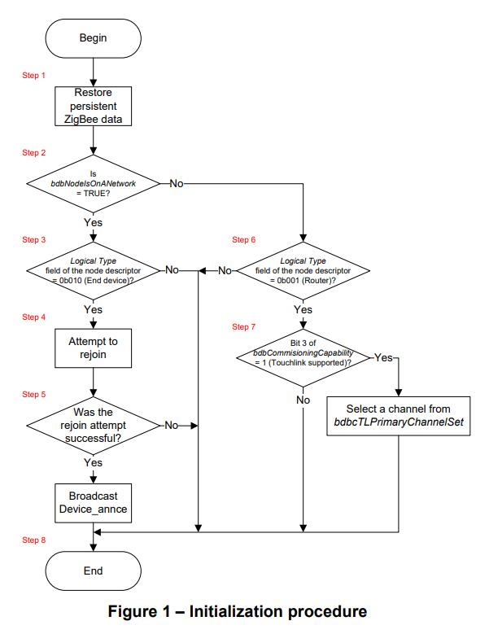

1. 节点应（SHALL）恢复其持久的 ZigBee 数据，如子条款 6.9 中所述。
2. 如果 **bdbNodeIsOnANetwork** 等于 **FALSE**，则节点应（SHALL）从步骤 6 继续。
3. 如果节点的节点描述符的 **logical type** 字段不等于 **0b010**（ZigBee 终端设备），则它应（SHALL）从步骤 8 继续。
4. 节点应（SHALL）尝试重新加入网络。为此，节点发出 **NLME-JOIN.request** 原语（**ExtendedPANId** 参数设置为已知网络的扩展 PAN 标识符、**RejoinNetwork** 设置为 **0x02**、**ScanChannels** 设置为 **0x00000000**、**ScanDuration** 设置为 **0x00**、**CapabilityInformation** 设置为适合节点的值、**SecurityEnable** 设置为 **TRUE**）。在从 NWK 层接收到 **NLME-JOIN.confirm** 原语时，将通知节点其请求的状态。
5. 如果 **NLME-JOIN.confirm** 原语的 **Status** 参数等于 **SUCCESS**，则节点应（SHALL）广播 **Device\_annce** ZDO 命令并从步骤 8 继续。如果 **NLME-JOIN.confirm** 原语的 **Status** 参数不等于 **SUCCESS**，则节点可以（MAY）在某个应用程序特定的时间重试该过程，或者从步骤 8 继续。实现的责任是处理后续的重新加入尝试。
6. 如果节点的节点描述符的 **logical type** 字段不等于 **0b001**（ZigBee 路由器），则它应（SHALL）从步骤 8 继续。
7. 如果 **bdbNodeCommissioningCapability** 的第 3 位等于 **1**（即支持 touchlink），则节点应（SHALL）将其逻辑信道设置为 **bdbcTLPrimaryChannelSet** 中指定的信道之一。
8. 然后节点应（SHALL）终止该初始化过程。

# 8. Commissioning

当节点不在网络上、在网络上但未绑定到另一个设备或在网络上并绑定到另一个设备时，可以（MAY）调用 Commissioning。Commissioning 可以（MAY）通过用户交互、一些空中机制（例如在 **Identify** 簇中定义的）或由应用软件直接调用（例如在初始化后自动调用）来触发。本节中指定的 commissioning 过程定义了调用 commissioning 时的步骤和状态。

实现应（SHALL）提供一种使用网络转向以调用 commissioning 的机制（参见子条款 8.2 和 8.3）。此外，简单设备应（SHALL）提供一种使用查找和绑定以调用 commissioning 的机制（参见子条款 8.5 和 8.6）。同样，如果动态设备支持查找和绑定，那么其应（SHALL）提供一种使用查找和绑定以调用 commissioning 的机制。如果应用程序要求，这些 commissioning 动作可以（MAY）被重载。实现还可以（MAY）为其他 commissioning 动作提供单独的或重载的机制。

通过 **bdbCommissioningMode** 属性控制每个端点的 Commissioning 过程，并且在 commissioning 开始之前，应该（SHOULD）视情况对每个应用刺激进行配置。例如，这允许实现使用网络转向和查找和绑定来重载应用刺激。

## 8.1 顶级 commissioning 过程

本节定义了在某些触发器上激活的顶级 commissioning 过程。

触发器是通过一些应用程序定义的刺激，例如按下按钮或来自用户界面的某些命令。刺激可以是每个端点的，也可以是整个节点的。发生这种情况的标准是制造商特定的。

应用程序通过将所需端点上的 **bdbCommissioningMode** 属性设置为适当的值（请参阅子条款 5.3.2）来配置所需的 commissioning 动作，然后执行下述过程。

Figure 2 展示了此过程的简化版本，以供快速参考。

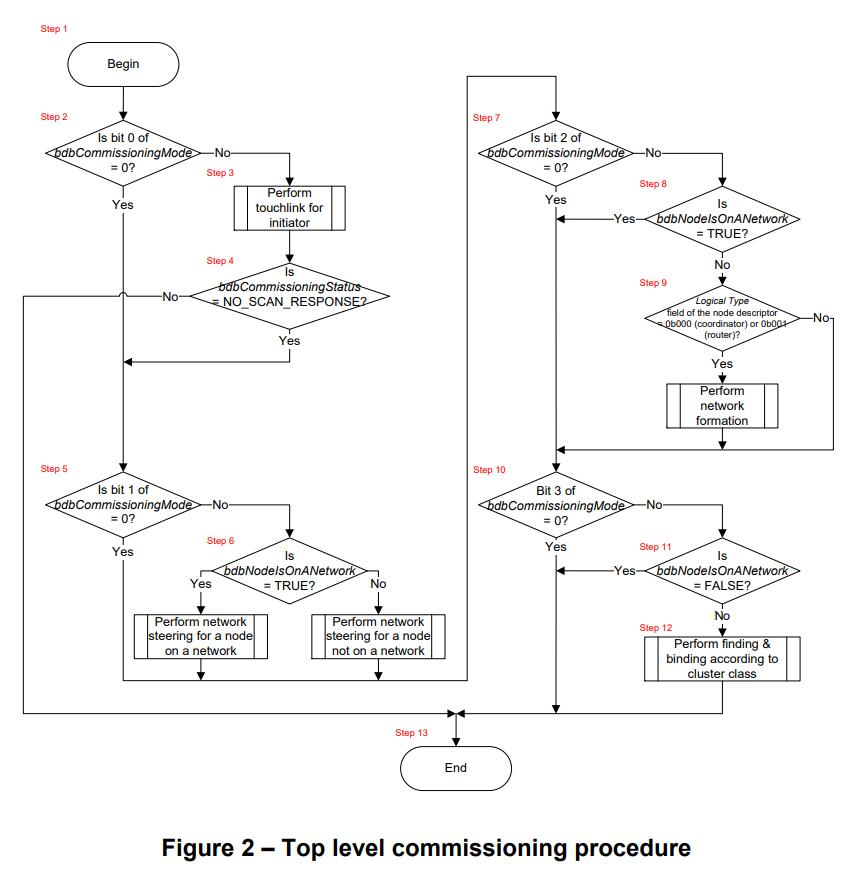

1. 在收到 commissioning 应用刺激后，设备首先将 **bdbCommissioningStatus** 设置为 **SUCCESS**，然后通过检查 **bdbCommissioningMode** 来确定所需的 commissioning 步骤。
2. 如果 **bdbCommissioningMode** 的第 0 位等于 **0**（即无需 touchlink），则设备应（SHALL）从步骤 5 继续。
3. 节点应遵循 touchlink 过程（作为发起者）（参见子条款 8.7）。
4. 如果 **bdbCommissioningStatus** 不等于 **NO\_SCAN\_RESPONSE**（即对来自发起者的 touchlink 扫描请求有响应，表示 touchlink 成功），则设备应（SHALL）从步骤 13 继续。
5. 如果 **bdbCommissioningMode** 的第 1 位等于 **0**（即无需网络转向），则设备应（SHALL）从步骤 7 继续。
6. 如果 **bdbNodeIsOnANetwork** 等于 **TRUE**，则节点应（SHALL）遵循已在网节点的网络转向过程（参见子条款 8.2）。如果 **bdbNodeIsOnANetwork** 等于 **FALSE**，则节点应（SHALL）遵循非在网节点的网络转向过程（参见子条款 8.3）。
7. 如果 **bdbCommissioningMode** 的第 2 位等于 **0**（即无需形成网络），则设备应（SHALL）从步骤 10 继续。
8. 如果 **bdbNodeIsOnANetwork** 等于 **TRUE**，则设备应（SHALL）从步骤 10 继续。
9. 如果节点的节点描述符的 **logical type** 字段等于 **0b000**（ZigBee 协调器）或 **0b001**（ZigBee 路由器），则节点应（SHALL）遵循网络形成过程（参见子条款 8.4）。
10. 如果 **bdbCommissioningMode** 的第 3 位等于 **0**（即无需查找和绑定），则设备应（SHALL）从步骤 13 继续。
11. 如果 **bdbNodeIsOnANetwork** 等于 **FALSE**，则设备应（SHALL）从步骤 13 继续。
12. 如果 **bdbCommissioningMode** 的第 3 位等于 **1**，则该节点应（SHALL）根据（节点上定义的）端点上实现的簇的类别来遵循查找和绑定过程。对于类型 1 客户端或类型 2 服务端簇，应用程序应（SHALL）执行查找和绑定（作为发起者端点）（请参阅子条款 8.6）。相反，对于类型 1 服务端或类型 2 客户端簇，应用程序应（SHALL）执行查找和绑定（作为目标端点）（请参阅子条款 8.5）。请注意，当 commissioning 多个设备端点并且可以并行处理某些设备端点时，应用程序还有责任确定查找和绑定的执行顺序。
13. 设备应（SHALL）终止该顶级 commissioning 过程。

## 8.2 已在网节点的网络转向过程

本节定义已在网节点的网络转向过程。在此过程中，已在网节点将在一段有限的时间内开放网络以允许其他节点加入。

Figure 3 展示了此过程的简化版本，以供快速参考。


1. 节点首先将 **bdbCommissioningStatus** 设置为 **IN\_PROGRESS**。
2. 节点应（SHALL）广播 **Mgmt\_Permit\_Joining\_req** ZDO 命令，**PermitDuration** 字段设置为至少 **bdbcMinCommissioningTime**、**TC\_Significance** 字段设置为 **0x01**。
3. 如果节点的节点描述符的 **logical type** 字段等于 **0b000**（ZigBee 协调器）或 **0b001**（ZigBee 路由器），则节点发出 **NLME-PERMIT-JOINING.request** 原语（**PermitDuration** 参数设置为至少 **bdbcMinCommissioningTime**）。在从 NWK 层接收到 **NLME-PERMIT-JOINING.confirm** 原语时，将通知节点其请求的状态。
4. 然后，节点将 **bdbCommissioningStatus** 设置为 **SUCCESS**，并且它应（SHALL）终止已在网节点的网络转向过程。

## 8.3 非在网节点的网络转向过程

本节定义了非在网节点的网络转向过程。在此过程中，非在网节点将扫描开放网络，并且如果找到合适的节点则尝试加入。加入后，该节点被身份验证并接收网络密钥。最后，如果网络中存在信任中心，则该节点随后会将其预配置链路密钥与信任中心生成的链路密钥交换。

为此过程定义了两个变量：布尔值 **vDoPrimaryScan**，用于控制节点通过 主要信道集/次要信道集 执行信道扫描；32-bit 位映像 **vScanChannels**，用于定义要扫描的当前信道集。

Figure 4 展示了此过程的简化版本，以供快速参考。

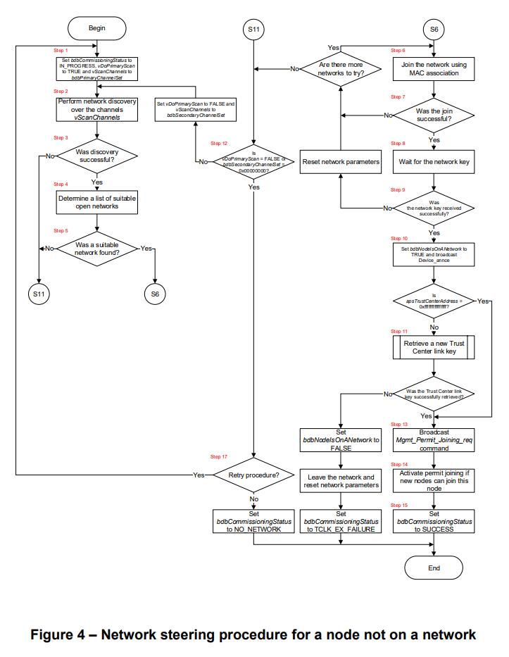

1. 节点首先将 **bdbCommissioningStatus** 设置为 **IN\_PROGRESS**、**vDoPrimaryScan** 设置为 **TRUE**、**vScanChannel** 设置为 **bdbPrimaryChannelSet**。如果 **bdbPrimaryChannelSet** 等于 **0x00000000**，则节点应（SHALL）从步骤 12 继续。
2. 节点应（SHALL）执行信道扫描，以便发现在信道集的无线电范围内可用的网络。为此，节点发出 **NLME-NETWORK-DISCOVERY.request** 原语（**ScanChannels** 参数设置为 **vScanChannels**、**ScanDuration** 设置为 **bdbScanDuration**）。在从 NWK 层接收到 **NLME-NETWORK-DISCOVERY.confirm** 原语时，将通知节点其请求的状态。
3. 如果 **NLME-NETWORK-DISCOVERY.confirm** 原语中的 **Status** 参数不等于 **SUCCESS**，则表示信道扫描不成功，节点应（SHALL）从步骤 12 继续。
4. 节点应（SHALL）通过分析 **NetworkCount** 和 **NetworkDescriptor** 参数来确定是否找到了许可加入标志设置为 **TRUE** 的任何合适网络。由应用程序判定其是否属于合适网络。
5. 如果在信道扫描中未找到合适的网络，则节点应（SHALL）从步骤 12 继续。
6. 节点应（SHALL）尝试加入使用 MAC 关联找到的网络。为此，节点发出 **NLME-JOIN.request** 原语（**ExtendedPANId** 参数设置为所选网络的扩展 PAN 标识符、**RejoinNetwork** 设置为 **0x00**、**ScanChannels** 设置为 **0x00000000**、**ScanDuration** 设置为 **0x00**、**CapabilityInformation** 设置为适合节点的值、**SecurityEnable** 设置为 **FALSE**）。在从 NWK 层接收到 **NLME-JOIN.confirm** 原语时，将通知节点其请求的状态。
7. 如果 **NLME-JOIN.confirm** 原语中的 **Status** 参数不等于 **SUCCESS**，则表示加入不成功，节点应（SHALL）尝试从步骤 6 中加入到下一个合适的网络。注意，允许尝试再次加入同一网络，但这不应（SHALL NOT）连续尝试超过 **bdbcMaxSameNetworkRetryAttempts** 次（建议的（RECOMMENDED）连续次数为 **bdbcRecSameNetworkRetryAttempts**）。如果没有其他合适的网络可加入，则节点应（SHALL）从步骤 12 继续。
8. 如果 **NLME-JOIN.confirm** 原语中的 **Status** 参数等于 **SUCCESS**，则表示加入成功，节点应（SHALL）至少等待 **apsSecurityTimeOutPeriod** 毫秒以进行身份验证，并从其父系接收网络密钥。注意，网络密钥可以从集中式安全网络中的信任中心进行隧道传输，其使用默认的全局信任中心链路密钥或通过安装码派生的预配置链路密钥进行加密；或者直接从分布式安全网络中的父系进行传输，其使用分布式安全全局链路密钥进行加密。节点应（SHALL）相应地设置 **bdbNodeJoinLinkKeyType**，以指示使用那种链路密钥来解密收到的网络密钥。
9. 如果节点在 **apsSecurityTimeOutPeriod** 毫秒内未从其父系中接收到网络密钥、在 **apsSecurityTimeOutPeriod** 毫秒内收到网络密钥但无法解密或以其他方式认证失败，节点应（SHALL）重置其网络参数及选择加入下一个合适的网络并返回到步骤 6。注意，允许尝试再次加入同一网络，但这不应（SHALL NOT）连续尝试超过 **bdbcMaxSameNetworkRetryAttempts** 次（建议的（RECOMMENDED）连续次数为 **bdbcRecSameNetworkRetryAttempts**）。如果没有其他合适的网络可加入，则节点应（SHALL）从步骤 12 继续。
10. 节点将 **bdbNodeIsOnANetwork** 设置为 **TRUE**，然后广播 **Device\_annce** ZDO 命令。如果 **apsTrustCenterAddress** 等于 **0xffffffffffffffff**，则节点应（SHALL）从步骤 13 继续。
11. 节点应（SHALL）执行检索新信任中心链路密钥的过程（请参阅子条款 10.2.5）。如果该过程成功，则节点应（SHALL）从步骤 13 继续。如果不成功，则节点应（SHALL）在其旧网络上执行离开请求并重置其网络参数。然后，该节点将 **bdbNodeIsOnANetwork** 设置为 **FALSE**，并将 **bdbCommissioningStatus** 设置为 **TCLK\_EX\_FAILURE**。为了执行离开请求，节点会将 **NWME-LEAVE.request** 原语发布到 NWK 层（**DeviceAddress** 参数设置为 **NULL**、**RemoveChildren** 设置为 **FALSE**、**Rejoin** 设置为 **FALSE**）。在收到 **NLME-LEAVE.confirm** 原语时，将通知节点其请求的状态。然后，节点应（SHALL）终止非在网节点的网络转向过程。
12. 如果 **vDoPrimaryScan** 等于 **FALSE** 或 **bdbSecondaryChannelSet** 等于 **0x00000000**，则节点应（SHALL）从步骤 16 继续。如果 **bdbSecondaryChannelSet** 不等于 **0x00000000**，则节点应（SHALL）将 **vDoPrimaryScan** 设置为 **FALSE**、**vScanChannels** 设置为 **bdbSecondaryChannelSet** 并从步骤 2 继续。
13. 节点应（SHALL）广播 **Mgmt\_Permit\_Joining\_req** ZDO 命令（**PermitDuration** 字段设置为至少 **bdbcMinCommissioningTime**、**TC\_Significance** 设置为 **0x01**）。注意，这将导致接收此命令的节点重置定时器，在此期间，其许可加入标志被激活，从而延长了其他新节点的加入时间。
14. 如果节点能够允许新节点加入，则它应（SHALL）激活其许可加入标志。为此，节点发出 **NLME-PERMIT-JOINING.request** 原语（**PermitDuration** 参数设置为至少 **bdbcMinCommissioningTime**）。在从 NWK 层接收到 **NLME-PERMIT-JOINING.confirm** 原语时，将通知节点其请求的状态。
15. 然后，节点将 **bdbCommissioningStatus** 设置为 **SUCCESS**。如果节点支持 **touchlink**，则它会将 **aplFreeNwkAddrRangeBegin**、**aplFreeNwkAddrRangeEnd**、**aplFreeGroupID-RangeBegin** 和 **aplFreeGroupIDRangeEnd** 属性的值全部设置为 **0x0000**（表示节点已使用 MAC 关联加入网络）。然后，节点应（SHALL）终止非在网节点的网络转向过程。
16. 节点可以（MAY）使用某些制造商特定的过程进行重试或将 **bdbCommissioningStatus** 设置为 **NO\_NETWORK**，然后它应（SHALL）终止非在网节点的网络转向过程。如果尝试制造商特定的过程，则 **bdbCommissioningStatus** 和 **bdbNodeIsOnANetwork** 属性会在其终止时相应地更新，以便使 commissioning 过程保持一致性。

## 8.4 网络形成过程

本节定义了节点的网络形成过程。在此过程中，ZigBee 协调器节点形成集中式安全网络并激活其信任中心功能，而 ZigBee 路由器节点则形成分布式安全网络。

为此过程定义了两个变量：布尔值 **vDoPrimaryScan**，用于控制节点通过 主要信道集/次要信道集 执行信道扫描；32-bit 位映像 **vScanChannels**，用于定义要扫描的当前信道集。

Figure 5 展示了此过程的简化版本，以供快速参考。


1. 节点首先将 **bdbCommissioningStatus** 设置为 **IN\_PROGRESS**、**vDoPrimaryScan** 设置为 **TRUE**、**vScanChannel** 设置为 **bdbPrimaryChannelSet**。如果 **bdbPrimaryChannelSet** 等于 **0x00000000**，则节点应（SHALL）从步骤 4 继续。
2. 节点应（SHALL）尝试在其中一个指定的信道上形成网络。为此，节点发出 **NLME-NETWORK-FORMATION.request** 原语（**ScanChannels** 参数设置为 **vScanChannels**、**ScanDuration** 设置为 **bdbScanDuration**、**BeaconOrder** 设置为 **0x0f**、**SuperframeOrder** 设置为 **0x00**、**BatteryLifeExtension** 设置为 **FALSE**）。在从 NWK 层接收到 **NLME-NETWORK-FORMATION.confirm** 原语时，将通知节点其请求的状态。
3. 如果 **NLME-NETWORK-FORMATION.confirm** 原语的 **Status** 参数等于 **SUCCESS**，则表示已形成新网络，节点应（SHALL）从步骤 5 继续。
4. 如果 **vDoPrimaryScan** 等于 **FALSE** 或 **bdbSecondaryChannelSet** 等于 **0x00000000**，则节点应（SHALL）从步骤 8 继续。如果 **bdbSecondaryChannelSet** 不等于 **0x00000000**，则节点应（SHALL）将 **vDoPrimaryScan** 设置为 **FALSE**、**vScanChannels** 设置为 **bdbSecondaryChannelSet** 并从步骤 2 继续。
5. 节点将 **bdbNodeIsOnANetwork** 设置为 **TRUE**。如果节点的节点描述符的 **logical type** 字段不等于 **0b000**（ZigBee 协调器），则节点应（SHALL）从步骤 7 继续。
6. ZigBee 协调器节点应（SHALL）启动其信任中心功能（根据 \[R1\] 的子条款 4.6.1）。
7. 节点将 **bdbCommissioningStatus** 设置为 **SUCCESS**，并且应（SHALL）终止网络形成过程。
8. 节点将 **bdbCommissioningStatus** 设置为 **FORMATION\_FAILURE**，并且应（SHALL）终止网络形成过程。

## 8.5 目标端点的查找和绑定过程

本节定义了对目标端点的查找和绑定过程。在此过程中，目标端点在有限的持续时间内标识自身，然后处理来自发起者端点的后续查找和绑定请求。

Figure 6 展示了此过程的简化版本，以供快速参考。

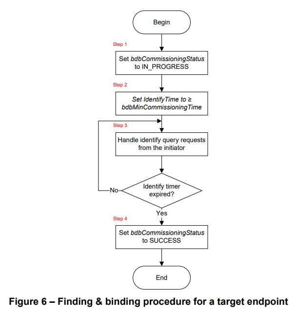

1. 目标设备首先将 **bdbCommissioningStatus** 设置为 **IN\_PROGRESS**。
2. 目标设备应（SHALL）将 **Identify** 簇的 **IdentifyTime** 属性设置为至少 **bdbcMinCommissioningTime**。目标设备还可以（MAY）在任何其他标识端点上将 **Identify** 簇的 **IdentifyTime** 属性设置为至少 **bdbcMinCommissioningTime**。
3. 在 **IdentifyTime** 期间，目标设备应（SHALL）响应标识查询。标识查询可能会跟随其他查找和绑定命令；无论标识状态如何，都应（SHALL）对其进行处理。
4. 当 **IdentifyTime** 属性递减到零时，目标设备将 **bdbCommissioningStatus** 设置为 **SUCCESS**，并且它应（SHALL）终止目标端点的查找和绑定过程。

## 8.6 发起者端点的查找和绑定过程

本节定义了发起者端点的查找和绑定过程。在此过程中，发起者端点首先搜索正在标识目标端点，如果找到则请求其简单描述符。然后，发起者端点在其自身与目标端点之间搜索任何匹配的簇，并且在其绑定表中为找到的每个匹配创建相应的条目。如果请求分组绑定，则发起者端点配置目标端点的分组成员身份。

Figure 7 展示了此过程的简化版本，以供快速参考。

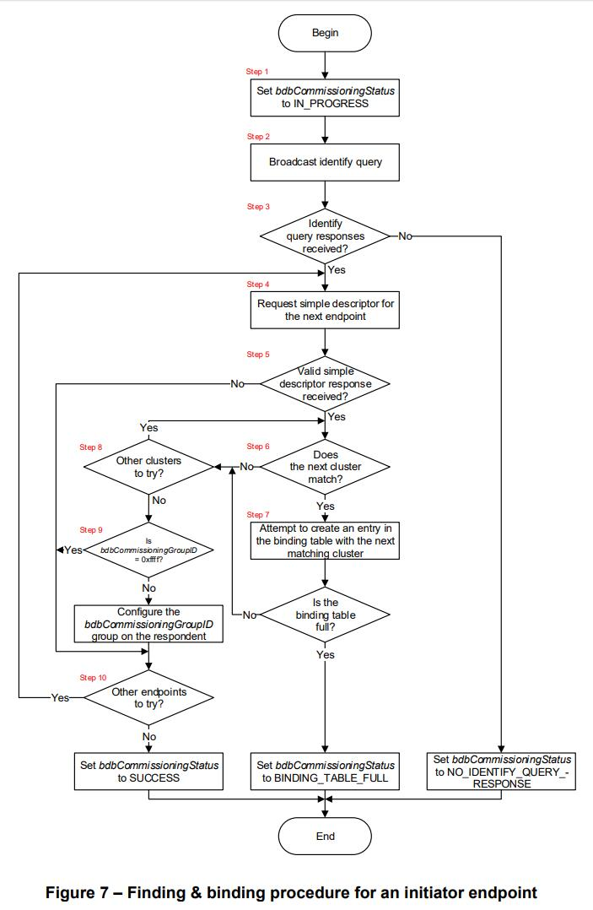

1. 发起者设备首先将 **bdbCommissioningStatus** 设置为 **IN\_PROGRESS**。
2. 发起者设备应（SHALL）将发起者端点的 **Identify** 簇的 **Identify Query** 命令广播到所有节点（即使用广播地址 0xffff）。发起者设备可以（MAY）一次或多次地广播该命令。
3. 如果没有收到 **Identify** 簇的 **Identify Query Response** 命令，则发起者设备将 **bdbCommissioningStatus** 设置为 **NO\_IDENTIFY\_QUERY\_RESPONSE**，并且应（SHALL）终止发起者端点的查找和绑定过程。如果至少接收到一个 **Identify** 簇的 **Identify Query Response** 命令，则发起者设备应（SHALL）注意每个传入帧（来自作出响应的目标设备，其被称为 “响应者”）的 NWK 地址（包含在 NWK 报头的 **source address** 字段中）和端点（包含在 APS 报头的 **source endpoint** 字段中的）。
4. 发起者设备应（SHALL）从响应者中获取下一个响应端点的简单描述符。为此，发起者设备应（SHALL）将 **Simple\_Desc\_req** ZDO 命令单播到响应者（**NWKAddrOfInterest** 字段设置为响应者的 NWK 地址、**EndPoint** 设置为被寻址端点的标识符（从响应者的 **Identify** 簇的 **Identify Query Response** 命令的 APS 报头中找到））。
5. 如果未从响应者中接收到 **Simple\_Desc\_rsp** ZDO 命令或者接收到 **Status** 字段不等于 **SUCCESS** 的 **Simple\_Desc\_rsp** ZDO 命令，则发起者设备应（SHALL）从步骤 10 继续。
6. 发起者应（SHALL）检查响应者的简单描述符的 **Application Input Cluster List** 或 **Application Output Cluster List** 字段中列出的下一个应用目标簇，如果发起者设备不支持相应的 客户端/服务端 簇，则发起者设备应（SHALL）从步骤 8 继续。
7. 如果发起者是一个简单设备，它应（SHALL）为该簇创建一个绑定表条目。相反，如果发起者不是一个简单设备，则它可以（MAY）为该簇创建一个绑定表条目。如果要创建一个单播绑定表条目（即如果 **bdbCommissioningGroupId** 等于 **0xffff**）并且响应者的 IEEE 地址是未知的，则发起者应（SHALL）在创建绑定之前使用 **IEEE\_addr\_req** ZDO 命令获取它。为了创建一个绑定表条目，发起者设备将发出 **APSME-BIND.request** 原语（**SrcAddr** 参数设置为发起者设备的 IEEE 地址（**aExtendedAddress**）、**SrcEndpoint** 设置为发起者端点的标识符、**ClusterId** 设置为匹配簇的标识符）。**DstAddrMode** 和 **DstAddr** 参数应（SHALL）分别设置为 **0x01** 和 **bdbCommissioningGroupId**（如果 **bdbCommissioningGroupId** 不等于 **0xffff**）或 **0x03** 和响应者的已知 IEEE 地址（如果 **bdbCommissioningGroupId** 等于 **0xffff**）。只有当 **bdbCommissioningGroupId** 等于 **0xffff** 时，才应该（SHOULD）包含 **DstEndpoint** 参数并将其设置为（已找到的匹配簇）响应者上的端点的标识符。在从 APS 子层接收到 **APSME-BIND.confirm** 原语时，将通知发起者设备其请求的状态。如果 **APSME-BIND.confirm** 原语的 **Status** 参数等于 **TABLE\_FULL**，则设备将 **bdbCommissioningStatus** 设置为 **BINDING\_TABLE\_FULL**，并且它（SHALL）应终止发起者端点的查找和绑定过程。
8. 如果从简单描述符中发现了更多匹配的簇，则发起者设备应（SHALL）选择下一个并从步骤 6 继续。
9. 如果 **bdbCommissioningGroupID** 不等于 **0xffff**，并且至少创建了一个绑定链路，则发起者设备应（SHALL）单播 **groups** 簇的 **add group** 命令到响应者；或广播 **groups** 簇的 **add group if identifying** 命令（**Group ID** 字段设置为 **bdbCommissioningGroupID**）。
10. 如果通过 **Identify Query** 命令发现了更多端点，则发起者设备应（SHALL）选择下一个端点并从步骤 4 继续。如果没有其他端点可供选择，则发起者设备将 **bdbCommissioningStatus** 设置为 **SUCCESS**，并且它应（SHALL）终止发起者端点的查找和绑定过程。注意：如果应用需要，发起者可以（MAY）发送 **Identify** 簇的 **Identify** 命令到所有标识目标（**IdentifyTime** 字段设置为 **0x0000**（停止标识过程））。

## 8.7 发起者的 Touchlink 过程

本节定义了发起者的 touchlink 过程。在此过程中，发起 touchlink 操作的节点称为 “发起者”，响应的节点称为 “目标”。发起者还扫描支持 touchlink 的节点，如果找到，就会与目标建立一个新的网络（如果发起者不在网络上）或将目标添加到网络（如果发起者已经在网络上）。

为此过程定义了三个变量：布尔值 **vDoPrimaryScan**，用于控制节点通过 主要信道集/次要信道集 执行信道扫描；32-bit 位映像 **vScanChannels**，用于定义要扫描的当前信道集；**vIsFirstChannel** 控制是否使用第一个信道执行前五个 touchlink commissioning 扫描。

发起者的 touchlink 过程可以执行 “normal” 信道扫描或 “extended” 信道扫描。如果需要重置为 factory new（参见子条款 9.2），或者目标可能在 **bdbcTLPrimaryChannelSet** 中定义的信道之外运行，则使用后者。对于常规信道扫描，**bdbPrimaryChannelSet** 和 **bdbSecondaryChannelSet** 应（SHALL）分别设置为 **bdbcTLPrimaryChannelSet** 和 **0x00000000**。对于扩展信道扫描，**bdbPrimaryChannelSet** 和 **bdbSecondaryChannelSet** 应（SHALL）分别设置为 **bdbcTLPrimaryChannelSet** 和 **bdbcTLSecondaryChannelSet**。

Figure 8 展示了此过程的简化版本，以供快速参考。

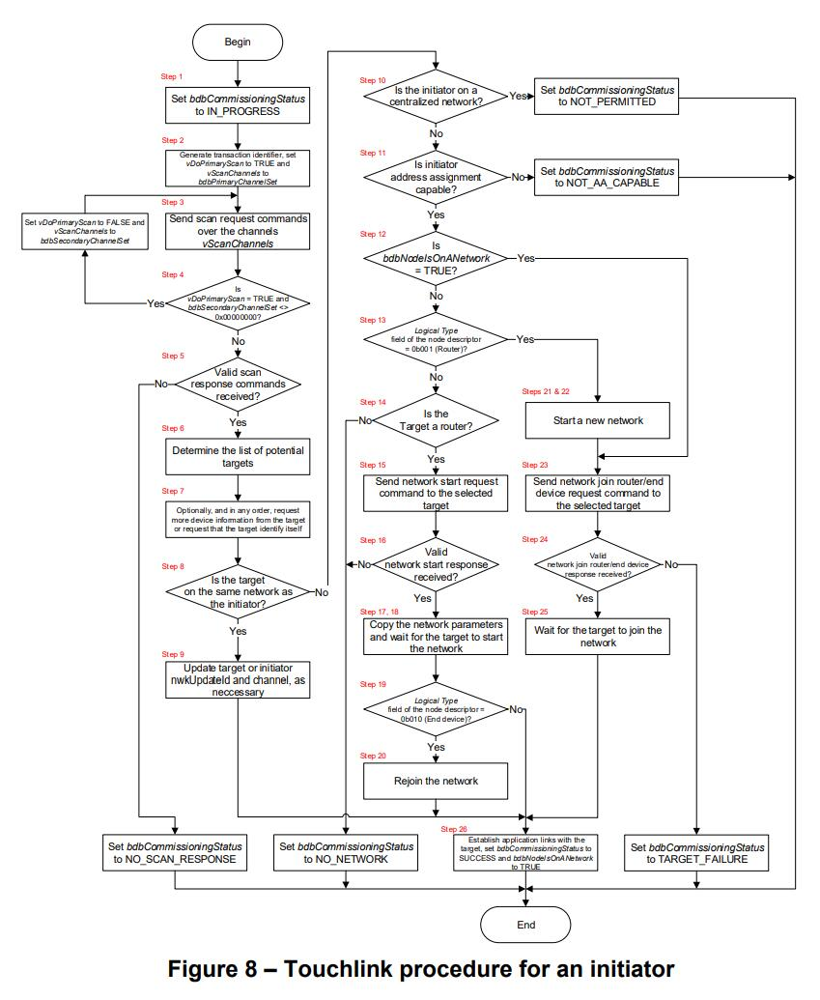

1. 发起者首先将 **bdbCommissioningStatus** 设置为 **IN\_PROGRESS**。
2. 发起者应（SHALL）生成一个 32-bit 事务标识符，在 touchlink 过程中使用的所有命令的 **inter-PAN transaction identifier** 字段中使用该标识符。事务标识符应（SHALL）是随机的、非零的和非顺序的。然后，发起者将 **vDoPrimaryScan** 设置为 **TRUE**、**vScanChannel** 设置为 **bdbPrimaryChannelSet**、**vIsFirstChannel** 设置为 **TRUE**。如果 **bdbPrimaryChannelSet** 等于 **0x00000000**，则节点应（SHALL）从步骤 4 继续。
3. 发起者应（SHALL）执行 touchlink 设备发现。如果 **vIsFirstChannel** 等于 **TRUE**，则发起者应（SHALL）将 **vIsFirstChannel** 设置为 **FALSE**，切换到 **vScanChannels** 定义的第一个通道，并广播五个连续的 **touchlink commissioning** 簇的 **scan request** inter-PAN 命令帧。然后，发起者应（SHALL）依次切换到 **vScanChannel** 中指定的每个剩余信道，并在每个信道上广播单个 **scan request** inter-PAN 命令帧。被广播的每个 **scan request** inter-PAN 命令帧应（SHALL）带有合适的 **ZigBee information** 和 **touchlink information** 字段值，并且带有一个 **0dBm** 的标称输出功率。每次传输后，发起者应（SHALL）等待 **bdbcTLScanTimeBaseDuration** 秒以接收任何响应。如果在扫描期间，发起者（**bdbNodeIsOnANetwork** 属性等于 **FALSE**）接收到另一个 **scan request** inter-PAN 命令帧（**touchlink information** 字段的 **factory new** 子字段等于 **1**），则应（SHALL）忽略它。相反，如果在扫描期间，发起者（**bdbNodeIsOnANetwork** 属性等于 **FALSE**）接收到另一个 **scan request** inter-PAN 命令帧（**touchlink information** 字段的 **factory new** 子字段等于 **0**），则它可以（MAY）停止发送自己的 **scan request** inter-PAN 命令帧并承担一个目标的角色（参见子条款 8.8），用一个 **touchlink commissioning** 簇的 **scan response** inter-PAN 命令帧进行响应，并为后续的 **touchlink** 命令帧而保持在同一信道上。Touchlink 设备发现可以（MAY）随时中止。由于没有更改任何节点参数（如网络设置），因此该步骤对所涉及的节点是非侵入式的。
4. 如果 **vDoPrimaryScan** 等于 **TRUE** 且 **bdbSecondaryChannelSet** 不等于 **0x00000000**，则节点将 **vDoPrimaryScan** 设置为 **FALSE**、**vScanChannels** 设置为 **bdbSecondaryChannelSet**，并且它应（SHALL）从步骤 3 继续。
5. 如果没有接收到 **touchlink commissioning** 簇的 **scan response** inter-PAN 命令帧，或者没有接收到 **touchlink commissioning** 簇的 **scan response** inter-PAN 命令帧（**inter-PAN transaction identifier** 字段等于发起者在其 **scan request** inter-PAN 命令帧中使用的值），则节点将 **bdbCommissioningStatus** 设置为 **NO\_SCAN\_RESPONSE**，它应（SHALL）终止发起者的 touchlink 过程。
6. Touchlink 设备发现可能导致多个 **touchlink commissioning** 簇的 **scan response** inter-PAN 命令帧在潜在目标列表中给出，应用程序通过某些特定的产品方式从中选择一个目标以进一步地进行处理。如果 **touchlink commissioning** 簇的 **scan response** inter-PAN 命令帧的 **touchlink information** 字段的 **touchlink priority request** 位等于 **1**，则发起者可以（MAY）考虑优先对这些节点进行处理。
7. 在任何顺序下，如果需要，发起者都可以（MAY）从目标中请求更多的设备信息，或者请求所选目标识别自己以便支持用户确认。为了从目标中请求更多的设备信息，发起者应（SHALL）生成和传输一个 **touchlink commissioning** 簇的 **device information request** inter-PAN 命令帧到合适的已发现目标，并等待一个相应的 **touchlink commissioning** 簇的 **device information response** inter-PAN 命令帧（注意，如果目标只有一个子设备，则这不是必需的，因为它的信息完全包含在 **scan response** 命令帧中）。为了请求目标标识自己，发起者应（SHALL）生成和传输一个 **touchlink commissioning** 簇的 **identify request** inter-PAN 命令帧到合适的已发现目标。发起者可以（MAY）向所选目标进一步地发送 **identify request** inter-PAN 命令帧，例如，要停止标识操作，前提是它可以在 touchlink 事务开始的 **bdbcTLInterPANTransIdLifetime** 秒内完成。如果这不可能，则应（SHALL）执行新的 touchlink 设备发现操作。
8. 如果 **scan response** 命令帧的 **extended PAN identifier** 字段不等于 **nwkExtendedPANID**（即目标与发起者不在同一网络上），则发起者应（SHALL）从步骤 10 继续。
9. 如果 **scan response** 命令帧的 **network update identifier** 字段低于 **nwkUpdateId**（即目标已错过了信道变更），则发起者应（SHALL）生成和传输一个 **touchlink commissioning** 簇的 **network update request** 命令帧到目标（**network update identifier** 字段设置为 **nwkUpdateId**、**logical channel** 设置为发起者的当前操作信道）。如果 **scan response** 命令帧的 **network update identifier** 字段高于 **nwkUpdateId**（即发起者已错过了信道变更），则发起者应（SHALL）将 **nwkUpdateId** 及其当前操作信道分别设置为 **scan response** 命令帧的 **network update identifier** 和 **logical channel** 的值。发起者应（SHALL）从步骤 26 继续。
10. 如果 **apsTrustCenterAddress** 的值不等于 **0xffffffffffffffff**（即发起者位于集中式安全网络上），则发起者将 **bdbCommissioningStatus** 设置为 **NOT\_PERMITTED**，并且它应（SHALL）终止发起者的 touchlink 过程。
11. 如果发起者不具 touchlink 地址分配能力，则将 **bdbCommissioningStatus** 设置为 **NOT\_AA\_CAPABLE**，并且它应（SHALL）终止发起者的 touchlink 过程。
12. 如果 **bdbNodeIsOnANetwork** 等于 **TRUE**，则发起者应（SHALL）从步骤 23 继续。
13. 如果发起者的节点描述符的  **logical type** 字段等于 **0b001**（ZigBee 路由器），则发起者应（SHALL）从步骤 21 继续。
14. 如果所选目标不是 ZigBee 路由器，则发起者将 **bdbCommissioningStatus** 设置为 **NO\_NETWORK**，并且它应（SHALL）终止发起者的 touchlink 过程。
15. 发起者应（SHALL）生成和单播 **touchlink commissioning** 簇的 **network start request** inter-PAN 命令帧到所选的目标。发起者应（SHALL）将 **logical channel** 字段设置为零（指示目标应该选择信道）或设置为 **bdbcTLPrimaryChannelSet** 中的信道（如果首选是特定的主要信道）。发起者应（SHALL）将 **extended PAN identifier** 和 **PAN identifier** 字段设置为零。发起者还应（SHALL）分别将 **initiator IEEE address** 和 **initiator network address** 字段设置为它的 IEEE 地址和它将在新网络上使用的网络地址。所有其他字段应（SHALL）根据第 8.7.1 小节指定。
16. 发起者应（SHALL）启用其接收器并等待最多 **bdbcRxWindowDuration** 秒，或直到从预期目标中接收到相应的 **network start response** inter-PAN 命令帧（**inter-PAN transaction identifier** 字段与发起者在 **scan request** 命令帧中使用的一致）。如果在 **bdbcRxWindowDuration** 秒内未收到相应的 **network start response** inter-PAN 命令帧，或者如果在 **bdbcRxWindowDuration** 秒内收到相应的 **network start response** inter-PAN 命令帧但其 **Status** 参数为非零值，则发起者将 **bdbCommissioningStatus** 设置为 **NO\_NETWORK**，并且它应（SHALL）终止发起者的 touchlink 过程。
17. 在接收到 **network start response** inter-PAN 命令帧（**Status** 参数为 **SUCCESS**）时，发起者应（SHALL）将这些参数复制到其网络信息库中。发起者应（SHALL）确定 **apsDeviceKeyPairSet** 中是否存在一个条目（**DeviceAddress** 字段对应为 **0xffffffffffffffff**）。如果此条目不存在，则发起方应（SHALL）创建一个新条目（**DeviceAddress** 字段设置为 **0xffffffffffffffff**、**apsLinkKeyType** 字段设置为 **0x01**、**LinkKey** 字段设置为分布式安全全局链路密钥、**OutgoingFrameCounter** 和 **IncomingFrameCounter** 字段设置为 **0**）。
18. 发起者应（SHALL）至少等待 **bdbcTLMinStartupDelayTime** 秒以允许目标启动网络。
19. 如果发起者的节点描述符的 **logical type** 字段不等于 **0b010**（ZigBee 终端设备）或者没有发送 **network start request** inter-PAN 命令帧，则发起者应（SHALL）从步骤 26 继续。
20. 发起者应（SHALL）执行网络重新加入请求。为此，发起者发出 **NLME-JOIN.request** 原语（**ExtendedPANId** 参数设置为所选网络的扩展 PAN 标识符、**RejoinNetwork** 设置为 **0x02**（该节点使用 NWK 重新加入过程加入网络）、**ScanChannels** 设置为 **0x00000000**、**ScanDuration** 设置为 **0x00**、**CapabilityInformation** 设置为适合节点的值、**SecurityEnable** 设置为 **TRUE**）。在从 NWK 层接收到 **NLME-JOIN.confirm** 原语时，将通知发起者其请求的状态。然后，发起者应（SHALL）从步骤 26 继续。
21. 发起者应（SHALL）执行网络发现以建立网络参数。为此，发起者将 **NWME-NETWORK-DISCOVERY.request** 原语发布到 NWK 层（**ScanChannels** 参数设置为 **bdbcTLPrimaryChannelSet**、**ScanDuration** 设置为 **bdbScanDuration**）。在从 NWK 层接收到 **NLME-NETWORK-DISCOVERY.confirm** 原语时，将结果通知发起者。基于这些结果，发起者应（SHALL）为网络的逻辑信道、PAN 标识符和扩展 PAN 标识符选择合适的值。
22. 发起者应（SHALL）将新网络参数复制到其网络信息库，并在新网络上开始操作。为此，发起者将 **NLME-START-ROUTER.request** 原语发布到 NWK 层（**BeaconOrder** 参数设置为 **0x0f**、**SuperframeOrder** 设置为 **0x00**、**BatteryLifeExtension** 设置为 **FALSE**）。在收到 **NLME-START-ROUTER.confirm** 原语后，将通知发起者其请求的状态。
23. 发起者应（SHALL）根据目标是 ZigBee 路由器还是 ZigBee 终端设备，分别生成和单播 **touchlink commissioning** 簇的 **network join router request** 或 **network join end device** inter-PAN 命令帧（**extended PAN identifier**、**network update identifier**、**logical channel** 和 **PAN identifier** 字段设置为发起者使用的相应网络参数值）到所选目标。所有其他字段应（SHALL）根据第 8.7.1 小节指定。
24. 发起者应（SHALL）启用其接收器并等待最多 **bdbcRxWindowDuration** 秒或直到从预期目标接收到相应的 **response** inter-PAN 命令帧（**inter-PAN transaction identifier** 字段与发起者在 **scan request** 命令帧中使用的一致）。**network join router request** 和 **network join end device request** 命令帧对应的响应分别是 **touchlink commissioning** 簇的 **network join router response** 和 **network join end device response** 命令帧。如果在 **bdbcRxWindowDuration** 秒内未收到相应的 **response** inter-PAN 命令帧，或者在 **bdbcRxWindowDuration** 秒内收到相应的 **response** inter-PAN 命令帧但其 **Status** 参数为非零值，则发起者将 **bdbCommissioningStatus** 设置为 **TARGET\_FAILURE**，并且它应（SHALL）终止发起者的 touchlink 过程。
25. 发起者应（SHALL）至少等待 **bdbcTLMinStartupDelayTime** 秒，以允许目标正确地启动网络或在网络上开始操作。
26. 如果发起者是一个简单设备，它应（SHALL）在绑定表中建立到目标的绑定链路。相反，如果发起者不是一个简单设备，则它可以（MAY）在绑定表中建立到目标的绑定链路。如果要建立绑定链路，则发起者应（SHALL）基于在 **scan response** 和/或 **device information response** inter-PAN 命令帧中接收的端点和设备标识符信息，在绑定表中为发起者上的 客户端/服务端 簇与目标上对应的 服务端/客户端 簇建立绑定链路。发起者将 **bdbCommissioningStatus** 设置为 **SUCCESS**，**bdbNodeIsOnANetwork** 设置为 **TRUE**，并且它应（SHALL）终止发起者的 touchlink 过程。

### 8.7.1 网络 启动/加入 命令的常规字段设置

#### 8.7.1.1 Inter-PAN transaction identifier 字段

**Inter-PAN transaction identifier** 字段应（SHALL）设置为 **scan request** 命令帧中使用的相同值。

#### 8.7.1.2 Key index 和 encrypted network key 字段

**Key index** 字段应（SHALL）设置为与 **encrypted network key** 字段（即 touchlink 预配置链路密钥）中用于加密 ZigBee 网络密钥的密钥相对应的 touchlink 密钥索引（参见 \[R2\]）。在认证测试期间，该值应（SHALL）设置为 **0x04**，或在其他所有时间设置为 **0x0f**。

**encrypted network key** 字段应（SHALL）包含已加密的 ZigBee 网络密钥已保护网络。ZigBee 网络密钥应（SHALL）使用 touchlink 预配置链路密钥进行加密。

#### 8.7.1.3 Network address 字段

**Network address** 字段应（SHALL）设置为目标在网络上操作的网络地址。

如果 **aplFreeNwkAddrRangeBegin** 属性（参见 \[R2\]）的值等于 **0x0000**（指示发起者已使用 MAC 关联加入网络），则地址应（SHALL）根据经典的 ZigBee 机制随机生成。如果 **aplFreeNwkAddrRangeBegin** 属性的值不等于 **0x0000**，则地址应（SHALL）等于 **aplFreeNwkAddrRangeBegin**，然后该值应（SHALL）递增。

#### 8.7.1.4 Group identifiers begin/end 字段

**Group identifiers begin** 和 **Group identifiers end** 字段应（SHALL）设置为分配给目标的分组标识符的允许范围。

如果目标在其 **scan response** 命令帧中请求了一组分组标识符，并且 **aplFreeGroupIDAddrRangeBegin** 属性（参见 \[R2\]）的值等于 **0x0000**（发起者已使用 MAC 关联加入网络），则 **group identifiers begin** 和 **group identifiers end** 字段应（SHALL）设置为 **0x0000**。如果目标在其 **scan response** 命令帧中请求了一组分组标识符，并且 **aplFreeGroupIDAddrRangeBegin** 属性的值不等于 **0x0000**，则应（SHALL）为目标分配分组标识符范围，并且 **group identifiers begin** 和 **group identifiers end** 字段应相应地设置。

#### 8.7.1.5 Free network/group address range begin/end 字段

**Free network address range begin**、**Free network address range end**、**Free group identifier range begin** 和 **Free group identifier range end** 字段应（SHALL）设置为网络地址的允许范围和分配给目标的分组标识符，以便将来分配给加入设备。

如果目标指示其 **scan response** 命令帧中的地址分配能力且 **aplFreeNwkAddrRangeBegin** 属性（参见 \[R2\]）的值等于 **0x0000**，则 **Free network address range begin**、**Free network address range end**、**Free group identifier range begin** 和 **Free group identifier range end** 字段应（SHALL）设置为 **0x0000**。如果目标指示其 **scan response** 命令帧中的地址分配能力且 **aplFreeNwkAddrRangeBegin** 属性的值不等于 **0x0000**，则应（SHALL）为目标分配网络地址和分组标识符，以用于其自身目的，并且 **Free network address range begin**、**Free network address range end**、**Free group identifier range begin** 和 **Free group identifier range end** 字段应相应地设置。

## 8.8 目标的 Touchlink 过程

本节定义了目标的 touchlink 过程。在此过程中，目标响应来自发起者的 touchlink 请求，并启动新网络或加入发起者的网络。由于此过程是对来自发起者的 touchlink 请求的响应，因此不通过顶级 commissioning 过程策动。

目标不应（SHALL NOT）更改其给定的网络地址，除非它离开并加入到另一个网络，或者需要解决地址冲突时，它可以这样做。

如果目标是正在睡眠的 ZigBee 终端设备，则它应（SHALL）首先需要被某些应用程序唤醒，以便它能够启用其接收器并响应来自发起者的扫描。

在当前事务完成之前，如果目标接收到额外的 **touchlink commissioning** 簇的 **scan request** 命令帧，则它可以（MAY）从头开始再次重新启动该过程或丢弃该帧。

注意，简单地接受 **touchlink commissioning** 簇的 **network start request** 和 **network join router/end device request** 命令帧可能会导致不希望的应用行为（目标离开它当前网络并加入到另一个网络，这在 touchlink 中被称为偷窃（stealing））。因此，该过程允许目标不接受这些命令，并通过设置相应的 **touchlink commissioning** 簇的 **network start response** 或 **network join router/end device** 命令帧的 **Status** 字段来指示这一点，以指示失败。

**network start request**、**network join router/end device request** 和 **network update request** 命令帧是否被接受的条件是（制造商）产品特定的。这里可以在安全性（例如当节点是集中式安全网络的一部分时不允许被偷窃）和用户友好性（例如总是允许节点被偷窃）之间进行平衡，因为专用的和消费者的应用都存在不同的要求。

为此过程定义了一个变量：32-bit 无符号整数 **vIPTransID**，用于存储传入的 **touchlink commissioning** 簇的 **scan request** inter-PAN 命令帧的 **inter-PAN transaction identifier** 字段。

Figure 9 展示了此过程的简化版本，以供快速参考。

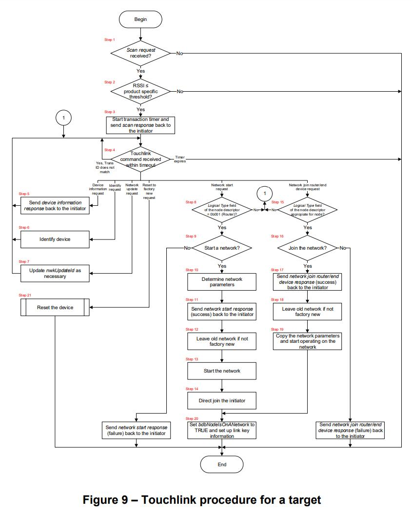

1. 在接收到 **touchlink commissioning** 簇的 **scan request** inter-PAN 命令帧之外的其他命令时，目标应（SHALL）终止目标的 touchlink 过程。
2. 目标将 **vIPTransID** 设置为 **inter-PAN transaction identifier** 字段的值，并且它应（SHALL）确定是否要响应。如果接收到 **scan request** 命令（RSSI 小于或等于某些产品特定的阈值）或者 **touchlink information** 字段的 **link initiator** 子字段等于 **0**，则目标应（SHALL）丢弃该帧并终止目标的 touchlink 过程。
3. 目标在 **bdbcTLInterPANTransIdLifetime** 秒后启动当前事务的定时器直到期满。随后，目标应（SHALL）生成和单播 **touchlink commissioning** 簇的 **scan response** inter-PAN 命令帧回发起者。**inter-PAN transaction identifier** 字段应（SHALL）设置为 **vIPTransID**。**RSSI correction** 字段应（SHALL）设置为产品特定的 RSSI 校正值，以便补偿无线电和产品外侧间的 RF 信号损耗。然后，发起者可以将此值与来自每个发现目标的 RSSI 结合使用，以选择合适的目标以继续进行 touchlink commissioning。如果目标希望在 touchlinking 期间被发起者优先考虑，则 **touchlink information** 字段的 **touchlink priority request** 子字段应（SHALL）被设置为 **1**（例如如果目标是功率受限并且在用户按下按钮后响应扫描）。**response identifier** 字段应（SHALL）设置为随机（非顺序）值。如果目标节点描述符的 **logical type** 字段等于 **0b001**（ZigBee 路由器）并且 **bdbNodeIsOnANetwork** 等于 **TRUE**，则 **extended PAN identifier**、**network update identifier**、**logical channel**、**PAN identifier** 和 **network address** 字段应（SHALL）设置为目标当前正在运行的网络的相应值。如果目标节点描述符的 **logical type** 字段不等于 **0b001**（ZigBee 路由器）或 **bdbNodeIsOnANetwork** 等于 **FALSE**，则 **extended PAN identifier**、**network update identifier**、**logical channel**、**PAN identifier** 和 **network address** 字段应（SHALL）设置为零。所有其他字段应（SHALL）根据目标的具体情况进行设置。
4. 在接收到 **touchlink commissioning** 簇的 **device information request**、**identify request**、**network start request**、**network join router request**、**network join end device request** 或 **reset to factory new request** inter-PAN 命令帧（**inter-PAN transaction identifier** 字段不等于 **vIPTransID**）时，目标应（SHALL）丢弃该帧并从步骤 4 继续。如果事务定时器到期，目标应（SHALL）终止目标的 touchlink 过程。
5. 在接收到 **device information request** inter-PAN 命令帧之外的其他命令时，目标应（SHALL）从步骤 6 继续。随后，目标应（SHALL）生成和单播 **touchlink commissionin** 簇的 **device information response** inter-PAN 命令帧回发起者。**inter-PAN transaction identifier** 字段应（SHALL）设置为 **vIPTransID**。所有其他字段应（SHALL）根据目标的具体情况进行设置。目标应（SHALL）从步骤 4 继续。
6. 在接收到 **identify request** inter-PAN 命令帧之外的其他命令时，目标应（SHALL）从步骤 8 继续。目标应（SHALL）根据 **identify time** 字段的值以应用特定方式（例如闪烁灯）标识自身。不应（SHALL）对 **identify request** inter-PAN 命令帧生成响应。标识操作不应（SHALL NOT）阻塞目标进一步地接收命令。目标应（SHALL）从步骤 4 继续。
7. 在接收到 **network update request** inter-PAN 命令帧之外的其他命令时，目标应（SHALL）从步骤 7 继续。如果 **network update request** inter-PAN 命令帧的 **extended PAN identifier** 和 **PAN identifier** 字段与其存储的值不同或 **network update identifier** 字段小于或等于 **nwkUpdateId**，则目标应（SHALL）丢弃该帧并从步骤 4 继续。如果 **network update request** inter-PAN 命令帧的 **extended PAN identifier** 和 **PAN identifier** 字段与其存储的值相同并且 **network update identifier** 字段高于 **nwkUpdateId**，则目标应（SHALL）使用 **network update identifier** 和 **logical channel** 的值分别更新 **nwkUpdateId** 及其当前逻辑信道。目标应（SHALL）从步骤 4 继续。
8. 在接收到 **network start request** inter-PAN 命令帧之外的其他命令时，目标应（SHALL）从步骤 15 继续。如果节点描述符的 **logical type** 字段不等于 **0b001**（ZigBee 路由器），则目标应（SHALL）丢弃该帧并从步骤 4 继续。
9. 目标应（SHALL）通过应用特定的方式决定是否允许自己启动新网络。如果目标决定不启动新网络，它应（SHALL）生成和单播 **touchlink commissioning** 簇的 **network start response** inter-PAN 命令帧（**inter-PAN transaction identifier** 字段设置为 **vIPTransID**、**Status** 为 **0x01**（失败））回发起者。目标应（SHALL）终止目标的 touchlink 过程。
10. 目标应（SHALL）执行网络发现以建立网络参数。为此，目标将 **NWME-NETWORK-DISCOVERY.request** 原语（**ScanChannels** 参数设置为与接收到的 **network start request** inter-PAN 命令帧的 **logical channel** 字段一致（如果其不等于零）或设置为 **bdbcTLPrimaryChannelSet** （如果其等于零），并且 **ScanDuration** 设置为 **bdbScanDuration**）发布到 NWK 层。在从 NWK 层接收到 **NLME-NETWORK-DISCOVERY.confirm** 原语时，将结果通知目标。基于这些结果，目标应（SHALL）为网络的逻辑信道、PAN 标识符和扩展 PAN 标识符选择合适的值。
11. 目标应（SHALL）随后生成和单播 **network start response** inter-PAN 命令帧回发起者。**inter-PAN transaction identifier** 字段应（SHALL）设置为 **vIPTransID**。**Status** 字段应（SHALL）设置为 **0x00**（成功）。所有其他字段应（SHALL）根据已验证的网络参数进行设置。
12. 如果 **bdbNodeIsOnANetwork** 等于 **TRUE**，则目标应（SHALL）在其旧网络上执行离开请求。为此，目标将 **NWME-LEAVE.request** 原语（**DeviceAddress** 参数设置为 **NULL**、**RemoveChildren** 为 **FALSE**、**Rejoin** 为 **FALSE**）发布到 NWK 层。在收到 **NLME-LEAVE.confirm** 原语后，将通知目标其请求的状态。然后，目标应（SHALL）清除所有 ZigBee 持久数据（除了传出 NWK 帧计数器）（参见子条款 6.9）。
13. 目标应（SHALL）将新网络参数复制到其网络信息库，并在新网络上开始操作。为此，目标将 **NLME-START-ROUTER.request** 原语（**BeaconOrder** 参数设置为 **0x0f**、**SuperframeOrder** 为 **0x00**、**BatteryLifeExtension** 为 **FALSE**）发布到 NWK 层。在收到 **NLME-START-ROUTER.confirm** 原语后，将通知目标其请求的状态。
14. 目标应（SHALL）代表发起者执行一个直接加入。为此，目标将 **NLME-DIRECT-JOIN.request** 原语（**DeviceAddress** 参数设置为发起者的 IEEE 地址）发布到 NWK 层。在收到 **NLME-DIRECT-JOIN.confirm** 原语后，将通知目标其请求的状态。然后目标应（SHALL）从步骤 20 继续。
15. 在接收到 **network join router request** 或 **network join end device** inter-PAN 命令帧之外的其他命令时，目标应（SHALL）从步骤 21 继续。如果接收到 **network join router request** inter-PAN 命令帧且节点描述符的 **logical type** 字段不等于 **0b001**（ZigBee 路由器）或接收到 **network join end device** inter-PAN 命令帧且节点描述符的 **logical type** 字段不等于 **0b010**（ZigBee 终端设备），则目标应（SHALL）丢弃该帧并从步骤 4 继续。
16. 目标应（SHALL）通过应用特定的方式决定是否允许自己加入到另一个网络。如果目标决定不加入另一个网络，它应（SHALL）生成和单播相应的 **touchlink commissioning** 簇的 **network join router response** 或 **network join end device response** inter-PAN 命令帧（**inter-PAN transaction identifier** 字段设置为 **vIPTransID**、**Status** 为 **0x01**（失败））回发起者，这取决于接收到的是 **network join router request** 还是 **network join end device request** inter-PAN 命令帧。目标应（SHALL）终止目标的 touchlink 过程。
17. 目标应（SHALL）生成和单播 **touchlink commissioning** 簇的 **network join router response** 或 **network join end device response** inter-PAN 命令帧（**inter-PAN transaction identifier** 字段设置为 **vIPTransID**、**Status** 为 **0x00**（成功））回发起者，这取决于接收到的是 **network join router request** 还是 **network join end device request** inter-PAN 命令帧。目标将 **bdbNodeJoinLinkKeyType** 设置为 **0x03**（touchlink 预配置链路密钥）。
18. 如果 **bdbNodeIsOnANetwork** 等于 **TRUE**，则目标应（SHALL）在其旧网络上执行离开请求。为此，目标将 **NWME-LEAVE.request** 原语（**DeviceAddress** 参数设置为 **NULL**、**RemoveChildren** 为 **FALSE**、**Rejoin** 为 **FALSE**）发布到 NWK 层。在收到 **NLME-LEAVE.confirm** 原语后，将通知目标其请求的状态。然后，目标应（SHALL）清除所有 ZigBee 持久数据（除了传出 NWK 帧计数器）（参见子条款 6.9）。
19. 目标应（SHALL）将新网络参数复制到其网络信息库。如果节点描述符的 **logical type** 字段等于 **0b010**（ZigBee 终端设备），则目标应（SHALL）从步骤 20 继续。目标将 **NLME-START-ROUTER.request** 原语（**BeaconOrder** 参数设置为 **0x0f**、**SuperframeOrder** 为 **0x00**、**BatteryLifeExtension** 为 **FALSE**）发布到 NWK 层。在收到 **NLME-START-ROUTER.confirm** 原语后，将通知目标其请求的状态。
20. 目标将 **bdbNodeIsOnANetwork** 设置为 **TRUE**、**apsTrustCenterAddress** 为 **0xffffffffffffffff**，并且它应（SHALL）确定 **apsDeviceKeyPairSet** 中是否存在一个条目（**DeviceAddress** 字段对应为 **0xffffffffffffffff**）。如果此条目不存在，则目标应（SHALL）创建一个新条目（**DeviceAddress** 字段设置为 **0xffffffffffffffff**、**apsLinkKeyType** 为 **0x01**、**LinkKey** 为分布式安全全局链路密钥、**OutgoingFrameCounter** 和 **IncomingFrameCounter** 为 **0**）。然后，目标应（SHALL）终止目标的 touchlink 过程。
21. 在接收到 **reset to factory new request** inter-PAN 命令帧之外的其他命令时，目标应（SHALL）丢弃该命令并从步骤 4 继续。目标应（SHALL）遵循 touchlink 重置过程（参见子条款 9.2），然后终止目标的 touchlink 过程。

# 9. 重置

节点实现应（SHALL）提供交互机制以将其自身重置为其出厂设置。该机制应（SHALL）可供产品安装者使用。

ZigBee-PRO 提供了多种用于重置（具有各种级别的影响）的机制，从重置应用簇属性到清除 ZigBee 持久数据（如网络设置，分组和绑定）以及离开网络。所有重置机制都应（SHALL）保留由所有设备维护的单个传出 NWK 帧计数器。

## 9.1 通过 basic 簇重置

**basic** 簇提供 **reset to factory defaults** 命令，该命令仅将目标设备上支持的所有簇的属性重置为其默认设置，即网络设置、分组和绑定不受此命令的影响。

要使用 **basic** 簇将目标设备上的所有属性重置为其默认值，发起者设备应（SHALL）生成并向目标设备传输 **basic** 簇的 **reset to factory defaults** 命令。

在收到 **basic** 簇的 **reset to factory defaults** 命令时，目标设备应（SHALL）将目标设备上支持的所有簇的属性重置为其默认值。应（SHALL）保留所有其他值，如网络设置，帧计数器，分组和绑定。

## 9.2 通过 touchlink commissioning 簇重置

**touchlink commissioning** 簇提供 **reset to factory new request** 命令，该命令清除所有 ZigBee 持久数据（除了传出 NWK 帧计数器）（参见子条款 6.9），并执行重置以使目标处于与出厂时一样的状态。该命令应（SHALL）通过 inter-PAN 通信传输。注意，由于此命令使用 inter-PAN 通信传输，因此不使用安全性。

要使用 **touchlink commissioning** 簇将目标重置为其新出厂状态，发起者应（SHALL）首先遵循发起者的 touchlink 过程（带扩展信道扫描）的前 12 个步骤（参见子条款 8.7）。然后，发起者应（SHALL）生成并向预期目标传输 **touchlink commissioning** 簇的 **reset to factory new request** inter-PAN 命令帧。

在收到 **touchlink commissioning** 簇的 **reset to factory new request** inter-PAN 命令帧时，如果目标位于集中式安全网络上（即 **apsTrustCenterAddress** 不等于 **0xffffffffffffffff**），则目标可以（MAY）在产品特定的条件下丢弃该帧并且不执行进一步的处理。

在收到 **touchlink commissioning** 簇的 **reset to factory new request** inter-PAN 命令帧（带无效事务标识符（即在当前活动事务中未接收到帧））时，目标应（SHALL）丢弃该帧并且不执行进一步的处理。

在收到 **touchlink commissioning** 簇的 **reset to factory new request** inter-PAN 命令帧（带有效事务标识符（即紧接着 touchlink 设备发现））时，目标应（SHALL）在网络上执行离开请求。为此，目标将 **NWME-LEAVE.request** 原语（**DeviceAddress** 参数设置为 **NULL**、**RemoveChildren** 为 **FALSE**、**Rejoin** 为 **FALSE**）发布到 NWK 层。在收到 **NLME-LEAVE.confirm** 原语后，将通知目标其请求的状态。

然后，目标应（SHALL）清除所有 ZigBee 持久数据（除了传出 NWK 帧计数器）（参见子条款 6.9）。

Figure 10 展示了通过 **touchlink commissioning** 簇将目标重置为新出厂的事件序列。

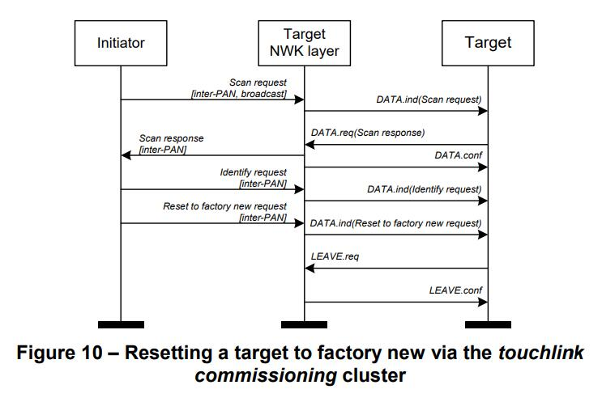

## 9.3 通过网络的 leave 命令重置

ZigBee-PRO 提供网络的 **leave** 命令，其通过清除所有 ZigBee 持久数据（除了传出 NWK 帧计数器）（参见子条款 6.9）来请求远程节点离开网络，并执行重置以使节点处于与出厂时一样的状态。

网络的 **leave** 命令在 \[R1\] 的子条款 3.4.4 中规定，其用法在 \[R1\] 的子条款 3.6.1.10 中规定。

## 9.4 通过 Mgmt\_Leave\_req ZDO 命令重置

ZigBee-PRO 提供 **Mgmt\_Leave\_req** ZDO 命令，该命令通过清除所有 ZigBee 持久数据（除了传出 NWK 帧计数器）（参见子条款 6.9）来请求远程节点离开网络，并执行重置以使节点处于与出厂时一样的状态。

**Mgmt\_Leave\_req** ZDO 命令在 \[R1\] 的子条款 2.4.3.3.5 中规定。

## 9.5 通过本地动作重置

建议（RECOMMENDED）提供本地动作以允许重置节点，这将清除所有 ZigBee 持久数据（除了传出 NWK 帧计数器）（参见子条款 6.9）来请求远程节点离开网络，并执行重置以使节点处于与出厂时一样的状态。

应该（SHOULD）实现一些用户可访问的特定应用刺激以调用此本地动作，例如节点上的外部按钮或通过某些软件激活。建议（RECOMMENDED）仅在用户物理地向节点提出时才允许激活此过程。

如果节点从应用程序中接收某些刺激以重置并离开其当前网络，则它应（SHALL）在网络上执行离开请求。为此，节点将 **NWME-LEAVE.request** 原语（**DeviceAddress** 参数设置为 **NULL**、**RemoveChildren** 为 **FALSE**、**Rejoin** 为 **FALSE**）发布到 NWK 层。在收到 **NLME-LEAVE.confirm** 原语后，将通知节点其请求的状态。

然后，节点应（SHALL）清除所有 ZigBee 持久数据（除了传出 NWK 帧计数器）（参见子条款 6.9）。

# 10. 安全

## 10.1 安装码

本节介绍了建立预配置信任中心链路密钥的带外过程、所需的安装码的格式以及用于从安装码派生预配置链路密钥的散列函数。请注意，安装码应（SHALL）是随机的，但可以不（MAY NOT）唯一。

如 Figure 11 所示，在制造过程期间为每个节点创建随机安装码。此安装码以制造商特定的方式（标签等）提供给节点，并在安装期间引用。安装码的空间应该（SHOULD）与密钥空间一样具有随机性。了解一组安装码不应该（SHOULD NOT）产生任何关于其他安装码的知识，而且每个安装码的可能性应该（SHOULD）相等。

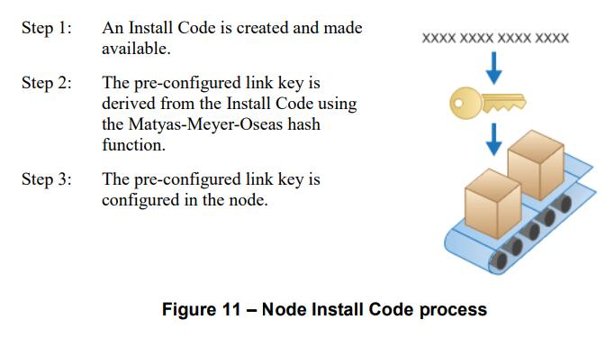

如 Figure 12 所示，在安装过程期间初始信任中心链路密钥是从安装码派生的，并通过带外通信通道发送到信任中心。信任中心使用此密钥作为信任中心链路密钥，该密钥随后用来配置关联节点的网络密钥。

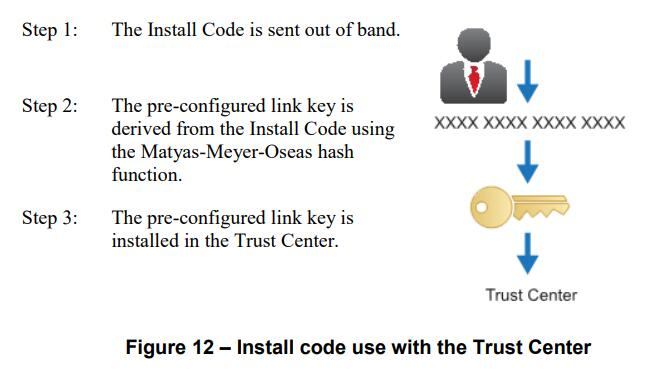

### 10.1.1 安装码格式

安装码由 128-bit 数字和 16-bit CRC 组成（使用 CCITT CRC 标准多项式：x\^16 + x\^12 + x\^5 + 1）。在打印或显示时，安装码表示为 4 个十六进制数字的多组。

示例：安装码 “83FE D340 7A93 9723 A5C6 39B2 6916 D505 C3B5”。

其中值 0x83、0xFE、0xD3、0x40、0x7A、0x93、0x97、0x23、0xA5、0xC6、0x39、0xB2、0x69、0x16、0xD5 和 0x05 用于计算 CRC16，结果返回 0xB5C3。（注意，CRC16 和安装码在上例中以小端字节顺序表示）

#### 10.1.1.1 CRC 算法信息

如前所述，安装码 CRC 计算基于 CRC 16-CCITT 算法并使用以下参数：

* Length: 16
* Polynomial: x\^16 + x\^12 + x\^5 + 1 (0x1021)
* Initialization method: Direct
* Initialization value: 0xFFFF
* Final XOR value: 0xFFFF
* Reflected In: True
* Reflected Out: True

CRC 16-CCITT 算法的开源实现可以在互联网上获得，如 SourceForge 等。源代码也可在 \[R5\] 中找到。

### 10.1.2 散列函数

AES-128 密钥使用 Matyas-Meyer-Oseas（MMO）散列函数从安装码中派生（参见 \[R1\] 的 Annex B.6 with a digest size (hashlen) equal to 128 bits）。

安装码示例：

应用于安装码 “83FE D340 7A93 9723 A5C6 39B2 6916 D505” 的 MMO 散列产生密钥 “66B6900981E1EE3CA4206B6B861C02BB”。

注意：最低有效字节为 0x83，最高有效字节为 0x05。

#### 10.1.2.1 MMO 散列代码示例

基于 Rijndael 实现的 MMO 散列的开源实现可以在互联网上获得，如 SourceForge 等。源代码也可在 \[R5\] 中找到。

## 10.2 节点操作

节点加入网络也应（SHALL）具有策略，以指示他们预期来自网络的安全。以下是可以（MAY）用于调整其安全策略的设置。

### 10.2.1 加入节点的策略值

加入节点可以（MAY）具有一组策略值，例如如果要将其 commissioned 到网络中。然而，它通常根据它加入的是集中式安全网络还是分布式安全网络来设置这些策略值。除了指定为 ZigBee 协调器的节点外，所有节点都应（SHALL）支持使用任一安全模型加入网络。

#### 10.2.1.1 acceptNewUnsolicitedTrustCenterLinkKey 策略

此布尔值指示节点是否接受新的未经请求的 APS 传输密钥消息（包含信任中心链路密钥）。

请注意，在分布式安全网络中忽略此值。

#### 10.2.1.2 acceptNewUnsolicitedApplicationLinkKey 策略

此布尔值指示节点是否接受信任中心或其他设备发送未经请求的新应用程序链路密钥给它。

如果设备需要对伙伴节点使用 APS 加密，则可以（MAY）在分布式安全网络中使用此值。

### 10.2.2 信任中心地址

节点可以（MAY）在加入前知道信任中心的地址，这取决于节点的 commissioning 过程。如果节点在加入网络前已知信任中心地址，则 commissioning 过程应（SHALL）将 **apsTrustCenterAddress** 设置为它将加入的网络中的信任中心的 IEEE 地址的值。

在大多数情况下，节点将加入的网络并非提前知道的。因此，建议（RECOMMENDED）节点的 commissioning 过程不要预编程信任中心地址。在这种情况下，**apsTrustCenterAddress** 最初应（SHALL）设置为 **0xffffffffffffffff**。一旦节点加入网络并接收和解密包含网络密钥的 APS 命令传输密钥命令，它应（SHALL）将 **apsTrustCenterAddress** 设置为命令中源地址的值。

如果 **bdbNodeIsOnANetwork** 等于 **TRUE** 且 **apsTrustCenterAddress** 等于 **0xffffffffffffffff**，则设备已加入到分布式安全网络，并且应该（SHOULD）相应地调整节点的设置。相反，如果 **apsTrustCenterAddress** 不等于 **0xffffffffffffffff**，则该节点已加入到集中式安全网络。

对于所有随后收到的信任中心或安全相关的 APS 命令帧（存在源地址字段），如果 **apsTrustCenterAddress** 不等于 **0xffffffffffffffff**，则节点应（SHALL）将 **apsTrustCenterAddress** 的值与 APS 命令的源地址值进行比较。如果值不匹配，则应（SHALL）丢弃该帧并且不再进行进一步处理。

### 10.2.3 信任中心链路密钥

所有节点在加入集中式安全网络后都应（SHALL）具有更新的信任中心链路密钥。这允许使用安全通信来通知加入事件以及将网络密钥分发给错过密钥更新的设备。节点应（SHALL）使用预配置密钥加入网络，然后在加入完成后请求更新链路密钥。一旦节点获得了更新的信任中心链路密钥，它就应（SHALL）忽略来自信任中心的任何未使用该密钥加密的 APS 命令。

### 10.2.4 请求链路密钥

如果 **bdbTCLinkKeyExchangeMethod** 等于 **0x00**，则节点应（SHALL）将其初始链路密钥与信任中心生成的密钥进行交换，以作为其在集中式安全网络中的初始加入操作的一部分。

如果 **bdbTCLinkKeyExchangeMethod** 不等于 **0x00**，则节点应（SHALL）遵循此属性指定的相应过程。然而，如果该过程失败，则节点将退回到上述链路密钥交换方法（0x00）。如果此方法成功，则节点可以（MAY）将密钥视为未授权的，以允许访问受限的簇。

### 10.2.5 信任中心链路密钥交换过程

本节定义了检索节点的新信任中心链路密钥的过程。该过程的序列图展示了消息的交换和用于加密消息的相应密钥，如 Figure 13 所示。

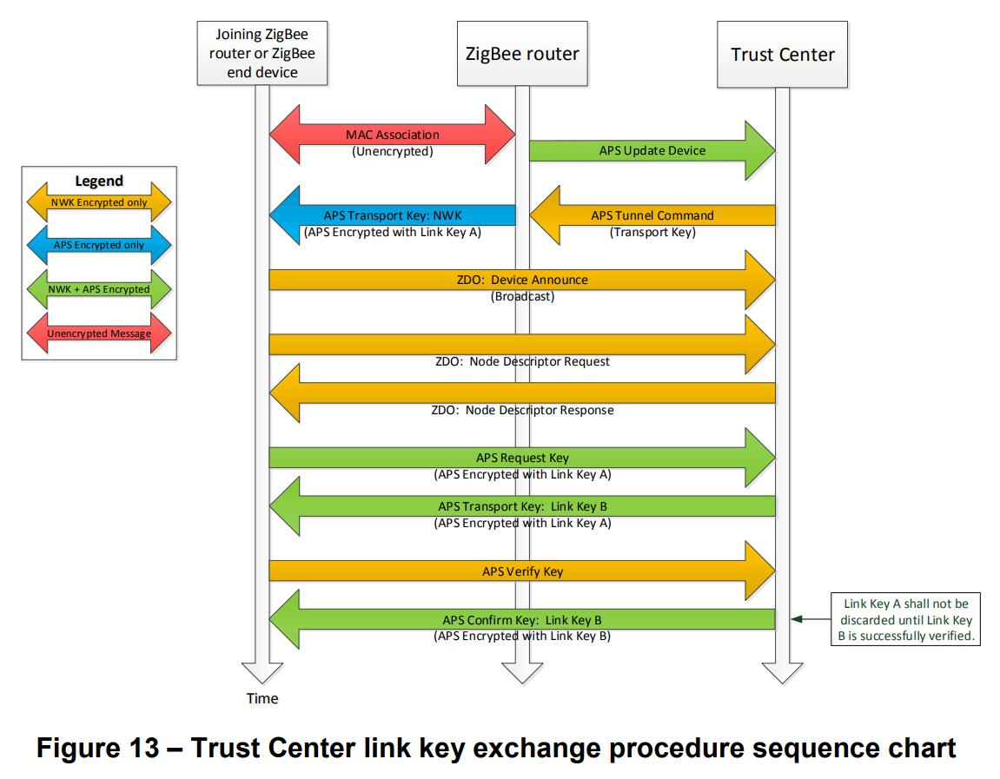

Figure 14 展示了此过程的简化版本，以供快速参考。

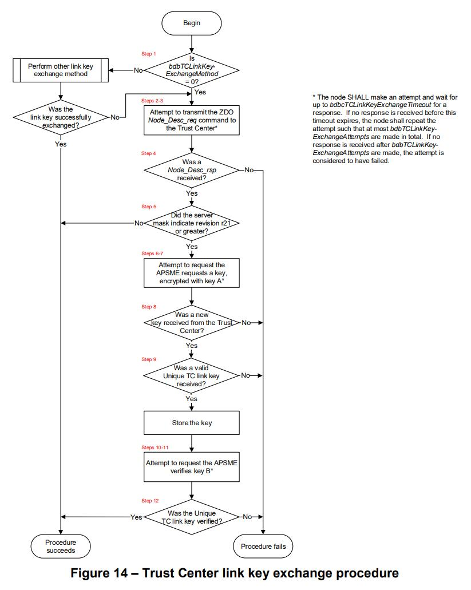

1. 加入节点应（SHALL）检查其 **bdbTCLinkKeyExchangeMethod**。如果 **bdbTCLinkKeyExchangeMethod** 设置为 **0**，则它应（SHALL）从步骤 2 继续。如果 **bdbTCLinkKeyExchangeMethod** 设置为另一个值，则它应（SHALL）执行该机制定义的适当步骤。如果机制成功，则节点应（SHALL）以成功状态终止信任中心链路密钥交换过程。
2. 加入节点将 **bdbTCLinkKeyExchangeAttempts** 设置为 **0**。
3. 加入节点应（SHALL）向信任中心发送 **Node\_Desc\_req** ZDO 命令。然后它启动 **bdbcTCLinkKeyExchangeTimeout** 秒的定时器，并将 **bdbTCLinkKeyExchangeAttempts** 递增 **1**。
4. 如果在定时器到期之前未收到 **Node\_Desc\_rsp** ZDO 命令，则加入节点应（SHALL）确定是否重试该尝试，如下所示：
    1. 如果 **bdbTCLinkKeyExchangeAttempts** 小于 **bdbTCLinkKeyExchangeAttemptsMax**，则加入节点应（SHALL）从步骤 3 继续。
    2. 如果 **bdbTCLinkKeyExchangeAttempts** 等于 **bdbTCLinkKeyExchangeAttemptsMax**，则加入节点应（SHALL）以失败状态终止信任中心链路密钥交换过程。
5. 如果接收方的节点描述符的 **server mask** 字段指示 r20 或更早的协议栈修订，则加入节点应（SHALL）以成功状态终止信任中心链路密钥交换过程。
6. 加入节点将 **bdbTCLinkKeyExchangeAttempts** 设置为 **0**。
7. 加入节点应（SHALL）从信任中心中请求新的链路密钥。为此，加入节点发布 **APSME-REQUEST-KEY.request** 原语（使用其初始信任中心链路密钥（key A）加密）。然后它启动 **bdbcTCLinkKeyExchangeTimeout** 秒的定时器并将 **bdbTCLinkKeyExchangeAttempts** 递增 **1**。
8. 如果加入节点在定时器到期之前没有收到 **APSME-TRANSPORT-KEY.indication** 原语，则加入节点应（SHALL）确定是否重试该尝试，如下所示：
    1. 如果 **bdbTCLinkKeyExchangeAttempts** 小于 **bdbTCLinkKeyExchangeAttemptsMax**，则加入节点应（SHALL）从步骤 7 继续。
    2. 如果 **bdbTCLinkKeyExchangeAttempts** 等于 **bdbTCLinkKeyExchangeAttemptsMax**，则加入节点应（SHALL）以失败状态终止信任中心链路密钥交换过程。
9. 加入节点应（SHALL）在 **apsDeviceKeyPairSet** 中找到与 **apsTrustCenterAddress** 相对应的 **DeviceAddress** 的条目。如果接收到的 **APSME-TRANSPORT-KEY.indication** 原语的 **KeyType** 参数不等于 **0x04**（唯一信任中心链路密钥）或原语中包含的链路密钥与 **apsDeviceKeyPairSet** 条目的 **LinkKey** 值相同，则加入节点应（SHALL）以失败状态终止信任中心链路密钥交换过程。否则，加入节点应（SHALL）用原语中包含的密钥（link key B）替换 **LinkKey** 的值，然后可以（MAY）将 **OutgoingFrameCounter** 设置为 **0**，并且它应（SHALL）为 **apsDeviceKeyPairSet** 条目将 **IncomingFrameCounter** 设置为 **0**。
10. 加入节点将 **bdbTCLinkKeyExchangeAttempts** 设置为 **0**。
11. 加入节点应（SHALL）与信任中心验证新链路密钥。为此，加入节点发出 **APSME-VERIFY-KEY.request** 原语以验证新密钥（link key B）。然后它启动 **bdbcTCLinkKeyExchangeTimeout** 秒的定时器并将 **bdbTCLinkKeyExchangeAttempts** 增加 **1**。
12. 如果加入节点在定时器到期之前没有收到 **APSME-CONFIRM-KEY.indication** 原语，则加入节点应（SHALL）确定是否重试该尝试，如下所示：
    1. 如果 **bdbTCLinkKeyExchangeAttempts** 小于 **bdbTCLinkKeyExchangeAttemptsMax**，则加入节点应（SHALL）从步骤 11 继续。
    2. 如果 **bdbTCLinkKeyExchangeAttempts** 等于 **bdbTCLinkKeyExchangeAttemptsMax**，则加入节点应（SHALL）以失败状态终止信任中心链路密钥交换过程。
13. 加入节点应（SHALL）以成功状态终止信任中心链路密钥交换过程。

注意，加入节点应（SHALL）认为 link key A 有效，直到 link key B 成功地被信任中心验证（成功地解密响应）。

### 10.2.6 接收新链路密钥

节点的安全策略可以（MAY）限制信任中心发送应用程序链路密钥给它。这可能是因为节点希望控制与其共享链路密钥的其他节点，或者因为它使用某种其他机制来建立应用程序链路密钥。

在某些情况下，更高级别的应用程序策略确定与应用程序链路密钥共享哪些数据，例如，通过基于证书的密钥交换协议建立更新的信任中心链路密钥的网络。

如果节点收到包含信任中心链路密钥的传输密钥命令，但它未曾发送请求并且 **acceptNewUnsolicitedTrustCenterLinkKey** 设置为 **FALSE**，则它应（SHALL）忽略该消息。如果节点收到包含应用程序链路密钥的传输密钥命令，但它未层发送请求并且 **acceptNewUnsolicitedApplicationLinkKey** 设置为 **FALSE**，则它应（SHALL）忽略该消息。
